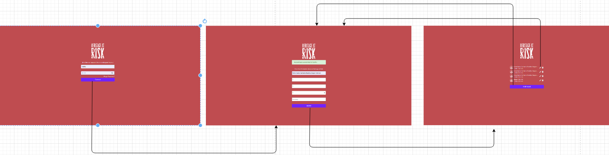
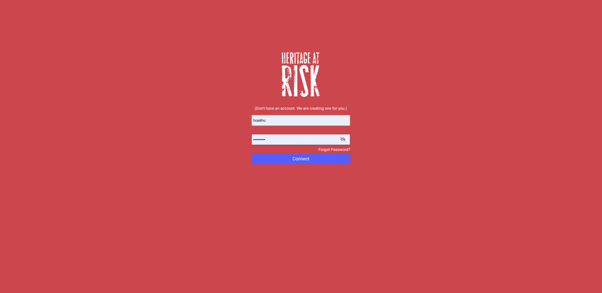
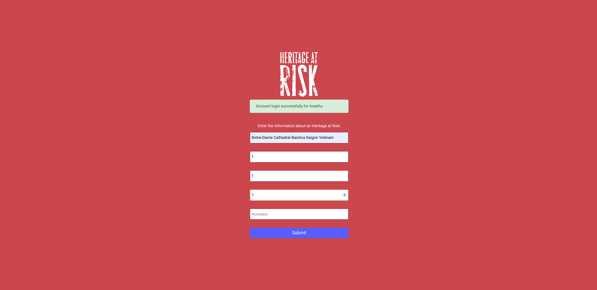
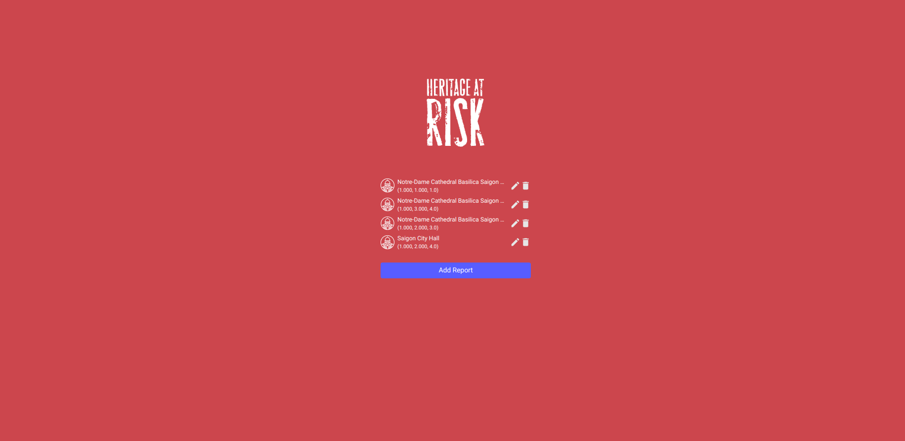

# Heritage at Risk RESTful API Server

## Introduction

Heritage at Risk Web server is a simple web server application that allows heritage lovers to edit heritage at risk reports they have submitted with their mobile phones.

## What the project does

Develop the Heritage at Risk web server application using **Django**.

### Storyboard

The navigation between these screens is the following:


The Heritage at Risk web server composed of 4 screens:

| Connection (Register + Login) | Report Creation & Submission   | Reports Page                    |
| ----------------------------- | ------------------------------ | ------------------------------- |
|  |  |  |

## Usage Information

### Prerequisites

- Python `3.6+` is required.

### Usage

- Clone the repository:
  ```
  git clone https://github.com/intek-training-jsc/har-web-server-hoaithu1.git
  ```
- Setup a directory to install
  ```
  $ cd ~/Documents/har-web-server-hoaithu1$
  ```
- Install our Flickr mirroring utility `pipenv install` to install virtual environment.

- Run a Python virtual environment: `$ pipenv shell`

- Run by typing command `./manage.py runserver`

* Demonstration:

  ```bash
  (har-web-server-hoaithu1) hoaithu@hoaithu-HP-ENVY-Laptop-13-ah0xxx:~/Documents/har-web-server-hoaithu1$ ./manage.py runserver
  Watching for file changes with StatReloader
  Performing system checks...

  System check identified no issues (0 silenced).
  July 05, 2020 - 10:17:59
  Django version 3.0.7, using settings 'har.settings'
  Starting development server at http://127.0.0.1:8000/
  Quit the server with CONTROL-C.
  ...
  ```

  - Open the browser and access to `http://127.0.0.1:8000/`

## Contact Information

- If you have any problems using this library, please use the contact below.
  `Email: hoai.kt178@gmail.com`
