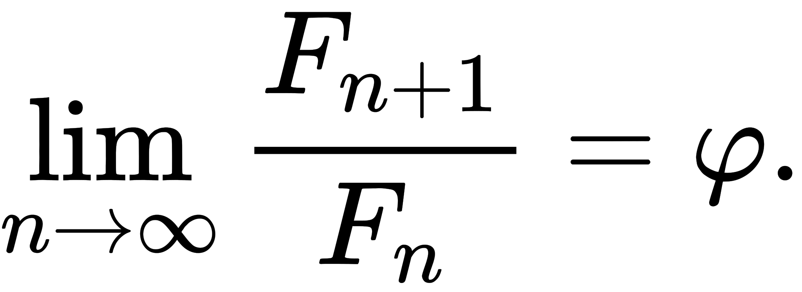

# Fibonacci Numbers


In mathematics, the [Fibonacci numbers](https://en.wikipedia.org/wiki/Fibonacci_number) form a sequence such that each number is the sum of the two preceding ones, [starting from `0` and `1`](https://math.stackexchange.com/questions/158699/why-does-the-fibonacci-series-start-with-0-1):

```text
F(0) = 0
F(1) = 1
F(n) = F(n - 1) + F(n -2), ∀n > 1
```

You will create a Python file `fibonacci.py` where you will write the code for the following missions.

# Waypoint 1: Direct Recursive Function

Write a function `fibonacci_direct_recursive` that takes an argument `n` ([a whole number](https://www.mathsisfun.com/definitions/whole-number.html), i.e., an integer that that is either positive or zero) and that returns the corresponding fibonacci number.

Your function **MUST NOT** use a regular/direct [recursion](<https://en.wikipedia.org/wiki/Recursion_(computer_science)#Recursive_programs>) to [calculate](https://www.youtube.com/watch?v=wMNrSM5RFMc) the Fibonacci number to return, meaning that your function **MUST NOT** use a **`for`** or **`while`** loop statement, but it **MUST** [call itself](https://www.youtube.com/watch?v=vuMK0b-Nrho).

```python
>>> fibonacci_recursive(0)
0
>>> fibonacci_recursive(1)
1
>>> fibonacci_recursive(2)
1
>>> fibonacci_recursive(8)
21
>>> [fibonacci_iterative(i) for i in range(20)]
[0, 1, 1, 2, 3, 5, 8, 13, 21, 34, 55, 89, 144, 233, 377, 610, 987, 1597, 2584, 4181]
```

# Waypoint 2: Tail Recursive Function

Write a function `fibonacci_tail_recursive` that takes an argument `n` (a whole number) and that returns the corresponding fibonacci number.

Your function **MUST NOT** use an [tail recursion](<(https://en.wikipedia.org/wiki/Recursion_(computer_science)#Tail-recursive_functions)>) to calculate the Fibonacci number to return, meaning your function **MUST NOT** use an iteration, when a [call returns](https://en.wikipedia.org/wiki/Tail_call), the returned value is [immediately returned](https://towardsdatascience.com/what-is-tail-recursion-elimination-or-why-functional-programming-can-be-awesome-43091d76915e).

For example:

```python
>>> import pprint
>>> pprint.pprint([fibonacci_tail_recursive(i) for i in range(0, 200, 10)])
[0,
 55,
 6765,
 832040,
 102334155,
 12586269025,
 1548008755920,
 190392490709135,
 23416728348467685,
 2880067194370816120,
 354224848179261915075,
 43566776258854844738105,
 5358359254990966640871840,
 659034621587630041982498215,
 81055900096023504197206408605,
 9969216677189303386214405760200,
 1226132595394188293000174702095995,
 150804340016807970735635273952047185,
 18547707689471986212190138521399707760,
 2281217241465037496128651402858212007295]
```

_Note: Your function using recursion will raise an [exception `RecursionError`](https://www.geeksforgeeks.org/python-handling-recursion-limit/) if you pass a large integer:_

```python
>>> fibonacci_tail_recursive(1000)
Traceback (most recent call last):
  File "<input>", line 1, in <module>
  File "<input>", line 35, in fibonacci_tail_recursive
  File "<input>", line 31, in _fibonacci_tail_recursive
  File "<input>", line 31, in _fibonacci_tail_recursive
  File "<input>", line 31, in _fibonacci_tail_recursive
  [Previous line repeated 985 more times]
  File "<input>", line 26, in _fibonacci_tail_recursive
RecursionError: maximum recursion depth exceeded in comparison
```

# Waypoint 3: Iterative Function

Write a function `fibonacci_iterative` that takes an argument `n` (a whole number) and that returns the corresponding fibonacci number.

Your function **MUST** use an [iteration](https://www.youtube.com/watch?v=kx6DfrYfWnQ) to calculate the Fibonacci number to return, meaning that your function **MUST NOT** call itself or any other function, but it **MUST** use a [**`for`** loop statement](https://realpython.com/python-for-loop/).

For example:

```python
>>> import pprint
>>> pprint.pprint([fibonacci_iterative(i) for i in range(0, 400, 20)])
[0,
 6765,
 102334155,
 1548008755920,
 23416728348467685,
 354224848179261915075,
 5358359254990966640871840,
 81055900096023504197206408605,
 1226132595394188293000174702095995,
 18547707689471986212190138521399707760,
 280571172992510140037611932413038677189525,
 4244200115309993198876969489421897548446236915,
 64202014863723094126901777428873111802307548623680,
 971183874599339129547649988289594072811608739584170445,
 14691098406862188148944207245954912110548093601382197697835,
 222232244629420445529739893461909967206666939096499764990979600,
 3361707149818144672666187219454104827980338677164658343636350711365,
 50852543833066829834000968538942350270948615962802847667687312219838755,
 769246427201094785080787978422393713094534885688979999504447628313150135520,
 11636390653418416980850249915594581159038678944868584489700931605805709880172285]
```

# Waypoint 4: Memoize the Direct Recursive Function

You may have noticed that the iterative and tail recursive versions are a lot faster than the recursive version.

We provide hereafter the performance of the **direct recursive**, **tail recursive**, and **iterative** functions, given in that order:

| `n` | Time      |     |     | `n` | Time    |     |     | `n` | Time    |
| --- | --------- | --- | --- | --- | ------- | --- | --- | --- | ------- |
| 0   | 0.25 ms   |     |     | 0   | 0.01 ms |     |     | 0   | 0.01 ms |
| 4   | 0.02 ms   |     |     | 100 | 0.03 ms |     |     | 100 | 0.03 ms |
| 8   | 0.03 ms   |     |     | 200 | 0.05 ms |     |     | 200 | 0.02 ms |
| 12  | 0.23 ms   |     |     | 300 | 0.07 ms |     |     | 300 | 0.03 ms |
| 16  | 1.63 ms   |     |     | 400 | 0.1 ms  |     |     | 400 | 0.05 ms |
| 20  | 12.48 ms  |     |     | 500 | 0.18 ms |     |     | 500 | 0.03 ms |
| 24  | 153.46 ms |     |     | 600 | 0.16 ms |     |     | 600 | 0.06 ms |
| 28  | 274.46 ms |     |     | 700 | 0.19 ms |     |     | 700 | 0.08 ms |
| 32  | 2.09 s    |     |     | 800 | 0.35 ms |     |     | 800 | 0.07 ms |
| 38  | 40.77 s   |     |     | 900 | 0.35 ms |     |     | 900 | 0.07 ms |

The performance issue of the direct recursive function comes from the fact that this function is calculating the same values over and over:

```txt
                     fib(5)
                     /    \
                 +--+      +--+
                /              \
          fib(3)                fib(4)
          /    \                /      \
         /      \              /        \
    fib(2)      fib(1)    fib(3)        fib(2)
      /\         |         /\            /\
     /  \        |        /  \          /  \
fib(0) fib(1)    1   fib(2)  fib(1)  fib(0) fib(1)
   |     |             /\              |     |
   |     |            /  \             |     |
   0     1        fib(0) fib(1)        0     1
                     |     |
                     |     |
                     0     1
```

The [computational complexity](https://en.wikipedia.org/wiki/Computational_complexity) (expressed with the [Big O Notation](https://en.wikipedia.org/wiki/Big_O_notation)) of the [**direct recursive** is exponential](https://medium.com/@syedtousifahmed/fibonacci-iterative-vs-recursive-5182d7783055) (`O(2^n)`), while the computational complexity of the **tail recursive** and **iterative** functions is linear (`O(n)`). A lost faster.

We can however drastically improve the performance of the direct recursive function without even having to modify its code. The idea is to cache and reuse values that have been already calculated. This technique is called [memoization](https://en.wikipedia.org/wiki/Memoization).

_Note: LRU is a technique used in various computer softwares to handle [cache replacement](https://www.youtube.com/watch?v=R5ON3iwx78M)._

Python provides an implementation of a [LRU (Least Recently Used) cache](https://www.interviewcake.com/concept/java/lru-cache) that can be used to cache and reuse values that our direct recursive function returns. Basically, if the Fibonacci value of a particular number has not been already calculated, the inner code of the function will be executed and the result will be cached and returned, otherwise the Fibonacci value will be retrieved from the cache and directly returned without the code of the function is executed.

Python provides the [decorator](https://www.youtube.com/watch?v=PJQ5XopgNog) [`lru_cache`](https://docs.python.org/3/library/functools.html#functools.lru_cache). Write function `fibonacci_direct_recursive_memoized` by copying/pasting the code of the function `fibonacci_direct_recursive`. Wrap this function`fibonacci_direct_recursive_memoized` with the decorator`functools.lru_cache`.

For example:

```python
>>> def test_fibonacci_direct_recursive(n):
...     from datetime import datetime
...     start_time = datetime.now()
...     values = [fibonacci_direct_recursive(i) for i in range(n)]
...     print(f"Function executed in {(datetime.now() - start_time).total_seconds()} s")
...     return values
...
>>> test_fibonacci_direct_recursive(34)
Function executed in 7.678301 s
>>>
>>> def test_fibonacci_direct_recursive_memoized(n):
...     from datetime import datetime
...     start_time = datetime.now()
...     values = [fibonacci_direct_recursive_memoized(i) for i in range(n)]
...     print(f"Function executed in {(datetime.now() - start_time).total_seconds()} s")
...     return values
...
... test_fibonacci_direct_recursive_memoized(34)
Function executed in 1e-05 s
```

The execution of the function `fibonacci_direct_recursive_memoized` is **a lot faster** while its code is exactly the same than the function `fibonacci_direct_recursive`. It's just that its results are cached and reused.

# Waypoint 5: Calculate the Golden Ratio


By the way, have you noticed the ratio between two consecutive Fibonacci numbers appears to converge to a number? If fact the ratio converges to the [Golden Ratio](https://www.youtube.com/watch?v=SjSHVDfXHQ4):

```python
>>> for n in range(1, 20):
...     print('{:.4f}'.format(fibonacci_tail_recursive(n + 1) / fibonacci_tail_recursive(n)))
1.0000
2.0000
1.5000
1.6667
1.6000
1.6250
1.6154
1.6190
1.6176
1.6182
1.6180
1.6181
1.6180
1.6180
1.6180
1.6180
1.6180
1.6180
1.6180
```

Write a function `fibonacci_golden_ratio` that takes an optional argument `max_occurrences_number` (an integer) and that calculates the golden ratio as the limit of the ratios of successive terms of the Fibonacci sequence:



Your function `fibonacci_golden_ratio` counts the number of times ratios keep the same value over several successive ratio calculations. If this number of times is equal to the value of the argument `max_occurrences_number`, the function returns this ratio.

The default value of the argument `max_occurrences_number` is `10`.

For example:

```python
>>> fibonacci_golden_ratio()
1.618033988749895
>>> fibonacci_golden_ratio(max_occurrences_number=10000)
1.618033988749895
```

Fibonacci is not only about calculation. [Golden ratio](https://youtu.be/wH32LujS9Yg) appears in [art](https://www.goldennumber.net/art-composition-design/) [composition](https://drawpaintacademy.com/golden-ratio-in-art/) [and]() [design](https://wpamelia.com/golden-ratio/), such as [logos](https://www.youtube.com/watch?v=YEu5FQtAXP8), and even in the Nature. Everything in our life has [mathematical patterns!](https://medium.com/however-mathematics/everything-in-our-life-has-only-mathematical-patterns-504a0e87ab3)

| Art Design                                            | Nature                       |
| ----------------------------------------------------- | ---------------------------- |
|  |  |
