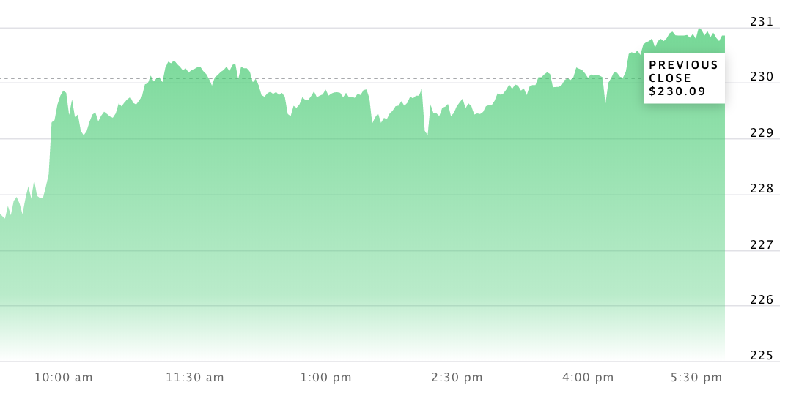

# Best Profit



How much money you could have made yesterday if you'd been trading Apple stocks all day?

Let's say you grabbed Apple's stock prices from yesterday and put them in a list called `stock_prices`, where:

- the indices are the time (e.g., in minutes) past trade opening time, which was 9:30am local time;
- the values are the price (in US dollars) of one share of Apple stock at that time.

So if the stock cost \$480 at 9:35am, that means `stock_prices[5] = 480`, and if the stock cost \$500 at 10:30am, that means `stock_prices[60] = 500`, etc.

Write a function `get_max_profit` that takes an argument `stock_prices` (a list of numbers) and that returns the best profit you could have made from one purchase and one sale of one share of Apple stock yesterday.

For example:

| 9:30am | 9:35am | 9:40am | 9:45am | 9:50am | 9:55am |
| ------ | ------ | ------ | ------ | ------ | ------ |
| \$10   | \$7    | \$5    | \$8    | \$11   | \$9    |

```python
>>> stock_prices = [10, 7, 5, 8, 11, 9]
>>> get_max_profit(stock_prices)
6
```

The function returns 6, buying for $5 and selling for $11.

_Note: no "shorting"—you need to buy before you can sell. Also, you can't buy and sell in the same time step—at least 1 minute has to pass._
