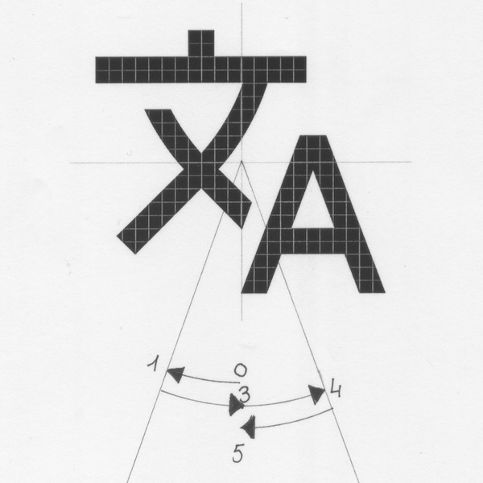

# Héritage GO

[Héritage GO](https://www.heritagego.org) is a social networking service dedicated to cultural and historical heritages, developed by the non-profit organization [Heritage Observatory](https://www.heobs.org).

Héritage GO displays old photographs of heritages around you, wherever you are in the world. There are more than 450,000 old photographs worldwide.


This project will teach you the [fundamentals of frontend development](https://www.youtube.com/watch?v=8gNrZ4lAnAw) using [Hypertext Markup Language (HTML), Cascading Style Sheets (CSS), and JavaScript](https://www.youtube.com/watch?v=8gNrZ4lAnAw).

## Waypoint 1: Basic HTML Page

We start with a minimal [HTML page](https://developer.mozilla.org/en-US/docs/Learn/HTML/Introduction_to_HTML/Getting_started) `index.html`:

```html
<!DOCTYPE html>
<html lang="en">
  <head>
    <meta http-equiv="X-UA-Compatible" content="ie=edge" />
    <meta name="viewport" content="width=device-width, initial-scale=1.0" />
    <title>Héritage GO</title>
  </head>
  <body></body>
</html>
```

We have defined "_Héritage GO_" as the [document's title](https://developer.mozilla.org/en-US/docs/Web/HTML/Element/title) that is shown in a browser's title bar or a page's tab.

We will see later what the other HTML elements, defined in this document, correspond to.

You can open with your favorite browser the `index.html` you have just created:


You will already notice that the title "_Hérigate GO_" displayed in the tab of your browser has [character encoding issue](http://kunststube.net/encoding/):


We'll be fixing this issue in the next waypoint.

## Waypoint 2: Specify Character Encoding

Our Web page will display English, French, and Vietnamese characters. Characters are [encoded](https://www.w3.org/International/questions/qa-what-is-encoding) using a particular repertoire of characters.

By the past, there were many ways to encode Vietnamese characters, such as [VSCII](https://en.wikipedia.org/wiki/VSCII), [VISCII](https://en.wikipedia.org/wiki/VISCII), [VNI](https://en.wikipedia.org/wiki/VNI#VNI_Encoding), [VPS](https://en.wikipedia.org/wiki/Vietnamese_Professionals_Society). All these character encodings were incompatible, resulting to Vietnamese [mojibake](https://en.wikipedia.org/wiki/Mojibake), for instance, when opening a document encoded with VPS while we were using a VNI font.

We use nowadays [Unicode](https://www.w3.org/International/articles/definitions-characters/) to encode almost every international character. It replaces all the previous deprecated Vietnamese character encodings. This a [MUST HAVE](https://www.joelonsoftware.com/2003/10/08/the-absolute-minimum-every-software-developer-absolutely-positively-must-know-about-unicode-and-character-sets-no-excuses/).

We need to [declare the character encoding](https://www.w3.org/International/questions/qa-html-encoding-declarations) used for the HTML document. We should always use the [UTF-8](https://en.wikipedia.org/wiki/UTF-8) character encoding.

[Declare the Web page](https://www.w3schools.com/tags/att_meta_charset.asp) as using the character encoding UTF-8:

You can now reload your `index.html` file in your browser. Better, uh?!


## Waypoint 3: Define Web Page Description

We need to add a description to this Web page. A [meta description](https://developer.mozilla.org/en-US/docs/Learn/HTML/Introduction_to_HTML/The_head_metadata_in_HTML) is an HTML attribute that provides a brief summary of a web page. It is typically up to 160 characters long. Search engines such as Google often display the meta description in search results where they can highly influence user click-through rates.

Add the content "_Héritage GO is the community for heritage lovers._" in a meta description of this Web page.

## Waypoint 4: Add Web Page Favorite Icon

A [favicon](https://en.wikipedia.org/wiki/Favicon) (short for favorite icon) is a graphic image associated with a particular Web page or website. This little 16×16 pixels icon is displayed in the tab on the web browser.

For example:


It's not required that you use a favicon, but it can be very good for branding purposes and to ensure people recognize your site across the web.

[Adding a favicon to your Website](https://developer.mozilla.org/en-US/docs/Learn/HTML/Introduction_to_HTML/The_head_metadata_in_HTML#Adding_custom_icons_to_your_site) is theoretically quite simple, however, in order to support most browsers and platforms, you need to add and reference [a lof of icons of different sizes](https://realfavicongenerator.net/faq). It's [a mess](https://realfavicongenerator.net/blog/favicon-why-youre-doing-it-wrong/)! Hopefully, you don't need to manually generate all these icons and HTML code. There are a few [generators](https://realfavicongenerator.net/) that you can find online that will do the job for you.

Generate the favicons of your Web site using the image `./assets/Favicon Héritage Go 3.0.png` , add the favicons files to the root folder of your Web page, and add the HTML code referencing these favicons in the `<head>` section of your Web page's file.

You will have to trick a little bit your HTML code to get the favicon displayed properly. Update the attributes `href` of the favicon HTML code you've just added, by prefixing the reference with a character `.` (dot):

```html
href="./favicon-16x16.png">
```

The reason is that your browser is reading a local file stored in your computer, not on the Internet. The character `.` indicates that referred file is located in the same directory than the `index.html` that has been loaded. The character `/` alone indicates the root directory of your drive (or your website).

Works better, right?


## Waypoint 5: Define Header HTML Element Structure

Let's start designing the layout of our Web page!

The header section of the Héritage GO Web page is horizontally composed of:

1. the Héritage GO's logo;
2. Name of the detected area where the user is currently located in, decomposed in two lines, where the top line refers to the primary area, basically the city (e.g., _Sa Đéc_), and the bottom line refers to a secondary larger area (e.g., _Đồng Tháp, Việt Nam_).
3. a compass icon that allows the user to request the Web application to geolocate him more accurately;
4. a button that allows the user to log-in.

Update your HTML code to add these elements following these specifications:

| Element             | Specifications                                                                                                                                                         |
| ------------------- | ---------------------------------------------------------------------------------------------------------------------------------------------------------------------- |
| Header Section      | Height of 80 pixels, width 100% of the page's width, background color is white, color of text is `rgb(38, 38, 38)` / `#262626`                                         |
| Logo                | Width of 100 pixels, height scaled proportionally, image file `./img/heritagego_logo_128x73.png`:<br />             |
| Primary Area Name   | Font family `Arial`, font size 18 pixels, text horizontally centered                                                                                                   |
| Secondary Area Name | Font family `Arial`, font size 14 pixels, text horizontally centered                                                                                                   |
| Compass Icon        | Width and height of 24 pixels, centered; use the icon [fa-compass](https://fontawesome.com/icons/compass?style=regular) from [Font Awesome](https://fontawesome.com/). |
| Login Button        | Font family `Arial`, font size 14 pixels, text horizontally centered, border radius 3 pixels, border color `rgb(230, 230, 230)` / `#e6e6e6`                            |

You MUST use the [Blocks, Elements and Modifiers](http://getbem.com/introduction/) (BEM) [naming convention](https://www.youtube.com/watch?v=er1JEDuPbZQ) to identify [HTML classes](https://developer.mozilla.org/en-US/docs/Web/HTML/Global_attributes/class). BEM is a methodology that helps you to create [reusable components and code sharing](https://css-tricks.com/bem-101/) in front-end development.

Don't worry from now about the exact positioning of your HTML elements on the page. We will fix this in the next waypoint.


## Waypoint 6: Position Header HTML Elements

We are going to position and align the header's HTML elements as follows:


This is what [Cascading Style Sheet (CSS)](https://developer.mozilla.org/en-US/docs/Web/CSS) is for. CSS is a language that describes the style of an HTML document, how HTML elements should be displayed.

Create a file `main.css` in the folder `css` and [link it in your HTML document](https://developer.mozilla.org/en-US/docs/Web/HTML/Element/link):

```html
<link rel="stylesheet" href="./css/main.css" />
```

The photograph feed section is displayed in the body of the HTML page. The content of this feed section is centered. It has a fixed width of 600 pixels.

Update the HTML code and edit the CSS code to add these following requirements:

| Element                                                                         | Specifications                                                                                                                                                                                                                                                      |
| ------------------------------------------------------------------------------- | ------------------------------------------------------------------------------------------------------------------------------------------------------------------------------------------------------------------------------------------------------------------- |
| [Document Body](https://developer.mozilla.org/en-US/docs/Web/HTML/Element/body) | Color `#262626`                                                                                                                                                                                                                                                     |
| Logo                                                                            | Aligned to the left of the feed section of the document; vertically aligned with the header section                                                                                                                                                                 |
| Area Name Section & Compass Icon                                                | Aligned to the right of the feed section of the document; vertically aligned with the header section                                                                                                                                                                |
| Compass Icon                                                                    | Aligned to the right of the area name section, with a margin of 6 pixels; vertically centered with the content of the primary area name                                                                                                                             |
| Login Button                                                                    | Aligned to the right of the Web page, margin of 24 pixels, vertically centered with the header section                                                                                                                                                              |
| Header Section                                                                  | A horizontal line separates the bottom of the header (CSS property [border-bottom](https://developer.mozilla.org/en-US/docs/Web/CSS/border-bottom)) from the main content of the website; this line is `solid`, of 1 pixel, black color, with an opacity of `.0975` |
| [Main Section](https://developer.mozilla.org/en-US/docs/Web/HTML/Element/main)  | Background color `#fafafa`                                                                                                                                                                                                                                          |

To align HTML elements of the header section, you need to use CSS [Flexible Box Module, or flexbox](https://developer.mozilla.org/en-US/docs/Web/CSS/CSS_Flexible_Box_Layout/Basic_Concepts_of_Flexbox) for short. Flexbox is one of the two modern layout systems, along with CSS Grid. Flexbox makes [layouts flexible and intuitive](https://medium.freecodecamp.org/an-animated-guide-to-flexbox-d280cf6afc35). You will many comprehensive guides to CSS flexbox layout such like [this one](https://css-tricks.com/snippets/css/a-guide-to-flexbox/), along with the more complete s[W3C Candidate Recommendation](https://www.w3.org/TR/css-flexbox/). You can even experiment flexbox with this [Flexbox Playground](https://demos.scotch.io/visual-guide-to-css3-flexbox-flexbox-playground/demos/).

"https://www.w3schools.com/css/css3_flexbox.asp

https://css-tricks.com/autoprefixer/"


## Waypoint 7: Logo Scaling with Transition

We would like to get the website's logo image bigger when the user moves the mouse over. The size of the logo needs to increase when the user hovers over the logo image with the mouse pointer, and it needs to get back to his normal size when the user moves the mouse out of the logo image.

This can be easily done using:

- [CSS pseudo-class `:hover`](https://developer.mozilla.org/en-US/docs/Web/CSS/:hover) to detect when the user hovers over the logo image,
- and then [CSS transform](https://developer.mozilla.org/en-US/docs/Web/CSS/transform)
- with [CSS transitions](https://developer.mozilla.org/en-US/docs/Web/CSS/CSS_Transitions) to smoothly [resize](https://developer.mozilla.org/en-US/docs/Web/CSS/transform-function/scale) the logo image.

Update your CSS file `main.css` to get the logo image resized from scale `1` to scale `1.1` when the user hovers over the logo image, and to get it back to scale `1` [when the mouse pointer leaves the logo image](https://css-tricks.com/different-transitions-for-hover-on-hover-off/).

The [origin of the transformation](https://developer.mozilla.org/en-US/docs/Web/CSS/transform-origin) needs to be the center of the logo image.

The [time of each transition animation](https://developer.mozilla.org/en-US/docs/Web/CSS/transition-duration) needs to take 100 ms to complete.

The transition needs to [start quickly](https://developers.google.com/web/fundamentals/design-and-ux/animations/the-basics-of-easing), and [decelerates gradually until the end](https://developer.mozilla.org/en-US/docs/Web/CSS/transition-timing-function). You need to use the [CSS timing function `ease-out`](https://css-tricks.com/ease-out-in-ease-in-out/).

The **correct** final animation of the logo image is the following:


The following animation of the logo image is **missing** the smooth transition back to the normal size of the logo image:


**Warning**: when CSS3 became popular, all sorts of new features started appearing. Unfortunately, not all of them were supported across all browsers. Vendor prefixes helped developers use those new features, and have them supported instantly without having to wait for each of them to become available for every browser.

A good way to check which property is available to use without a vendor prefix is by checking the [CanIUse](https://caniuse.com/) service. There you can see which browser currently supports which property.

https://dzone.com/articles/understanding-css-vendor-prefixes

## Waypoint 8: Spin Compass Icon Around

The compass icon is used to indicate that the Web application doesn't know precisely where the user is currently located.

The human brain is hardwired to pay attention to moving objects. We would like to animate the compass icon to draw the user's attention to it. The user would then click on the compass icon to request the Web application to geolocate him more accurately.

We will see later, in this mission, how to accurately geolocate the user.

For now, let's animate the compass icon. We would like to spin it around (like a record), for ever. This is what [CSS transitions](https://developer.mozilla.org/en-US/docs/Web/CSS/CSS_Transitions) and [CSS animation](https://developer.mozilla.org/en-US/docs/Web/CSS/CSS_Animations) are used for.

A CSS transition lets you create gradual transitions between the values of specific CSS properties. The behavior of these transitions can be controlled by specifying their timing function, duration, and other attributes.

A CSS animation allows to animate [transitions](https://developer.mozilla.org/en-US/docs/Web/CSS/CSS_Transitions) from one CSS style configuration to another. It consists of two components, a style describing the CSS animation and a set of [keyframes](https://developer.mozilla.org/en-US/docs/Web/CSS/@keyframes) that indicate the start and end states of the animation’s style, as well as possible intermediate waypoints.

Spinning the compass icon is quite easy. We simply need to define a transition of 360 degrees, and include this transition in an CSS animation statement composed of only one waypoint. Then we add the corresponding CSS class to the compass icon's HTML element. The result is the following animation:


Update your `index.html` and `main.css` files to include this animation.

## Waypoint 9: Define Header Responsive Layout

[Responsive Web design](https://en.wikipedia.org/wiki/Responsive_web_design) (RWD) is an approach to Web design that automatically [resize, hide, shrink, or enlarge](https://developers.google.com/web/fundamentals/design-and-ux/responsive/), the content of a Web page, to make it [look good on all devices](https://www.udacity.com/course/responsive-web-design-fundamentals--ud893) (desktop, tablet, mobile phone).

We need to update the CSS code of our web page so that when the user shrinks the width of his browser, the web page adjusts the position of the login button, of the location area, and the logo image:

- the login button keeps aligned to the right of the Web page with a margin of 24 pixels;
- the area name & compass icon section keeps aligned to the right of the main section of the document **as long** as there is a minimal margin of 24px between this section and the login button;
- the area name & compass icon section moves on the left to respect the margin constraint of 24px between this section and the login button.

The page should appear this way on a mobile phone:


Update the HTML code and create the CSS code to add these following requirements when the size of the screen is under 600 px:

| Element                          | Specifications                                             |
| -------------------------------- | ---------------------------------------------------------- |
| Body                             | Width of 100%                                              |
| Logo                             | Aligned to the left of the Web page, margin 24 pixels      |
| Section Area Name & Compass Icon | Aligned to the right of the Login button, margin 24 pixels |
| Login Button                     | Aligned to the left of the Web page, margin of 24 pixels   |

The end result should be similar to the following:


## Waypoint 10: Integrate Héritage GO RESTful API JavaScript Library

In the next waypoints, we will need to fetch photograph data from both [Héritage GO](https://heritagego.org) and [Heritage Observatory](https://heobs.org)'s RESTful API servers to render the feed with photograph posts.

We provide the JavaScript file `heritagego-service.1.0.0.js` located in the folder `js` that will handle the communication with these 2 RESTful API servers for you.

This script relies on a fast, small, and feature-rich JavaScript library: [jQuery](https://jquery.com/). It makes things like HTML document traversal and manipulation, event handling, animation, and Ajax much simpler with an easy-to-use API that works across a multitude of browsers.

To include this JavaScript library, you can download file `jquery-x.y.z.min.js` to your `js` folder, and [reference it in your HTML document](https://developer.mozilla.org/en-US/docs/Web/HTML/Element/script) as follows:

```html
<script src="js/jquery-3.2.1.min.js"></script>
```

_Note: as [Google HTML/CSS Style Guide](https://google.github.io/styleguide/htmlcssguide.html) indicates, [do not use `type` attributes](https://google.github.io/styleguide/htmlcssguide.html#type_Attributes) for style sheets (unless not using CSS) and scripts (unless not using JavaScript)._

A better way is to reference this file hosted in a [Content Delivery Network (CDN)](https://developer.mozilla.org/en-US/docs/Glossary/CDN). For example:

```html
<script
  src="https://code.jquery.com/jquery-3.3.1.min.js"
  integrity="sha384-tsQFqpEReu7ZLhBV2VZlAu7zcOV+rXbYlF2cqB8txI/8aZajjp4Bqd+V6D5IgvKT"
  crossorigin="anonymous">
</script
```

The attribute `integrity` is related to [Subresource Integrity (SRI)](https://developer.mozilla.org/en-US/docs/Web/Security/Subresource_Integrity). SRI is a W3C specification that allows web developers to ensure that resources hosted on third-party servers have not been tampered with. Use of SRI is recommended as a best-practice, whenever libraries are loaded from a third-party source. You can easily [generate integrity hashes](https://www.srihash.org) for your own CSS and JavaScript files.

You may have noticed the third [attribute `crossorigin`](https://developer.mozilla.org/en-US/docs/Web/HTML/CORS_settings_attributes). This attribute is related to security considerations, and more specifically permission to access selected resources from a server at a different origin, also known as [Cross-Origin Resource Sharing (CORS)](https://developer.mozilla.org/en-US/docs/Web/HTTP/CORS).

_Note: if a script writes page content, it should be placed in the body section. When you place scripts above the body HTML, the JavaScript files need to be downloaded before anything starts to render on the page. Therefore it is generally a good idea to [place scripts at the bottom of the `<body>` element](https://developer.yahoo.com/performance/rules.html#js_bottom). It also improves the display speed, because script compilation slows down the display. For example:_

```html
    <script
        src="https://code.jquery.com/jquery-3.3.1.min.js"
        integrity="sha384-tsQFqpEReu7ZLhBV2VZlAu7zcOV+rXbYlF2cqB8txI/8aZajjp4Bqd+V6D5IgvKT"
        crossorigin="anonymous"></script>
    <script src="js/heritagego-service.1.0.0.js"></script>
  </body>
</html>
```

You may consider [wrapping long lines](https://google.github.io/styleguide/htmlcssguide.html#HTML_Line-Wrapping) if it significantly improves readability.

## Waypoint 11: Design Login Form

When the user clicks on the button `Log In`, the Web page display a [dialog box](https://en.wikipedia.org/wiki/Dialog_box) inviting the user to enter his email address and his password to login.

You will use a [Bootstrap Modal](https://getbootstrap.com/docs/4.1/components/modal/) to implement the login dialog box as a [modal window](https://en.wikipedia.org/wiki/Modal_window).

Update your HTML to include Bootstrap’s compiled CSS and JS, using [BootstrapCDN](https://www.bootstrapcdn.com/).

```html
<link
  rel="stylesheet"
  href="https://stackpath.bootstrapcdn.com/bootstrap/4.3.1/css/bootstrap.min.css"
  integrity="sha384-ggOyR0iXCbMQv3Xipma34MD+dH/1fQ784/j6cY/iJTQUOhcWr7x9JvoRxT2MZw1T"
  crossorigin="anonymous"
/>
<script
  src="https://cdnjs.cloudflare.com/ajax/libs/popper.js/1.14.7/umd/popper.min.js"
  integrity="sha384-UO2eT0CpHqdSJQ6hJty5KVphtPhzWj9WO1clHTMGa3JDZwrnQq4sF86dIHNDz0W1"
  crossorigin="anonymous"
></script>
<script
  src="https://stackpath.bootstrapcdn.com/bootstrap/4.3.1/js/bootstrap.min.js"
  integrity="sha384-JjSmVgyd0p3pXB1rRibZUAYoIIy6OrQ6VrjIEaFf/nJGzIxFDsf4x0xIM+B07jRM"
  crossorigin="anonymous"
></script>
```

Create a modal component with the following layout:


- A title: `Log In`
- An edit field to allow the user to enter his email address
- An edit field to allow the user to enter his password
- A button of the rightmost location of the password edit field, to allow the user to show/hide his password
- A button to submit the user's credentials

The [password edit field](<(https://developer.mozilla.org/en-US/docs/Web/HTML/Element/input/password)>) MUST obscure the text entered so that it cannot be read, usually by replacing each character with a symbol such as the asterisk ("\*") or a dot ("•").

The email address and the password edit fields MUST contain [hints that describe the expected value](https://developer.mozilla.org/en-US/docs/Web/HTML/Element/label), respectively "Email address" and "Password.


## Waypoint 12: Display Placeholder Floating Labels

You will use [placeholders](https://developer.mozilla.org/en-US/docs/Web/HTML/Element/input#Labels_and_placeholders) `Email address` and `Password`, and you will implement them as [floating labels](https://medium.com/@eugeniolujambio/accessible-css-only-floating-labels-74bf9173bc5f). A [floating label](https://css-tricks.com/float-labels-css/) is a text label which appears inside the input field at full font size. When interacted with, the label "floats" above, making room for the user to input a value.


## Waypoint 13: Toggle Password Visibility

Hiding passwords visibility in forms helps protect from people looking over users shoulder and reading their password, but greatly increases in the likelihood that someone will enter the wrong one.

We would like to allow our users to toggle password field text visibility on and off so that they have a quickly show if they have misspelt their password.


When a user clicks on the lock icon on the rightmost position of the password edit field, you need to to change the password edit field’s type from [`password`](https://developer.mozilla.org/en-US/docs/Web/HTML/Element/input/password) to [`text`](https://developer.mozilla.org/en-US/docs/Web/HTML/Element/input/text). When the user clicks one more time on this lock icon, you need to switch this type back to `password`.

Yeah, it’s really that simple!

## Waypoint 14: Design Photo Post Layout

The Web page shows a feed of old photos of cultural and historical heritages collected and geolocated in the [Heritage Observatory](https://heobs.org) platform.

The layout photo post is composed of:

1. Avatar of the user who posted this photo;
2. Caption of the photo;
3. Icon that allows the user to translate the caption in his preferred languages;
4. Location where the photograph has been taken;
5. Precise or approximate date when this photograph has been taken;
6. Number of users who liked this photo;
7. Number of comments posted by users to this photo;
8. Number of [rephotographies](https://en.wikipedia.org/wiki/Rephotography) of this photo;
9. Icon that allows the user to bookmark this photo;
10. Edit field that allows the user to enter and post a comment to this photo.


Update your HTML file `index.html` to display a photo's post using [mockup](https://en.m.wikipedia.org/wiki/Mockup) data (fake data for demoing purpose only).

## Waypoint 15: Design Feed Layout

Héritage GO page displays a continuous feed of photographs of heritages that have been taken near the current location of the user.

The most recent published photographs appear on the top of the feed. The user can vertically scroll down this feed to display photographs that were published earlier.

Each photograph is vertically separated from another by a margin of 20 pixels.


Define the HTML layout of the photograph feed.

## Waypoint 16: Display a List of Photos when Loading the Page

### Asynchronous Programming Overview

We have designed so far the graphical layout of a photograph post and the layout of the photograph feed. We need now to fill out the feed with photograph posts.

The object `mHeritageGoService` provides an access to the Héritage GO's RESTful API server. This object supports a few methods to communicate with this RESTful API server.

For instance, the method `getPhotos` allows you to request the RESTful API server to return a list of photos.

All the methods that the object `mHeritageGoService` supports are [asynchronous](<https://en.wikipedia.org/wiki/Asynchrony_(computer_programming)>). It means that when you call a method, the method returns immediately, but the requested result is not actually yet available. The actual call to the RESTful API server is asynchronously performed. The execution of the method is not blocking.

So what does the method return right away?! It returns an object. A [Promise](https://developer.mozilla.org/en-US/docs/Web/JavaScript/Reference/Global_Objects/Promise) that represents the request being processed asynchronously.

How do you get the result once the request has been successfully processed? The object Promise supports two methods. The method [`then`](https://developer.mozilla.org/en-US/docs/Web/JavaScript/Reference/Global_Objects/Promise/then), when the asynchronous operation eventually completes, providing the requested result. The method [`catch`](https://developer.mozilla.org/en-US/docs/Web/JavaScript/Reference/Global_Objects/Promise/catch), when the asynchronous operation fails (server error, network issue, etc.).

How does that work behind the scene? The object `mHeritageGoService`'s methods use [Asynchronous JavaScript And XML (AJAX)](<https://en.wikipedia.org/wiki/Ajax_(programming)>), which is a programming practice of loading data dynamically. AJAX uses a JavaScript API, called [`XMLHttpRequest`](https://developer.mozilla.org/en-US/docs/Web/API/XMLHttpRequest/Using_XMLHttpRequest) which methods provide the ability to send network requests between the browser and a server.

What AJAX allows you to do is just update parts of the DOM of a HTML webpage instead of having to reload the entire page. AJAX also lets you work asynchronously, meaning your code continues to run while that part of your webpage is trying to reload.

### Fetch a List of Photographs

Hopefully, you don't need today to go into the details of `XMLHttpRequest`, [AJAX programming](https://www.keycdn.com/support/ajax-programming), or `Promise`! The methods of the object `mHeritageGoService`'s abstract you all the details. Just call these methods, and you are good to go!

```javascript
> mHeritageGoService.getPhotos()
    .then(photos => { console.log(photos); })
    .catch(error => { console.log(error); });
Promise {<pending>}
(10) ["71dee8ee-f814-11e7-9de2-0007cb040bcc",
"37790ee0-16c4-11e8-9dee-0007cb040bcc",
"0e7012b4-16c4-11e8-9dee-0007cb040bcc",
"5dd294f8-16c4-11e8-9dee-0007cb040bcc",
"43b478ca-c2aa-11e7-9da9-0007cb040bcc",
"c4a9b14e-f814-11e7-9de2-0007cb040bcc",
"120e5432-f813-11e7-9de2-0007cb040bcc",
"fb83a1f4-6a41-11e7-9da2-0007cb040bcc",
"dd06abcc-f812-11e7-9de2-0007cb040bcc",
"2ea37e42-6a42-11e7-9da2-0007cb040bcc"]
```

You can limit the number of photographs to be returned by passing the attribute `limit`:

```javascript
> mHeritageGoService.getPhotos({limit: 2})
    .then(photos => { console.log(photos); })
    .catch(error => { console.log(error); });
Promise {<pending>}
(2) ["dd06abcc-f812-11e7-9de2-0007cb040bcc",
"2ea37e42-6a42-11e7-9da2-0007cb040bcc"]
```

The method `getPhotos` only returns an array of photo identifications. It does not returns the complete details of each photo, such as the caption of the photo, the date when the photo has been taken, etc. There are some performance reasons for that we won't discuss here.

To retrieve details about one particular photo, you need to call the method `getPhoto` providing the identification of this photo:

```javascript
> mHeritageGoService.getPhoto("71dee8ee-f814-11e7-9de2-0007cb040bcc")
  .then(function (photo) { console.log(photo); })
  .catch(function (error) { console.log(error); });
Promise {<pending>}
{image_url: "//cdn.heobs.org/photo/71dee8ee-f814-11e7-9de2-0007cb040bcc",
update_time: "2018-04-20T09:23:48.045+02:00",
inventory_number: "CC336",
orientation: "landscape",
title: Array(1), …}
```

This function returns an array of JavaScript objects. Each JavaScript object represents a photograph with the following attributes:

```code
{
  "account": {
    "account_id": string,
    "fullname": string,
    "picture_id": string,
    "picture_url": string
  },
  "comment_count": integer,
  "image_url": string,
  "like_count": integer,
  "photo_id": string,
  "team": {
    "name": string,
    "picture_id": string,
    "picture_url": string,
    "team_id": string
  },
  "title": [
    _label_
    ...
  ],
  "view_count": integer
}
```

where:

- `account` (required): information about the account of the user who submitted this photo:
  - `account_id` (required): identification of the user account.
  - `fullname` (optional): full name of the user.
  - `picture_id` (optional): identification of the user account's picture, if any picture defined for this user account.
  - `picture_url` (optional): Uniform Resource Locator (URL) that specifies the location of the user account's picture, if any defined. The client application can use this URL and append the query parameter `size` to specify a given pixel resolution of the user account's picture, such as `thumbnail`, `small`, `medium`, `large`.
- `comment_count` (optional): number of comments posted by user on this photo.
- `image_url` (required): Uniform Resource Locator (URL) that specifies the location of the photo's image. The client application can use this URL and append the query parameter `size` to specify a given pixel resolution of the picture, such as `thumbnail`, `small`, `medium`, `large`.
- `like_count` (optional): number of users who like this photo.
- `photo_id` (required): identification of the photo.
- `team` (optional): information about the organization that has been entrusted the collection that this photo belongs to:
  - `name` (required): name of the organization.
  - `picture_id` (optional): identification of the organization's picture.
  - `picture_url` (optional): Uniform Resource Locator (URL) that specifies the location of the organization's picture. The client application can use this URL and append the query parameter`size` to specify a given pixel resolution of the picture, such as `thumbnail`, `small`, `medium`, `large`.
  - `team_id` (required): identification of the organization.
- `title` (required): title of the photo in various locales.
- `view_count` (required): number of times this photo has been viewed by users.

The structure `_label_` is of the following form::

    {
      "content": string,
      "locale": string
    }

where:

- `content`: textual content in a given locale.
- `locale`: the locale in which textual content is written. A locale corresponds to a tag respecting RFC 4646, which is a set of parameters that defines a language, country and any special variant references. A locale identifier consists of at least a language identifier and a region identifier, i.e., a ISO 639-3 alpha-3 code element, optionally followed by a dash character `-` and a ISO 3166-1 alpha-2 code. For example: `eng` (which denotes a standard English), `eng-US` (which denotes an American English).

### Render Photograph Posts

Create a file `main.js` in the folder `js` and reference it in your HTML document:

```html
<script src="js/main.js"></script>
```

Edit your file `main.js` to add an jQuery handler that will be called as soon as [the page's Document Object Model (DOM) becomes safe to manipulate](https://learn.jquery.com/using-jquery-core/document-ready/).

Call the method `getPhotos` to fetch an initial list of photographs, and the method `getPhoto` retrieve the details of each photograph, and render each individual photograph post to be added to the feed.

**WARNING: DO NOT GENERATE HTML CODE IN YOUR JAVASCRIPT CODE!** That's ugly and hardly maintainable! You have already written the HTML code of a photograph post's layout in "Waypoint 14: Design Photo Post Layout". Just [clone your HTML](https://api.jquery.com/clone/) as many as the number of photographs, update the HTML elements' [properties](http://api.jquery.com/prop/) with the attributes of a each photograph, and add each the HTML root element of a photograph to the feed.

## Waypoint 17: Auto Load more Photographs when Scroll down

Infinite scrolling is a web-design technique that loads content continuously as the user scrolls down the page. This is the way [Instagram](https://www.instagram.com/) and [Twitter](https://www.twitter.com/) works.

Aza Raskin, the inventor of the infinite-scroll feature that allows you to endlessly scroll down websites, said: "It's as if they're taking behavioral cocaine and just sprinkling it all over your interface. And that's the thing that keeps you like coming back and back and back."

Edit your file `main.js` to bind your own jQuery handler to [the `scroll` JavaScript event ](https://api.jquery.com/scroll/) that is triggered when the user scrolls to a different place in the [window of the browser](https://developer.mozilla.org/en-US/docs/Web/API/Window).

Indeed, you will then determine if the user scrolls close to the bottom of the feed, and you will automatically fetch more photographs to be rendered and add them to the feed.

But how to fetch the data of the photographs that followed in the feed? The method `getPhotos` supports an option `offset` that allows the web application to require to skip that many photos before beginning to return them to the client. This option allows you to do data pagination exactly the same way you would do it [with SQL](https://www.postgresql.org/docs/current/queries-limit.html).

For instance:

```javascript
> mHeritageGoService.getPhotos({
      offset: 2,
      limit: 5
    })
    .then(photos => { console.log(photos); })
    .catch(error => { console.log(error); });
Promise {<pending>}
(10) ["0e7012b4-16c4-11e8-9dee-0007cb040bcc",
"5dd294f8-16c4-11e8-9dee-0007cb040bcc",
"43b478ca-c2aa-11e7-9da9-0007cb040bcc",
"c4a9b14e-f814-11e7-9de2-0007cb040bcc",
"120e5432-f813-11e7-9de2-0007cb040bcc"]
```

## Waypoint 18: Blur Content scrolling below the Header (Bonus)

We would like our users see the content of the photograph feed scroll behind the header of the web page. We basically want the header to be transparent with an [opacity](https://developer.mozilla.org/en-US/docs/Web/CSS/opacity) of 35%:


However getting the header transparent as it doesn't provide a great visual result. It's actually quite confusing. The graphical and textual content of the feed conflicts with the content of the header. It catches way too much the user's attention.

We need to [blur](https://en.wikipedia.org/wiki/Gaussian_blur) the content of the feed that scrolls behind the header so that this content looks smoother, like a simple background image:


Update your HTML and CSS files to blur the content of the photograph feed that scrolls behind the header.

## Waypoint 19: Allow Users to Help in Translating Photograph Captions

### Overview

The caption of a photograph is used to index this photograph to support [full-text search queries](https://en.wikipedia.org/wiki/Full-text_search). Full-text search allows users to find photographs by entering a list of words. For instance: "Saigon Cầu Mống".


The problem is that the caption of most of the old photographs of this bridge is not written is Vietnamese, but in French with the initial French name of this bridge "Pont des Messageries Maritimes".


Therefore there is more chance that old photographs of this bridge are indexed with the French name than the Vietnamese name. This is unfortunate because most of the people who are interested in this Saigon bridge are more likely Vietnamese! The caption of old photographs of this bridge, currently written in French, needs to be translated in Vietnamese.

The [Heritage Observatory](https://heobs.org/) platform supports multiple languages. The caption of a photograph can be written in as many languages as you want. A photograph can have its caption written in English, French, Vietnamese, etc.:

```json
{
  "photo_id": "db3210cc-5c79-11e8-9e03-0007cb040bcc",
  "title": [
    {
      "content": "Le Pont des Messageries Maritimes",
      "locale": "fra"
    },
    {
      "content": "Cầu Mống",
      "locale": "vie"
    },
    {
      "content": "Mong Bridge",
      "locale": "eng"
    }
  ]
}
```

The [Heritage Observatory](https://heobs.org/) platform indexes a photograph in all the languages which the caption is written in.

You probably understand a second language other than your native language. For instance, as a Vietnamese native speaker, you can more or less understand English too. You might not be able to efficiently translate Vietnamese to English, but you would easily translate English to Vietnamese, right? Hundreds of thousands of users would be able to translate the caption of photographs in many languages. That would allow any Internet users to search for photograph in every language.

This is the basic principle of [crowdsourcing](https://en.wikipedia.org/wiki/Crowdsourcing): the practice of engaging a "crowd" or group for a common goal, often innovation, problem solving. It provides many opportunities for nonprofits to tap the power of crowds. Crowdsourcing is [a social movement, a mindset](https://www.entrepreneur.com/article/307438).

We are going to allow our users to translate the caption of photographs whenever these users are able to help. A user can help in translating the caption of a photograph only if this caption is written in one language the user speaks, and when this caption is not currently available in one other language that this user speaks.

For instance, let's say the caption of the previous photograph is available in French and English, and let's say you can speak English and Vietnamese. Because the caption of this photograph is available in a language you speak (English) and because this caption is not available in one other language you speak (Vietnamese), then you should be able to translate this caption in Vietnamese.

Wouldn't you be able to translate the caption of the following photograph in Vietnamese, hu?


### User's Preferred Languages

How can we know which languages the user speaks? This is actually defined in the preferences that the user has configured in his browser. For instance:


The user can choose several languages he speaks:


The preferred languages of the user are available as the returned value of the read-only property [`NavigatorLanguage.languages`](https://developer.mozilla.org/en-us/docs/web/api/navigatorlanguage/languages).

_Warning: the property `NavigatorLanguage.languages` returns an array of [tags identified with a ISO 639 alpha-2 code](https://tools.ietf.org/html/bcp47) while the language of the caption of a photo is identified with a [ISO 639-3 alpha-3 code](https://en.wikipedia.org/wiki/ISO_639-3)
._

We suggest you create a JavaScript object that represents a mapping between ISO 639 alpha-2 and ISO 639-3 alpha-3 codes. You can find the common list of ISO 639 codes in the [Heritage Observatory Language ISO Codes sheet](https://docs.google.com/spreadsheets/d/1BnrNVSsFbgSuP_ERyAPEZ-LFpvKYfGlREsInTjJVvr4/edit#gid=893823414). This material is licensed under the terms of the [Creative Commons Attribution 4.0 International (CC BY 4.0)](https://creativecommons.org/licenses/by/4.0/).

For instance:

```javascript
// Conversion table from ISO 639 alpha-2 codes (ISO 639-1:2002) to
// equivalent ISO 639-3 alpha-3 codes (ISO 639-3:2007).
const ISO_639_ALPHA2_CODE_TO_ISO_639_ALPHA3_CODE_MAPPING = {
  en: "eng",
  fr: "fra",
  vi: "vie",
  ...
};
```

### Requirements: Functional Specifications

You need to check for a given photograph whether the user is able to translate the caption of this photograph in one or more languages he speaks. If this is the case, you need to display a shaking [translation icon](https://material.io/tools/icons/?search=translate&icon=translate&style=baseline) on the right most position of the photograph's caption.


The shaking animation the translation icon is composed of 5 steps. For each step, the translation icon is rotated with the following angles expressed in degrees: 0, 20, 0, -20, 0. The total duration of the animation is 350 ms.



When the user clicks on the shaking translation icon of a photograph post, the web application allows the user to edit the caption of the photograph in one or more languages spoken by the user which is/are not currently available for the caption of this photograph.

The web application replaces the translation icon with a dropdown list of these spoken languages. When the user selects one language in this list, the web application makes the photograph's caption editable. The user enters the translation of the caption for the selected language.

When the the caption edit field [lost the focus](https://developer.mozilla.org/en-US/docs/Web/API/Element/blur_event), or when the user presses the `Enter` key, the web application calls the RESTful API to submits the user's translation for the selected language (also known as [locale](<https://en.wikipedia.org/wiki/Locale_(computer_software)>)):

```javascript
let photoId = /* the identification of the photograph */;
let caption = /* the suggested translation of the caption */;
let locale = /* the language this translation is written in */;
mHeritageGoService
  .suggestPhotoCaption(photoId, caption, locale)
  .catch(error => {
    console.log(error);
  });
```

If the user clicks outside the photograph post, or he starts scrolling the photograph feed, the web application disables the edition of the caption and it replaces the language dropdown list with the shaking icon.

### Requirement: UI/UX Specifications

**_Do as I say, not as I do...._**

The question you might be asking yourself is how to represent the languages in the dropdown list.

This is both a [User Interface (UI) and a User eXperience (UX)](https://careerfoundry.com/en/blog/ux-design/what-is-user-experience-ux-design-everything-you-need-to-know-to-get-started/). UI focuses on the look and layout of visual component, while UX focuses on how a feature works and how users easily understand and interact with it.

Because the dropdown list will replace the translation icon, the size of this control component ([widget](<https://en.wikipedia.org/wiki/Widget_(GUI)>)) should to be as small as the translation icon image, to avoid drastic dynamic size change of components.

We suggest you the _not that good of an idea_ to use country flags to represent languages. That sounds quite natural, hu? Flag of Vietnam to represent Vietnamese language, flag of France to represent French language, and... 🤔... let's say flag of Great Britain to represent English language. We should be _almost_ good.

Don't waste your time in creating the conversion [hash table](https://en.wikipedia.org/wiki/Hash_table) between a language ([ISO 639-1:2002](https://en.wikipedia.org/wiki/List_of_ISO_639-1_codes)) and its arbitrary corresponding country ([ISO 3166-1 alpha-2](https://en.wikipedia.org/wiki/ISO_3166-1_alpha-2)). Here it is:

```text
{"aa":"DJ","af":"ZA","ak":"GH","sq":"AL","am":"ET","ar":"AA","hy":"AM",
"ay":"WH","az":"AZ","bm":"ML","be":"BY","bn":"BD","bi":"VU","bs":"BA",
"bg":"BG","my":"MM","ca":"AD","zh":"CN","hr":"HR","cs":"CZ","da":"DK",
"dv":"MV","nl":"NL","dz":"BT","en":"GB","et":"EE","ee":"EW","fj":"FJ",
"fil":"PH","fi":"FI","fr":"FR","ff":"FF","gaa":"GH","ka":"GE","de":"DE",
"el":"GR","gn":"GX","gu":"IN","ht":"HT","ha":"HA","he":"IL","hi":"IN",
"ho":"PG","hu":"HU","is":"IS","ig":"NG","id":"ID","ga":"IE","it":"IT",
"ja":"JP","kr":"NE","kk":"KZ","km":"KH","kmb":"AO","rw":"RW","kg":"CG",
"ko":"KR","kj":"AO","ku":"IQ","ky":"KG","lo":"LA","la":"VA","lv":"LV",
"ln":"CG","lt":"LT","lu":"CD","lb":"LU","mk":"MK","mg":"MG","ms":"MY",
"mt":"MT","mi":"NZ","mh":"MH","mn":"MN","mos":"BF","ne":"NP","nd":"ZW",
"nso":"ZA","no":"NO","nb":"NO","nn":"NO","ny":"MW","pap":"AW","ps":"AF",
"fa":"IR","pl":"PL","pt":"PT","pa":"IN","qu":"WH","ro":"RO","rm":"CH",
"rn":"BI","ru":"RU","sg":"CF","sr":"RS","srr":"SN","sn":"ZW","si":"LK",
"sk":"SK","sl":"SI","so":"SO","snk":"SN","nr":"ZA","st":"LS","es":"ES",
"sw":"SW","ss":"SZ","sv":"SE","tl":"PH","tg":"TJ","ta":"LK","te":"IN",
"tet":"TL","th":"TH","ti":"ER","tpi":"PG","ts":"ZA","tn":"BW","tr":"TR",
"tk":"TM","uk":"UA","umb":"AO","ur":"PK","uz":"UZ","ve":"ZA","vi":"VN",
"cy":"GB","wo":"SN","xh":"ZA","yo":"YO","zu":"ZA"}
```

When the user clicks on the translation icon, the web application stops the shaking animation of the translation icon, and displays a dropdown list of flags that _represent_ that languages for which the user should be able to translate the photo's caption in.


When the user clicks on a flag, the web application lets the user enter the translation of the photo's caption in the selected language.


## Waypoint 20: Improve UX for Translating Photograph Captions

It's actually a bad idea to use a country flag to represent a language. [Country flags are not languages](http://www.flagsarenotlanguages.com/blog/). Canada is a country. Canadian is not a language. English and French are the official languages of Canada.

French is the or one of the official languages of [numerous countries](https://en.wikipedia.org/wiki/List_of_territorial_entities_where_French_is_an_official_language). France is probably not the main country who is leading the Francophonie movement the most. Why France should be the best representation for the French language? Would Belgium people easily accept to click on the flag of France to indicate that they speak French? You are going to hurt their feeling! 😆

[Don't use flags to indicates languages!](https://www.w3.org/International/questions/qa-link-lang#flags)

Suggest another UI design to allow users to select the languages they speak and for which they can provide a translation of the caption of a photo.
