# Pac-Man


Pac-Man is an arcade maze chase game, originated from Japan, in 1980. It is considered one of the classics of the medium and an icon of 1980s popular culture.

The player [navigates Pac-Man through a maze](https://www.youtube.com/watch?v=uswzriFIf_k) containing dots, known as Pac-Dots, and four multi-colored [ghosts](<https://en.wikipedia.org/wiki/Ghosts_(Pac-Man)>): Blinky, Pinky, Inky, and Clyde. The goal of the game is to accumulate as many points as possible by collecting the dots and eating ghosts. When all of the dots in a stage is eaten, that stage is completed and the player will advance to the next one.


# Preliminaries

## Waypoint 1: Load Pac-Man Map

We have recreated the [original map](./map/level1.amap) of Pac Man and stored it in the directory `./map` of this project. This is a text file, encoded in UTF-8, representing the Pac-Man's maze with the Unicode characters "`═`", "`║`", "`╔`", "`╗`", "`╚`", and "`╝`".

The Unicode character "`·`" represents a Pac-Dot. The Unicode character "`•`" represents an energizer (also known as a power capsule). Characters "`X`" and "`-`" represent ghosts' home where Pac-Man cannot move on.

Create a file `game.py` where you will write the code of the first waypoints.

Write a function `load_map` that takes an argument `file_pathname` (the file path name of a Pac-Man map) and returns an array of lines.

For example:

```python
>>> pacman_map = load_map('./map/level1.amap')
>>> for line in pacman_map:
...     print(line)
...
╔════════════╗╔════════════╗
║············║║············║
║·╔══╗·╔═══╗·║║·╔═══╗·╔══╗·║
║•║  ║·║   ║·║║·║   ║·║  ║•║
║·╚══╝·╚═══╝·╚╝·╚═══╝·╚══╝·║
║··························║
║·╔══╗·╔╗·╔══════╗·╔╗·╔══╗·║
║·╚══╝·║║·╚══╗╔══╝·║║·╚══╝·║
║······║║····║║····║║······║
╚════╗·║╚══╗·║║·╔══╝║·╔════╝
     ║·║╔══╝·╚╝·╚══╗║·║
     ║·║║          ║║·║
     ║·║║ ╔══--══╗ ║║·║
═════╝·╚╝ ║xxxxxx║ ╚╝·╚═════
      ·   ║xxxxxx║   ·
═════╗·╔╗ ╚══════╝ ╔╗·╔═════
     ║·║║          ║║·║
     ║·║║ ╔══════╗ ║║·║
╔════╝·╚╝ ╚══╗╔══╝ ╚╝·╚════╗
║············║║············║
║·╔══╗·╔═══╗·║║·╔═══╗·╔══╗·║
║·╚═╗║·╚═══╝·╚╝·╚═══╝·║╔═╝·║
║•··║║················║║··•║
╚═╗·║║·╔╗·╔══════╗·╔╗·║║·╔═╝
╔═╝·╚╝·║║·╚══╗╔══╝·║║·╚╝·╚═╗
║······║║····║║····║║······║
║·╔════╝╚══╗·║║·╔══╝╚════╗·║
║·╚════════╝·╚╝·╚════════╝·║
║··························║
╚══════════════════════════╝
```

## Waypoint 2: Simplify Pac-Man Map

We need to simplify the representation of this map with less characters. We want to simplify that data structure of the map so that we can compress the file map; it will consume less space on disk.

Write a function `simplify_map` that takes a Pac-Man map and returns a simplified version where:

- the [Unicode box drawing characters](https://en.wikipedia.org/wiki/Box-drawing_character#Unicode) "`═`", "`║`", "`╔`", "`╗`", "`╚`", and "`╝`" are replaced with the ASCII character "`*`";
- the Unicode character "`·`" is replaced with the ASCII character "`.`" (dot).

For example:

```python
>>> pacman_map = load_map('./map/level1.amap')
>>> simplified_map = simplify_map(pacman_map)
>>> for line in simplified_map:
...     print(line)
...
****************************
*............**............*
*.****.*****.**.*****.****.*
*o*  *.*   *.**.*   *.*  *o*
*.****.*****.**.*****.****.*
*..........................*
*.****.**.********.**.****.*
*.****.**.********.**.****.*
*......**....**....**......*
******.*****.**.*****.******
     *.*****.**.*****.*
     *.**          **.*
     *.** ***--*** **.*
******.** *xxxxxx* **.******
      .   *xxxxxx*   .
******.** ******** **.******
     *.**          **.*
     *.** ******** **.*
******.** ******** **.******
*............**............*
*.****.*****.**.*****.****.*
*.****.*****.**.*****.****.*
*o..**................**..o*
***.**.**.********.**.**.***
***.**.**.********.**.**.***
*......**....**....**......*
*.**********.**.**********.*
*.**********.**.**********.*
*..........................*
****************************
```

## Waypoint 3: Convert Simplified to Human-Viewable Pac-Man Map

We will only distribute simplified versions of the Pac-Man maps, with the file extension `.map`. These files will be later compressed in a binary format.

We need however to convert a simplified Pac-Man map to its original version, which is more human-readable, i.e., that can be naturally visualized by humans.

Write a function `prettify_map` that takes a Pac-Man simplified map and returns a human-readable version.

For example:

```python
>>> pacman_map = load_map('./map/level1.map')
>>> prettified_map = prettify_map(pacman_map)
>>> for line in prettified_map:
...     print(line)
...
╔════════════╗╔════════════╗
║············║║············║
║·╔══╗·╔═══╗·║║·╔═══╗·╔══╗·║
║•║  ║·║   ║·║║·║   ║·║  ║•║
║·╚══╝·╚═══╝·╚╝·╚═══╝·╚══╝·║
║··························║
║·╔══╗·╔╗·╔══════╗·╔╗·╔══╗·║
║·╚══╝·║║·╚══╗╔══╝·║║·╚══╝·║
║······║║····║║····║║······║
╚════╗·║╚══╗·║║·╔══╝║·╔════╝
     ║·║╔══╝·╚╝·╚══╗║·║
     ║·║║          ║║·║
     ║·║║ ╔══--══╗ ║║·║
═════╝·╚╝ ║xxxxxx║ ╚╝·╚═════
      ·   ║xxxxxx║   ·
═════╗·╔╗ ╚══════╝ ╔╗·╔═════
     ║·║║          ║║·║
     ║·║║ ╔══════╗ ║║·║
╔════╝·╚╝ ╚══╗╔══╝ ╚╝·╚════╗
║············║║············║
║·╔══╗·╔═══╗·║║·╔═══╗·╔══╗·║
║·╚═╗║·╚═══╝·╚╝·╚═══╝·║╔═╝·║
║•··║║················║║··•║
╚═╗·║║·╔╗·╔══════╗·╔╗·║║·╔═╝
╔═╝·╚╝·║║·╚══╗╔══╝·║║·╚╝·╚═╗
║······║║····║║····║║······║
║·╔════╝╚══╗·║║·╔══╝╚════╗·║
║·╚════════╝·╚╝·╚════════╝·║
║··························║
╚══════════════════════════╝
```

## Waypoint 4: Compress Pac-Man Map with RLE

[Run-Length Encoding (RLE)](https://en.wikipedia.org/wiki/Run-length_encoding) is a simple form of data compression that reduces a sequence of a same character with a number representing the length of this sequence, followed with this character.

For example, the following line composed of 28 characters:

```txt
******.**.*      *.**.******
```

could be translated, using RLE, to the following line of 22 characters:

```txt
6*1.2*1.1*6 1*1.2*1.6*
```

We reduce the number of characters representing this line. The line is 6 characters shorter. We save 21% of disk space for this line.

_Note: RLE is not useful with files that don't have long sequences as it could greatly increase the file size._

Write a function `compress_map_with_rle` that takes a simplified Pac-Man map and returns the compressed version of this map using RLE.

```python
>>> pacman_map = load_map('./map/level1.map')
>>> compressed_map = compress_map_with_rle(pacman_map)
>>> for line in compressed_map:
...     print(line)
...
28*
1*12.2*12.1*
1*1.4*1.5*1.2*1.5*1.4*1.1*
1*1.1*2 1*1.1*3 1*1.2*1.1*3 1*1.1*2 1*1.1*
1*1.4*1.5*1.2*1.5*1.4*1.1*
1*26.1*
1*1.4*1.2*1.8*1.2*1.4*1.1*
1*1.4*1.2*1.8*1.2*1.4*1.1*
1*6.2*4.2*4.2*6.1*
6*1.5*1.2*1.5*1.6*
5 1*1.5*1.2*1.5*1.1*
5 1*1.2*10.2*1.1*
5 1*1.2*1.3*2 3*1.2*1.1*
6*1.2*1.1*6 1*1.2*1.6*
10.1*6 1*10.
6*1.2*1.8*1.2*1.6*
5 1*1.2*10.2*1.1*
5 1*1.2*1.8*1.2*1.1*
6*1.2*1.8*1.2*1.6*
1*12.2*12.1*
1*1.4*1.5*1.2*1.5*1.4*1.1*
1*1.4*1.5*1.2*1.5*1.4*1.1*
1*3.2*16.2*3.1*
3*1.2*1.2*1.8*1.2*1.2*1.3*
3*1.2*1.2*1.8*1.2*1.2*1.3*
1*6.2*4.2*4.2*6.1*
1*1.10*1.2*1.10*1.1*
1*1.10*1.2*1.10*1.1*
1*26.1*
28*
```

We can determine the [data compression ratio](https://en.wikipedia.org/wiki/Data_compression_ratio) of the RLE algorithm, that is the reduction in data-representation size produced by this algorithm:

```python
>>> pacman_map_size = sum([len(line) for line in pacman_map])
>>> pacman_map_size
809
>>> compressed_map_size = sum([len(line) for line in compressed_map])
>>> compressed_map_size
579
```

The compression ratio is `809 / 579 = 1.4`, notated as an explicit ratio, `7:5`. The space saving is `1 - (579 / 809)`, nearly 30%.

## Waypoint 5: Save the Compressed Pac-Man Map

Write a function `save_map` that takes a compressed Pac-Man map and a file path name, and stores this map in this file.

_Note: this function is actually not specific to a compressed Pac-Man map; it should work with any kind of Pac-Man map, such as simplified or human-viewable map._

For example:

```python
>>> pacman_map = load_map('./map/level1.map')
>>> compressed_map = compress_map_with_rle(pacman_map)
>>> save_map(compressed_map, './map/level1.rle')
```

You can easily check the content of the file you have created:

```bash
$ ls -la ./map/level2.*
-rw-r--r--  1 botnet  staff  2093 Feb  8 10:15 ./map/level2.amap
-rw-r--r--  1 botnet  staff   851 Feb  8 10:42 ./map/level2.map
-rw-r--r--  1 botnet  staff   622 Feb  9 08:39 ./map/level2.rle
$ less ./map/level2.rle
28*
1*6.2*10.2*6.1*
1*1.4*1.2*1.8*1.2*1.4*1.1*
1*1.4*1.2*1.8*1.2*1.4*1.1*
1*26.1*
3*1.2*1.5*1.2*1.5*1.2*1.3*
3*1.2*1.5*1.2*1.5*1.2*1.3*
4.2*7.2*7.2*4.
3*1.5*1.8*1.5*1.3*
2 1*1.5*1.8*1.5*1.1*
2 1*22.1*
2 1*1.5*1.3*2 3*1.5*1.1*
2 1*1.5*1.1*6 1*1.5*1.1*
2 1*1.2*4.1*6 1*4.2*1.1*
2 1*1.2*1.2*1.1*6 1*1.2*1.2*1.1*
3*1.2*1.2*1.8*1.2*1.2*1.3*
7.2*10.2*7.
3*1.8*1.2*1.8*1.3*
2 1*1.8*1.2*1.8*1.1*
2 1*10.2*10.1*
2 1*1.5*1.8*1.5*1.1*
3*1.5*1.8*1.5*1.3*
1*26.1*
1*1.4*1.5*1.2*1.5*1.4*1.1*
1*1.1*2 1*1.5*1.2*1.5*1.1*2 1*1.1*
1*1.1*2 1*1.2*4.2*4.2*1.1*2 1*1.1*
1*1.1*2 1*1.2*1.8*1.2*1.1*2 1*1.1*
1*1.4*1.2*1.8*1.2*1.4*1.1*
1*26.1*
28*
```

## Waypoint 6: Uncompress Pac-Man Map with RLE

Write a function `uncompress_map_with_rle` that takes a simplified Pac-Man map that was encoded with the Run-Length Encoding (RLE) algorithm, and returns the decoded simplified Pac-Man map.

```python
>>> compressed_map = load_map('./map/level1.rle')
>>> prettified_map = prettify_map(uncompress_map_with_rle(compressed_map))
>>> for line in prettified_map:
...     print(line)
...
╔════════════╗╔════════════╗
║············║║············║
║·╔══╗·╔═══╗·║║·╔═══╗·╔══╗·║
║•║  ║·║   ║·║║·║   ║·║  ║•║
║·╚══╝·╚═══╝·╚╝·╚═══╝·╚══╝·║
║··························║
║·╔══╗·╔╗·╔══════╗·╔╗·╔══╗·║
║·╚══╝·║║·╚══╗╔══╝·║║·╚══╝·║
║······║║····║║····║║······║
╚════╗·║╚══╗·║║·╔══╝║·╔════╝
     ║·║╔══╝·╚╝·╚══╗║·║
     ║·║║          ║║·║
     ║·║║ ╔══--══╗ ║║·║
═════╝·╚╝ ║xxxxxx║ ╚╝·╚═════
      ·   ║xxxxxx║   ·
═════╗·╔╗ ╚══════╝ ╔╗·╔═════
     ║·║║          ║║·║
     ║·║║ ╔══════╗ ║║·║
╔════╝·╚╝ ╚══╗╔══╝ ╚╝·╚════╗
║············║║············║
║·╔══╗·╔═══╗·║║·╔═══╗·╔══╗·║
║·╚═╗║·╚═══╝·╚╝·╚═══╝·║╔═╝·║
║•··║║················║║··•║
╚═╗·║║·╔╗·╔══════╗·╔╗·║║·╔═╝
╔═╝·╚╝·║║·╚══╗╔══╝·║║·╚╝·╚═╗
║······║║····║║····║║······║
║·╔════╝╚══╗·║║·╔══╝╚════╗·║
║·╚════════╝·╚╝·╚════════╝·║
║··························║
╚══════════════════════════╝
```

# Data Model

We are going to create classes for representing Pac-Man, the four ghosts, bonuses that Pac-Man eats when travelling in the maze, and several other entities such as map, level, palette of colors, etc.

Instead of writing all the code of the game in one unique file, we will split our code in several files ([**modules**](https://realpython.com/python-modules-packages/)). We will separate data models from the game engine itself.

Create a folder `pacman` (**package**) and add the files `__init__.py` and `model.py`. Your project file hierarchy should look like the following:

```text
.
├── Pipfile
├── game.py
├── map
│   ├── level1.amap
│   ├── level1.json
│   ├── level1.map
│   └── level1.rle
└── pacman
    ├── __init__.py
    └── model.py
```

## Waypoint 7: Base Class `Object`

Objects, such as Pac-Man (`ᗧ`), Blinky, Pinky, Inky, and Clyde (`ᗣ`), and bonuses ([`🍒`, `🍓`, `🍊`](https://emojipedia.org/food-drink/), etc.) are going to be represented by Unicode characters (**symbol**). Bonuses are static, but Pac-Man and the ghosts are going to travel in the maze. All these objects are going to be displayed on the map using coordinates **`(x, y)`**.

Unicode does not have specific characters for representing Pac-Man in yellow, and the ghosts in their respective colors. We will display the symbols representing Pac-Man (`ᗧ`) and the ghosts (`ᗣ`) with the [corresponding **colors**](https://www.schemecolor.com/pac-man-ghosts-color-palette.php):

- Pac-Man: Yellow [rgb(255, 255, 0)](https://www.colorhexa.com/ffff00)
- Blinky: Red [rgb(255, 0, 0)](https://www.colorhexa.com/ff0000)
- Pinky: Pink [rgb(255, 184, 255)](https://www.colorhexa.com/ffb8ff)
- Inky: Cyan [rgb(0, 255, 255)](https://www.colorhexa.com/00ffff)
- Clyde: Orange [rgb(255, 184, 82)](https://www.colorhexa.com/ffb852)

So basically, any of these objects are represented with the following attributes:

- A symbol corresponding to the Unicode character that visually represents the object.
- An abscissa and an ordinate forming the coordinates of the current location of the object on the map.
- A possible color to display the symbol of the object with.

Create a class `Object` which constructor accepts the arguments `x`, `y`, `symbol`, and `color`, in that particular order.

The attributes MUST not be public, but they need to be modified by the implementation of classes inheriting from the class `Object`.

Add the read-only properties `x`, `y`, `symbol`, and `color`, that surface the respective instance attributes.

For example:

```python
>>> pacman = Object(13, 22, 'ᗧ', (255, 255, 0))
>>> pacman.x
13
>>> pacman.y
22
>>> pacman.symbol
'ᗧ'
>>> pacman.color
(255, 255, 0)
```

## Waypoint 8: Object Class Hierarchy

We have seen that objects have similar attributes. They can also have similar behaviors. For example, Pac-Man, Blinky, Pinky, Inky, and Clyde, can move in the maze, while bonuses are static on the map.

On another hand, the behavior of the ghosts differ a little bit from Pac-Man. For instance, they can be vulnerable when Pac-Man eats a power capsule. Also Pac-Man is controlled by the player, while the ghosts are controlled by the computer.

Even if Blinky, Pinky, Inky, and Clyde have many similar attributes and behaviors, they also have specific behavior when in chase mode. For instance:

- Blinky doggedly pursues Pac-Man.
- Pinky tries to ambush Pac-Man by moving parallel to him.
- Inky tries to get Pac-Man in between Blinky and himself.
- Clyde pursues Pac-Man when far from him, but usually wanders away when he gets close.


We define the following [**class hierarchy** (or **inheritance tree**)](https://staff.fnwi.uva.nl/a.j.p.heck/Courses/JAVAcourse/ch3/s1.html) to represent the various objects of the game:

```text
                      Object
                        ^
                        |
               +--------+--------+
               |                 |
       AnimatedCharacter       Bonus
               ^
               |
      +--------+--------+
      |                 |
    Pacman            Ghost
                        ^
                        |
             +-------+--+--+------+
             |       |     |      |
           Blinky  Pinky  Inky  Clyde
```

Write the class `AnimatedCharacter` which constructor takes the arguments `x`, `y`, `symbol`, and `color`.

Write the class `Bonus` which constructor takes the arguments `x`, `y`, `symbol`, and `points`. The argument `points` corresponds to the number of points that the player earns when Pac-Man eats the bonus. For instance:

- 🍒 Cherry: 100 points
- 🍓 Strawberry: 300 points
- 🍊 Orange: 500 points
- 🍎 Apple: 700 points
- 🍈 Melon: 1000 points
- 🔔 Bell: 3000 points
- 🔑 Key: 5000 points

Write the class `Ghost` which constructor takes the arguments `x`, `y`, and `color`.

Write the classes `Blinky`, `Pinky`, `Inky`, and `Clyde` which constructors take the arguments `x` and `y`.

_Note: you will need to use the built-in function [`super`](https://realpython.com/python-super/) appropriately._

## Waypoint 9: Class `Map`

Our Pac-Man game supports several maps. A player can select one of those maps to play on. Our Pac-Man game engine needs to load the map and to handle it as an object.


Write a class `Map` which constructor takes an argument `data` corresponding to the content of a Pac-Man map file.

Add a method `load_map` that takes an argument representing the absolute path and name of a Pac-Man map file and returns an object `Map`. The Pac-Man map file can be compressed (`.rle`) or uncompressed (`.map`).

For example:

```python
>>> pacman_map = Map.load_map('./map/level1.map')
<__main__.Map at 0x1028e03c8>
```

## Waypoint 10: Map Grid Representation

A Pac-Man map is composed of rows. The trailing spaces of the rows (i.e., the whitespace located at the end of a row) are trimmed, depending on the position of the enclosed walls. Therefore the map may be composed of rows of different lengths.

For instance, the rows of the map:

```text
[
  '********',
  '*......*',
  '*.****.*****',
  '*.*  *.....*',
  '*.*  *.***.*',
  '*.*  *.* *.*',
  '*.****.***.*',
  '*..........*',
  '************'
]
```

correspond to the following lengths:

```text
   0         1      0         1
   012345678901     012345678901     Length

0  ********         ╔══════╗         (8)
1  *......*         ║······║         (8)
2  *.****.*****     ║·╔══╗·╚═══╗     (12)
3  *.*  *.....*     ║·║  ║·····║     (12)
4  *.*  *.***.*     ║·║  ║·╔═╗·║     (12)
5  *.*  *.* *.*     ║·║  ║·║ ║·║     (12)
6  *.****.***.*     ║·╚══╝·╚═╝·║     (12)
7  *..........*     ║··········║     (12)
8  ************     ╚══════════╝     (12)
```

We would rather prefer to represent a Pac-Man map as a grid of cells. That would be easier to access a particular cell of the map providing the coordinates `(x, y)`, where `y` corresponds to the index of a row (starting with `0`), and `x` corresponds to a column in this row (starting with `0`).

The rows of the map:

```text
[
  '********',
  '*......*',
  '*.****.*****',
  '*.*  *.....*',
  '*.*  *.***.*',
  '*.*  *.* *.*',
  '*.****.***.*',
  '*..........*',
  '************'
]
```

can be represented by the following grid:

```text
[
  ['*', '*', '*', '*', '*', '*', '*', '*', ' ', ' ', ' ', ' '],
  ['*', '.', '.', '.', '.', '.', '.', '*', ' ', ' ', ' ', ' '],
  ['*', '.', '*', '*', '*', '*', '.', '*', '*', '*', '*', '*'],
  ['*', '.', '*', ' ', ' ', '*', '.', '.', '.', '.', '.', '*'],
  ['*', '.', '*', ' ', ' ', '*', '.', '*', '*', '*', '.', '*'],
  ['*', '.', '*', ' ', ' ', '*', '.', '*', ' ', '*', '.', '*'],
  ['*', '.', '*', '*', '*', '*', '.', '*', '*', '*', '.', '*'],
  ['*', '.', '.', '.', '.', '.', '.', '.', '.', '.', '.', '*'],
  ['*', '*', '*', '*', '*', '*', '*', '*', '*', '*', '*', '*']
]
```

Add a read-only property `grid` to the class `Map` that returns the grid representation of a map.

Add two read-only properties `height` and `width` to the class `Map` that respectively return the number of rows and the number of columns of the map's grid.

For example:

```python
>>> pacman_map = Map.load_map('./map/level1.map')
>>> pacman_map.grid
[
  ['*', '*', '*', '*', '*', '*', '*', '*', '*', '*', '*', '*', '*', '*', '*', '*', '*', '*', '*', '*', '*', '*', '*', '*', '*', '*', '*', '*'],
  ['*', '.', '.', '.', '.', '.', '.', '.', '.', '.', '.', '.', '.', '*', '*', '.', '.', '.', '.', '.', '.', '.', '.', '.', '.', '.', '.', '*'],
  ['*', '.', '*', '*', '*', '*', '.', '*', '*', '*', '*', '*', '.', '*', '*', '.', '*', '*', '*', '*', '*', '.', '*', '*', '*', '*', '.', '*'],
  ['*', 'o', '*', ' ', ' ', '*', '.', '*', ' ', ' ', ' ', '*', '.', '*', '*', '.', '*', ' ', ' ', ' ', '*', '.', '*', ' ', ' ', '*', 'o', '*'],
  ['*', '.', '*', '*', '*', '*', '.', '*', '*', '*', '*', '*', '.', '*', '*', '.', '*', '*', '*', '*', '*', '.', '*', '*', '*', '*', '.', '*'],
  ['*', '.', '.', '.', '.', '.', '.', '.', '.', '.', '.', '.', '.', '.', '.', '.', '.', '.', '.', '.', '.', '.', '.', '.', '.', '.', '.', '*'],
  ['*', '.', '*', '*', '*', '*', '.', '*', '*', '.', '*', '*', '*', '*', '*', '*', '*', '*', '.', '*', '*', '.', '*', '*', '*', '*', '.', '*'],
  ['*', '.', '*', '*', '*', '*', '.', '*', '*', '.', '*', '*', '*', '*', '*', '*', '*', '*', '.', '*', '*', '.', '*', '*', '*', '*', '.', '*'],
  ['*', '.', '.', '.', '.', '.', '.', '*', '*', '.', '.', '.', '.', '*', '*', '.', '.', '.', '.', '*', '*', '.', '.', '.', '.', '.', '.', '*'],
  ['*', '*', '*', '*', '*', '*', '.', '*', '*', '*', '*', '*', '.', '*', '*', '.', '*', '*', '*', '*', '*', '.', '*', '*', '*', '*', '*', '*'],
  [' ', ' ', ' ', ' ', ' ', '*', '.', '*', '*', '*', '*', '*', '.', '*', '*', '.', '*', '*', '*', '*', '*', '.', '*', ' ', ' ', ' ', ' ', ' '],
  [' ', ' ', ' ', ' ', ' ', '*', '.', '*', '*', ' ', ' ', ' ', ' ', ' ', ' ', ' ', ' ', ' ', ' ', '*', '*', '.', '*', ' ', ' ', ' ', ' ', ' '],
  [' ', ' ', ' ', ' ', ' ', '*', '.', '*', '*', ' ', '*', '*', '*', '-', '-', '*', '*', '*', ' ', '*', '*', '.', '*', ' ', ' ', ' ', ' ', ' '],
  ['*', '*', '*', '*', '*', '*', '.', '*', '*', ' ', '*', 'x', 'x', 'x', 'x', 'x', 'x', '*', ' ', '*', '*', '.', '*', '*', '*', '*', '*', '*'],
  [' ', ' ', ' ', ' ', ' ', ' ', '.', ' ', ' ', ' ', '*', 'x', 'x', 'x', 'x', 'x', 'x', '*', ' ', ' ', ' ', '.', ' ', ' ', ' ', ' ', ' ', ' '],
  ['*', '*', '*', '*', '*', '*', '.', '*', '*', ' ', '*', '*', '*', '*', '*', '*', '*', '*', ' ', '*', '*', '.', '*', '*', '*', '*', '*', '*'],
  [' ', ' ', ' ', ' ', ' ', '*', '.', '*', '*', ' ', ' ', ' ', ' ', ' ', ' ', ' ', ' ', ' ', ' ', '*', '*', '.', '*', ' ', ' ', ' ', ' ', ' '],
  [' ', ' ', ' ', ' ', ' ', '*', '.', '*', '*', ' ', '*', '*', '*', '*', '*', '*', '*', '*', ' ', '*', '*', '.', '*', ' ', ' ', ' ', ' ', ' '],
  ['*', '*', '*', '*', '*', '*', '.', '*', '*', ' ', '*', '*', '*', '*', '*', '*', '*', '*', ' ', '*', '*', '.', '*', '*', '*', '*', '*', '*'],
  ['*', '.', '.', '.', '.', '.', '.', '.', '.', '.', '.', '.', '.', '*', '*', '.', '.', '.', '.', '.', '.', '.', '.', '.', '.', '.', '.', '*'],
  ['*', '.', '*', '*', '*', '*', '.', '*', '*', '*', '*', '*', '.', '*', '*', '.', '*', '*', '*', '*', '*', '.', '*', '*', '*', '*', '.', '*'],
  ['*', '.', '*', '*', '*', '*', '.', '*', '*', '*', '*', '*', '.', '*', '*', '.', '*', '*', '*', '*', '*', '.', '*', '*', '*', '*', '.', '*'],
  ['*', 'o', '.', '.', '*', '*', '.', '.', '.', '.', '.', '.', '.', '.', '.', '.', '.', '.', '.', '.', '.', '.', '*', '*', '.', '.', 'o', '*'],
  ['*', '*', '*', '.', '*', '*', '.', '*', '*', '.', '*', '*', '*', '*', '*', '*', '*', '*', '.', '*', '*', '.', '*', '*', '.', '*', '*', '*'],
  ['*', '*', '*', '.', '*', '*', '.', '*', '*', '.', '*', '*', '*', '*', '*', '*', '*', '*', '.', '*', '*', '.', '*', '*', '.', '*', '*', '*'],
  ['*', '.', '.', '.', '.', '.', '.', '*', '*', '.', '.', '.', '.', '*', '*', '.', '.', '.', '.', '*', '*', '.', '.', '.', '.', '.', '.', '*'],
  ['*', '.', '*', '*', '*', '*', '*', '*', '*', '*', '*', '*', '.', '*', '*', '.', '*', '*', '*', '*', '*', '*', '*', '*', '*', '*', '.', '*'],
  ['*', '.', '*', '*', '*', '*', '*', '*', '*', '*', '*', '*', '.', '*', '*', '.', '*', '*', '*', '*', '*', '*', '*', '*', '*', '*', '.', '*'],
  ['*', '.', '.', '.', '.', '.', '.', '.', '.', '.', '.', '.', '.', '.', '.', '.', '.', '.', '.', '.', '.', '.', '.', '.', '.', '.', '.', '*'],
  ['*', '*', '*', '*', '*', '*', '*', '*', '*', '*', '*', '*', '*', '*', '*', '*', '*', '*', '*', '*', '*', '*', '*', '*', '*', '*', '*', '*']
]
>>> pacman_map.height
30
>>> pacman_map.width
28
```

## Waypoint 11: Game Level

A game level is a section of a game. Most games are so large that they are broken up into levels. Only one portion of the game needs to load at one time. To complete a game level, a player usually needs to meet specific goals or perform a specific task to advance to the next level.

Our Pac-Man game is broken up into several levels corresponding to different maps. The level `1` corresponds to the first map, the level `2` corresponds to the second map, etc.

A level is not only a map (a maze with walls and the ghosts' home). It only corresponds to information about the objects on the map, such as the initial location of Pac-Man and the ghosts in the map, the location of the bonuses and the number of points that the player earns when Pac-Man eats the bonuses.

This information is stored in a JSON file:

```text
.
└── map
    ├── level1.json  <-- Configuration of the objects in the map of the level 1
    ├── level1.map   <-- Uncompressed version of the map of the level 1
    └── level1.rle   <-- Compressed version of the map of the level 1
```

For example, the file `level1.json` contains the following attributes:

```json
{
  "pacman": {
    "x": 13,
    "y": 22
  },
  "blinky": {
    "x": 12,
    "y": 13
  },
  "pinky": {
    "x": 15,
    "y": 13
  },
  "inky": {
    "x": 12,
    "y": 14
  },
  "clyde": {
    "x": 15,
    "y": 14
  },
  "cherry": [
    {
      "x": 13,
      "y": 16,
      "symbol": "\uD83C\uDF52",
      "points": 100
    }
  ],
  "standing_start_announcement": {
    "x": 14,
    "y": 16
  }
}
```

Write a class `Level` in the file `model.py`. Add the static or class method `load` that takes 2 arguments:

- `number` (required): An integer representing the level to load. Level number starts with `0`.
- `root_path_name` (optional): Path of the root directory where Pac-Man game is stored in.

The method `load` returns an object `Level`.

We suggest you to add a constructor to the class `Level` that takes the following parameters:

- `number` (required): An integer representing the level to load. Level number starts with `0`.
- `pmap` (required): An object `Map`.
- `objects` (required): A list of objects which class inherits from `Objects`.

We want to protect the constructor of the class `Level` against direct instantiation by using the [factory method pattern](https://en.wikipedia.org/wiki/Factory_method_pattern). A client application MUST call the factory method `load` to build a new instance of this class `Level`.

For example:

```python
# Common usage.
>>> level = Level.load(1)
>>> level.number
1
>>> level.pmap
<pacman.model.Map object at 0x109fd7fd0>
>>> level.objects
dict_values([<pacman.model.Pacman object at 0x109fd6278>, <pacman.model.Blinky object at 0x109fd62b0>, <pacman.model.Pinky object at 0x109fd62e8>, <pacman.model.Inky object at 0x109fd6320>, <pacman.model.Clyde object at 0x109fd6358>, <pacman.model.Bonus object at 0x109fd63c8>, <pacman.model.StandingStartAnnouncement object at 0x109fd6390>])
>>> level.pacman
<pacman.model.Pacman at 0x101187c50>
>>> level.ghosts
[<pacman.model.Blinky at 0x101187fd0>, <pacman.model.Pinky at 0x101187438>, <pacman.model.Inky at 0x101187be0>, <pacman.model.Clyde at 0x101187160>]
>>> level.bonuses
[<pacman.model.Bonus at 0x101187cc0>]

# It is not allowed to call directly the constructor of the class
# 'Level'.
>>> Level(1, None, None)
Exception: the class Level MUST be instantiated using its factory method
```

# Python Curses

[Curses](https://docs.python.org/3.8/howto/curses.html) is a [terminal control library](https://www.youtube.com/watch?v=BK7YvpTT4Sw) enabling the construction of [text user interface (TUI) applications](https://www.devdungeon.com/content/curses-programming-python).

It allows to [move the cursor](https://www.youtube.com/watch?v=BK7YvpTT4Sw) to any position in the screen, [print characters](https://www.youtube.com/watch?v=oJYPSLHc-zI), print [different colors](https://www.youtube.com/watch?v=kZ2FrAcfZHg), and interpret key presses as events.

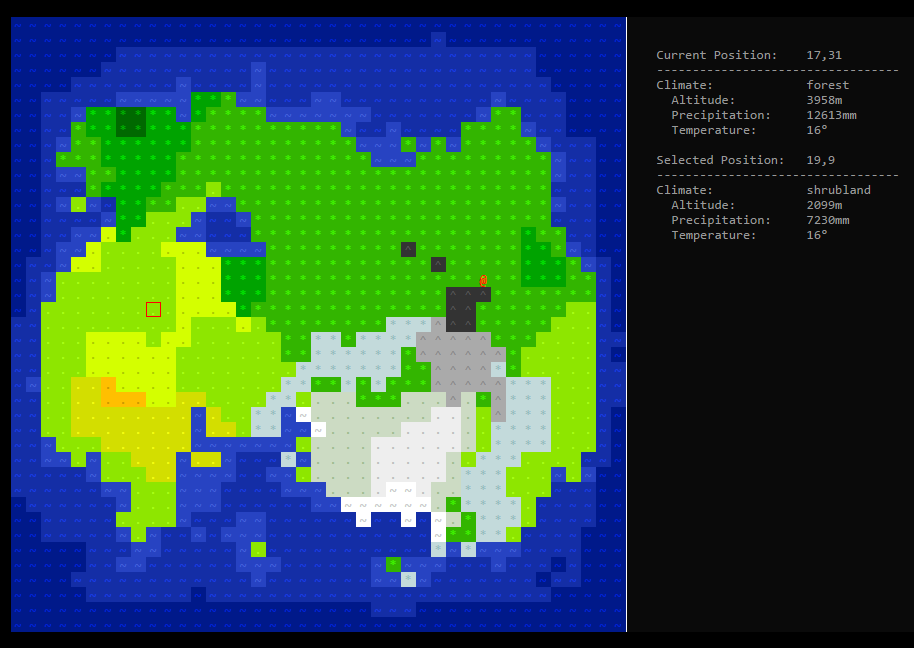

## Waypoint 12: Setup Pac-Man Game Engine

Add a file `game.py` in the folder `pacman` and write a class `PacmanGameEngine` which constructor doesn't take any argument.

Add a private static method `__set_up` to the class `PacmanGameEngine` that initializes the `curses` library and returns a [window object](https://docs.python.org/3/library/curses.html#curses-window-objects) which represents the whole screen.

Add a private static method `_tear_down` to the class `PacmanGameEngine` that takes an argument `window`. This method de-initializes the `curses` library and returns terminal to normal status.

Add a private instance method `__run` that will be used to implement the [game loop](https://dewitters.com/dewitters-gameloop/).

Add a public instance method `start` that takes one argument `level_number` (an integer) representing the level/map to load (_we won't use this argument for the moment_). The method `start` basically calls the following methods in that particular order:

1. `__set_up`: Initialize the screen.
2. `__run`: Run the game.
3. `__tear_down`: Return terminal to normal status.

For example:

```python
>>> game_engine = PacmanGameEngine()
>>> game_engine.start(1)
```

This does almost nothing. We have just setup the core of our game engine.

## Waypoint 13: Color Palette

Handling [colors with `curses`](https://docs.python.org/3.8/howto/curses.html#attributes-and-color) is a bit tricky. `Curses` doesn't allow to use an infinite number of colors, but a set of colors that needs to be declared first. Basically a **color palette**.

You need to get familiarized with `curses` color notions, such as [color definition](https://docs.python.org/3.8/library/curses.html#curses.init_color), color number, pair number. You **SHOULD** definitively play with the `curses` library to display text with different **foreground** and **background** colors.

Write a class `Palette` in the file `model.py`. The constructor of the class `Palette` doesn't take any argument.

Add a public instance method `get_composite_color` that takes two arguments:

- `foreground_color` (required): A foreground color corresponding to a tuple `(r, g, b)` that represents the value of the components R, G, and B that range between `0` and `255`.

- `background_color` (optional): A background color corresponding to a tuple `(r, g, b)` that represents the value of the components R, G, and B that range between `0` and `255`.

The method `get_composite_color` returns the `curse` attribute representing this composite color. If the composite color is not already present in the palette, the function automatically adds it to the palette.

_Note: Standard RGB colors range from `0` to `255`, while `curses` library ranges colors from `0` to `1000`; your code needs to do conversion when setting `curses` colors._

For example:

```python
# Define the RGB components of a few colors.
>>> COLOR_RGB_PACMAN = (255, 255, 0)
>>> COLOR_RGB_BLINKY = (255, 0, 0)
>>> COLOR_RGB_PINKY = (255, 184, 255)
>>> COLOR_RGB_INKY = (0, 255, 255)
>>> COLOR_RGB_CLYDE = (255, 184, 82)

# Initialize the curses library for using colors.
>>> import curses
>>> curses.initscr()
>>> curses.has_colors()
True
>>> curses.start_color()

# Create a palette and register the colors.
>>> palette = Palette()
>>> palette.get_composite_color(COLOR_RGB_PACMAN)
256
>>> palette.get_composite_color(COLOR_RGB_BLINKY)
512
>>> palette.get_composite_color(COLOR_RGB_PINKY)
768
>>> palette.get_composite_color(COLOR_RGB_INKY)
1024
>>> palette.get_composite_color(COLOR_RGB_CLYDE)
1280

# Retrieve the intensity of the RGB components of the curses color
# of Pinky.
>>> curses.pair_number(768)
3
>>> curses.pair_content(3)
(10, 0)
>>> curses.color_content(10)
(1000, 722, 1000)

# Get the 'curses' attribute of a color already added to the palette.
>>> palette.get_composite_color(COLOR_RGB_PINKY)
768
```

## Waypoint 14: Game Scene

The scene is the window where game engine builds and places game objects. The Pac-Man game scene is composed of the map, Pac-Man, ghost monsters, bonuses, high score and [player](https://www.atlasobscura.com/articles/how-1up-went-from-pinball-to-gamer-speak)s' score, remaining [lives](<https://en.wikipedia.org/wiki/Life_(video_games)>), and some other information:

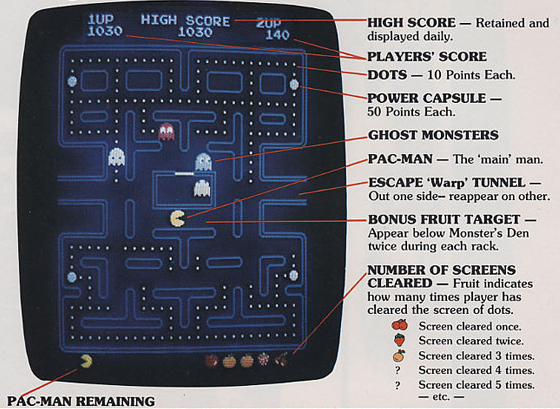

Write the class `Scene` in the file `model.py`. The constructor of this class takes two arguments:

- `window` (required): A [`window`](https://docs.python.org/3/library/curses.html#curses-window-objects) object which represents the whole screen.
- `level` (required): A `Level` object representing the Pac-Man level to play.

For example:

```python
>>> import curses
>>> window = curses.initscr()
>>> level = Level.load(1)
>>> scene = Scene(window, level)
>>> scene
<pacman.model.Scene object at 0x105c46c50>
```

Write an instance method `render` of the class `Scene` that displays the multiple game objects on the window.

For example:

```python
>>> scene.render()
```

| Scores, Life, Number of Screen Cleared | + Map with Dots and Power Capsule | + Pac-Man, Ghosts, and Bonus Fruit  |
| -------------------------------------- | --------------------------------- | ----------------------------------- |
| 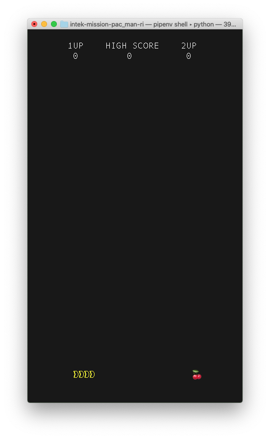     |    | 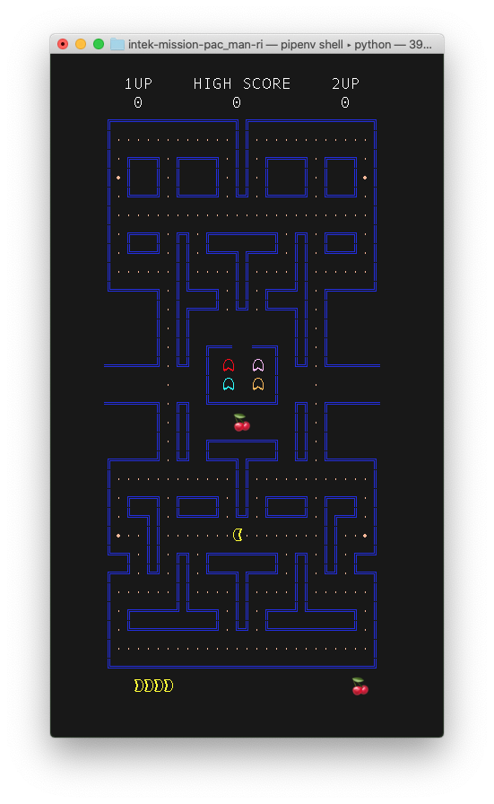 |

## Waypoint 15: Game Loop


The [**game loop**](http://gameprogrammingpatterns.com/game-loop.html) is the heart of a video game. It is an infinite loop that makes the game keep running.

Each [turn of the loop](https://gamedevelopment.tutsplus.com/articles/gamedev-glossary-what-is-the-game-loop--gamedev-2469), it processes user input from a [**game controller**](https://en.wikipedia.org/wiki/Game_controller) (e.g., keyboard, mouse, joystick, etc.) without blocking, updates the game state, and renders the game. It tracks the passage of time to control the rate of gameplay:

```text
while (user does not exit)
    check for user input
    run AI
    move enemies
    resolve collisions
    draw graphics
    play sounds
end while
```

_Note: Unlike most other software, a video game keeps moving even when the user isn't providing input. If you sit staring at the screen, the game doesn’t freeze: animations keep animating, visual effects keep dancing and sparkling. Ghost monsters would keep chomping your Pac-Man, and you eventually loose._

Complete the function `start` of your class `GameEngine` to integrate a basic game loop.

The key `q` allows the user to end the game.

The keyboard [arrow keys](https://en.wikipedia.org/wiki/Arrow_keys) allows the user to set the direction towards which Pac-Man will move continuously and smoothly. When the user presses on an arrow key, Pac-Man starts moving in that direction and doesn't stop until it either hits a wall, or another arrow key is pressed taking Pac-Man in a new direction.

|                                                 |                                    |
| ----------------------------------------------- | ---------------------------------- |
|  | 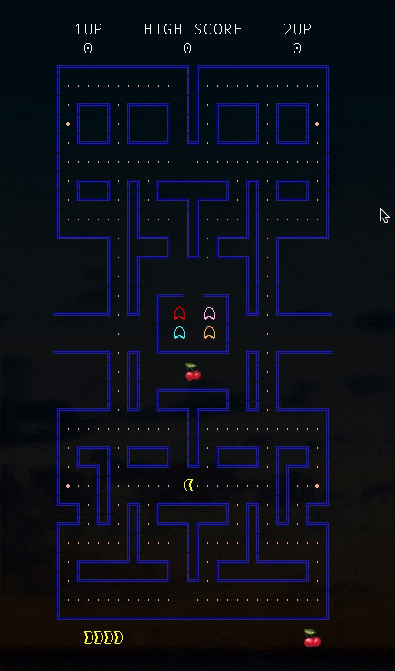 |

Write the method `set_direction` to the class `AnimatedCharacter`. This method takes two arguments `dx` and `dy` (integers between `-1` and `1`) that indicate the horizontal and the vertical directions which the character is moving towards.

Write the instance method `play` to the class `AnimatedCharacter` that takes a parameter `scene` (an object `Scene`). The method `play` updates the current location (coordinates) of the character in the maze depending on the current direction the character is moving towards. If the character hits a wall, the method `play` stops the character and clears the direction that the character was moving towards.

Set the direction of Pac-Man depending on the arrow keys that the user presses on.

## Waypoint 16: Screen Resizing

We would like to center the scene whenever the user changes the size of the terminal's window.

In the game loop of your application, check whether the size of the terminal has changed and center the scene in the terminal's windows accordingly:


Write an instance method `is_fully_visible` to your class `Scene` that takes no argument and that returns `true` if the current terminal window is large enough to display the whole scene, `false` otherwise.

In the game loop of your application, check whether the whole scene can be displayed in the terminal window, and if not, display the message "`Enlarge your... terminal!`" to inform the user that he needs to resize the window of his terminal to continue playing the game:


# Game Play

## Waypoint 17: Score Update and Game End

Update the code of your game loop to detect when Pac-Man eats a dot or a power capsule, and to update the current score of the player accordingly. Eating a dot awards the player `10` points. Eating a power capsule awards the player `50` points. Eating a fruit bonus awards the player the number of points corresponding to this fruit bonus.

For example:

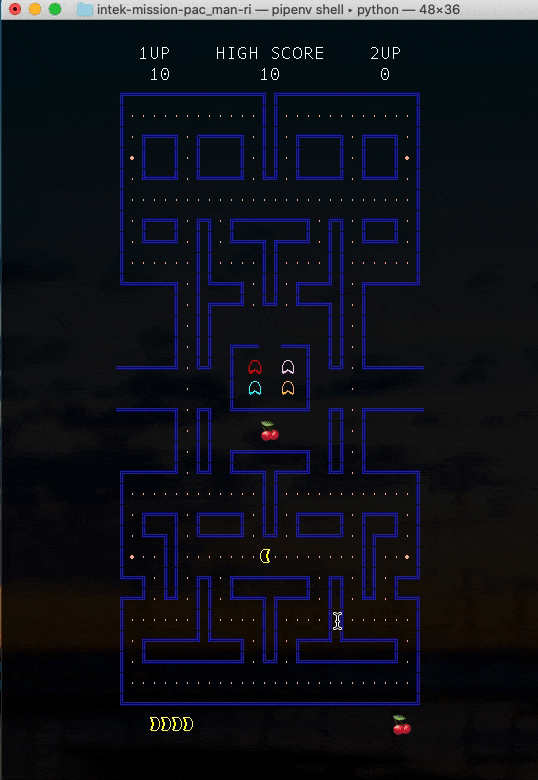

The game ends when Pac-Man has eaten all the dots, capsule powers, and bonus fruits:

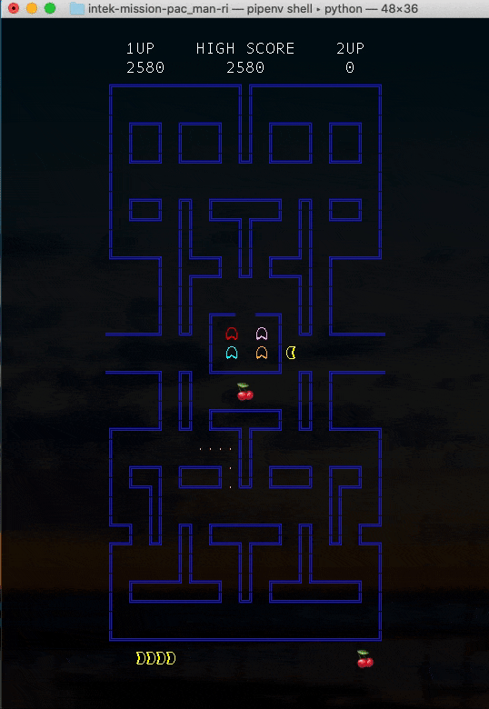

## Waypoint 18: Ghosts Leaving Home and Moving Randomly

There can be only one ghost on a given cell of the maze.

The ghost monsters need first to leave their home before chasing Pac-Man.

Once a ghost has left home, it chooses a direction to move towards. A ghost continues towards this direction until either it hits a wall or it arrives at an intersection:

1. If a ghost hits a wall, it determines a new direction to move **forward**. The ghost doesn't choose a direction that lets it move backward to its previous direction. Going forward and then backward when hitting a wall would look strange!
1. If a ghost arrives at an intersection, it chooses whatever direction that doesn't let it move backward to its previous direction.
1. If a ghost collides with another ghost, it must go to another direction. If a ghost is blocked by two other ghosts, it must hold on until there is a new available direction for it to go to.

[Overload](https://medium.com/@shanikae/polymorphism-explained-simply-75,294c8deeef7) the instance method `play` of the class `Ghost` to implement those behaviors.

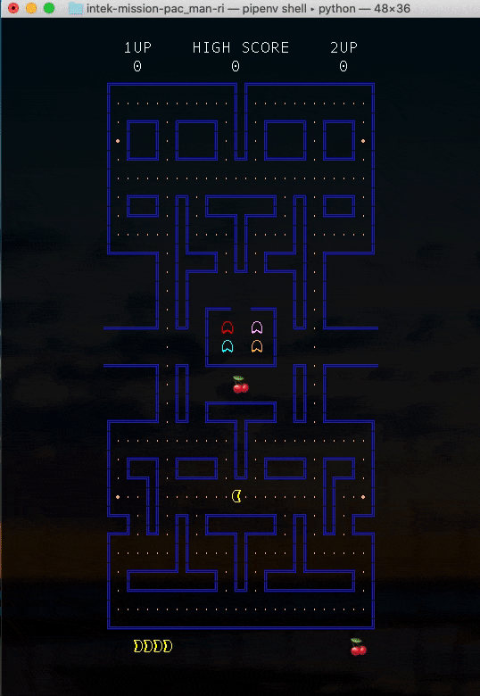

## Waypoint 19: Pac-Man Death

Update the game logic so that when Pac-Man makes contact with a ghost, he looses a life.

The symbol representing Pac-Man alternates between the characters `💀` and `💥` for a total duration 4 seconds, after which Pac-Man reappears at his initial location.

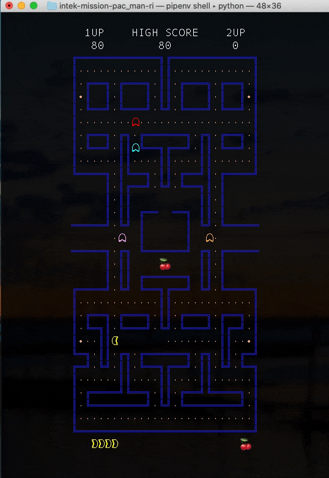

The game ends when all lives are lost.

## Waypoint 20: Eating Power Capsule

When Pac-Man eats a power capsule, all [the ghosts turn vulnerable](https://pacman.fandom.com/wiki/Vulnerable_Ghost). Pac-Man can eat them. They are scared! They turn blue (`rgb((33, 33, 255)`).

The blue effect will wear off rather quickly, and will start to flash white (`rgb(255, 255, 255)`) when it is about to. Ghost will flash between white and blue states during `2` seconds. The total duration from when ghosts turn blue up to when they return to their normal state is `10` seconds.

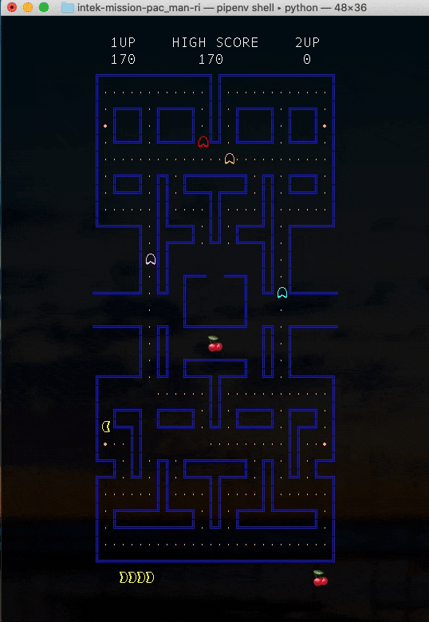

When Pac-Man eats a vulnerable ghost, the ghost's eyes pop out for `10` seconds before the ghost returns to its normal state. During this duration, the ghost continues to move randomly in the maze.

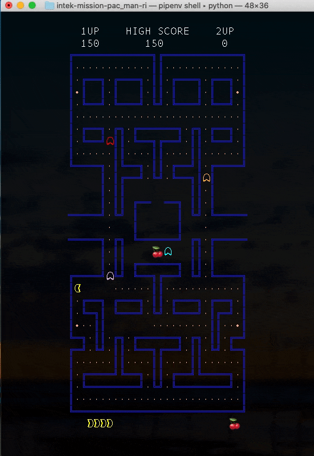

The player is rewarded points each time Pac-Man eats a ghost. The points earned by eating ghosts in succession are:

- 1 in succession: `200` points.
- 2 in succession: `400` points.
- 3 in succession: `800` points.
- 4 in succession: `1600` points.

## Waypoint 21: Standing Start Announcement

A [standing start](https://en.wikipedia.org/wiki/Standing_start) is a type of start in which the characters are stationary when the game begins. This period of time allows the player to gain his attention to the game just before playing.


The standing start announcement corresponds to the text `READY!` that is displayed with the color `rgb(255, 255, 0)` for `3` seconds. The standing start is blinking.

The JSON file of the map indicates the location where the standing start announcement needs to be displayed:

```json
{
  (...)
  "standing_start_announcement": {
    "x": 14,
    "y": 16
  }
}
```

Update the game loop to include the standing start announcement just before the player starts to play.

# Ghosts Artificial Intelligence

## Waypoint 22: Maze Graph

Pac-Man is a [**tile**-based video game](https://en.wikipedia.org/wiki/Tile-based_video_game) where the playing area consists of small square graphic images referred to as **tiles** (**cells**) laid out in a **grid** (**maze**).

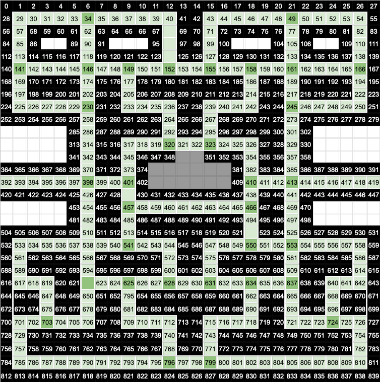

Write a class `Cell` that represents walkable tiles of the Pac-Man maze. Its constructor takes `3` integers `id_`, `x` and `y` (in that order):

- `id_`: Unique identification of the cell in the map.
- `x` and `y`: Location of the cell in the map, starting from `(0, 0)` at the top left position of the maze.

For example:

```python
>>> cell = Cell(85, 1, 3)
>>> cell.id
85
>>> cell.x
1
>>> cell.y
3
>>> cell.y = 2
Traceback (most recent call last):
  File "<stdin>", line 1, in <module>
AttributeError: can't set attribute
```

Each cell is connected to one or more other cells of the maze. This **[doubly linked list](https://en.wikipedia.org/wiki/Doubly_linked_list)** of cells constitutes the corridors of the maze.

Add the instance method `add_neighbor_cell` to the class `Cell`. This method takes an argument `other` that corresponds to another object `Cell`, neighbor to the current instance.

```python
>>> cell1 = Cell(29, 1, 1)
>>> cell1
<Cell at 0x102c63c88>
>>> cell2 = Cell(30, 2, 1)
>>> cell2
<Cell at 0x102c63cf8>
>>> cell1.add_neighbor_cell(cell2)
>>> cell1.neighbor_cells
[<Cell at 0x102c63cf8>]
>>> cell2.add_neighbor_cell(cell1)
>>> cell2.neighbor_cells
[<Cell at 0x102c63cf8>]
```

Add an instance method `is_intersection` to the class `Cell` that takes no argument and that returns `True` if this cell is an intersection of several routes of a maze (i.e., the cell is connected to 3 or 4 neighbor cells); otherwise `False`.

Add a public method instance `build_graph` to the class `Map` that takes two arguments `x` and `y` (integers) and that returns a list of objects `Cell` corresponding to connected cells, i.e., the walkable tiles of the maze ([**graph**](<https://en.wikipedia.org/wiki/Graph_(discrete_mathematics)>)).

The arguments `x` and `y` are respectively the abscissa and ordinates of the location the first walkable cell to start traversing the map with. But what is the best position to start with? Probably not with a cell that corresponds to a wall, nor with cells behind walls. We let you figure out the best position to start with.

We also let you figure out how to generate the unique identification of a cell. It's quite obvious!

For example:

```python
>>> pacman_map = Map.load_map("./map/level1.rle")
>>> cells = pacman_map.build_graph(13, 22)
>>> for i, cell in enumerate(cells):
>>> ... print(f"{i}: {cell.id} ({cell.x}, {cell.y})")
0: 29 (1, 1)
1: 30 (2, 1)
2: 31 (3, 1)
3: 32 (4, 1)
4: 33 (5, 1)
5: 34 (6, 1)
...
290: 805 (21, 28)
291: 806 (22, 28)
292: 807 (23, 28)
293: 808 (24, 28)
294: 809 (25, 28)
295: 810 (26, 28)
```

## Waypoint 23: Maze Weighted Graph

Cells connected to 3 or more other cells correspond to the **vertices** (nodes) of the map's graph. The route segment between two nodes corresponds to the **edges** of this graph. The connection (route segment) between two edges of the graph is **weighted** by the length of the route segment (i.e., the number of cells between these two nodes):

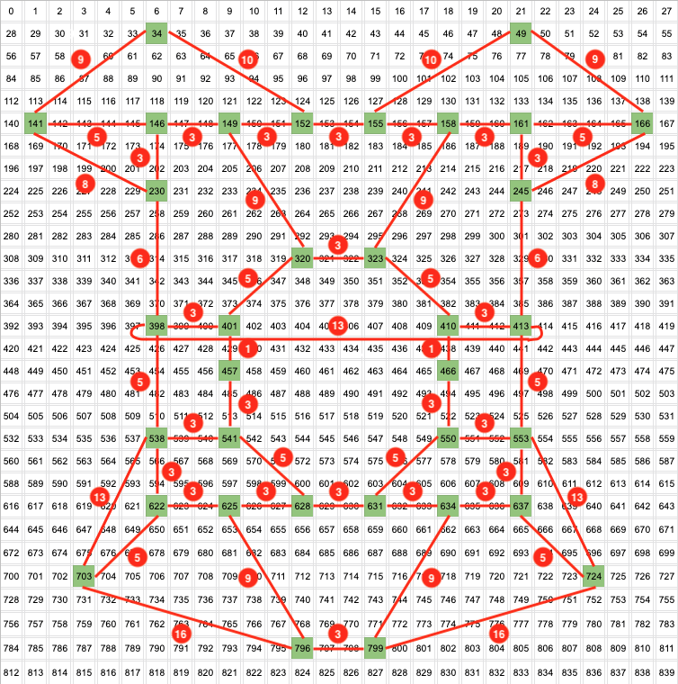

Write a class `Node` which constructor takes an argument `cell` (an object `Cell`). The object `Node` contains the object `Cell` ([**aggregation**](https://www.visual-paradigm.com/guide/uml-unified-modeling-language/uml-aggregation-vs-composition/), i.e., a relationship where the child object can exist independently of the parent object).

The class `Node` surfaces the properties `id`, `x`, and `y` of the class `Cell`.

Add the method `add_neighbor_node` to the class `Node` that takes 2 arguments `node` (an object `Node`) and `distance` (an integer), where `node` represents a node of the graph and `distance` corresponds to the number of cells to traverse from the current node `self` to this node `node`.

Add the public property `neighbor_nodes` to the class `Node` that returns the list of objects `Node` representing the neighbor nodes of this node `self.`

For example:

```python
>>> cell1 = Cell(34, 6, 1)
>>> cell2 = Cell(141, 1, 5)
>>> node1 = Node(cell1)
>>> node2 = Node(cell2)
>>> node1.add_neighbor_node(node2, 9)
>>> node1.neighbor_nodes
[(9, <Node at 0x10db34198>)]
```

Add a public method instance `build_weighted_graph` to the class `Map` that takes two arguments `x` and `y` (integers), and that returns a list of objects `Node`.

For example:

```python
>>> pacman_map = Map.load_map("./map/level1.rle")
>>> nodes = pacman_map.build_weighted_graph(13, 22)
>>> len(nodes)
34
>>> for i, node in enumerate(nodes):
...     print(f"{i}: {node.id} ({node.x}, {node.y})")
...     for distance, neighbor_node in node.neighbor_nodes:
...         print(f"  {neighbor_node.id} ({neighbor_node.x}, {neighbor_node.y}) at {distance}")
0: 34 (6, 1)
  141 (1, 5) at 9
  152 (12, 5) at 10
  146 (6, 5) at 4
1: 49 (21, 1)
  155 (15, 5) at 10
  166 (26, 5) at 9
  161 (21, 5) at 4
2: 141 (1, 5)
  34 (6, 1) at 9
  146 (6, 5) at 5
  230 (6, 8) at 8
3: 146 (6, 5)
  34 (6, 1) at 4
  141 (1, 5) at 5
  149 (9, 5) at 3
  230 (6, 8) at 3

32: 796 (12, 28)
  625 (9, 22) at 9
  703 (3, 25) at 16
  799 (15, 28) at 3
33: 799 (15, 28)
  634 (18, 22) at 9
  796 (12, 28) at 3
  724 (24, 25) at 16
```

## Waypoint 24: Find Shortest Path

Finding the shortest path between two nodes (**vertices**) of a graph consists in finding the succession of nodes, from the source node (departure) to the destination node, that corresponds to the shortest possible distance.


The most known algorithm for finding the shortest path between 2 nodes is [Dijkstra's algorithm](https://en.wikipedia.org/wiki/Dijkstra%27s_algorithm). This algorithm uses a [data structure for storing and querying partial solutions sorted by distance](https://www.youtube.com/watch?v=pVfj6mxhdMw) from the start.

Add an instance method `find_shortest_path` to the class `Map` that takes two arguments `source_node` and `destination_node` (objects `Node`) and that returns a list of objects `Node` corresponding to the shortest route from `source_node` to `destination_node`.

For example:

```python
>>> pacman_map = Map.load_map("./map/level1.rle")
>>> nodes = pacman_map.build_weighted_graph(13, 22)
>>> source_node = nodes[12]
>>> destination_node = nodes[33]
>>> shortest_path = pacman_map.find_shortest_path(source_node, destination_node)
>>> len(shortest_path)
8
>>> for i, node in enumerate(shortest_path):
...     print(f"{i}: {node.id} ({node.x}, {node.y})")
0: 320 (12, 11)
1: 323 (15, 11)
2: 410 (18, 14)
3: 466 (18, 16)
4: 550 (18, 19)
5: 631 (15, 22)
6: 634 (18, 22)
7: 799 (15, 28)
```

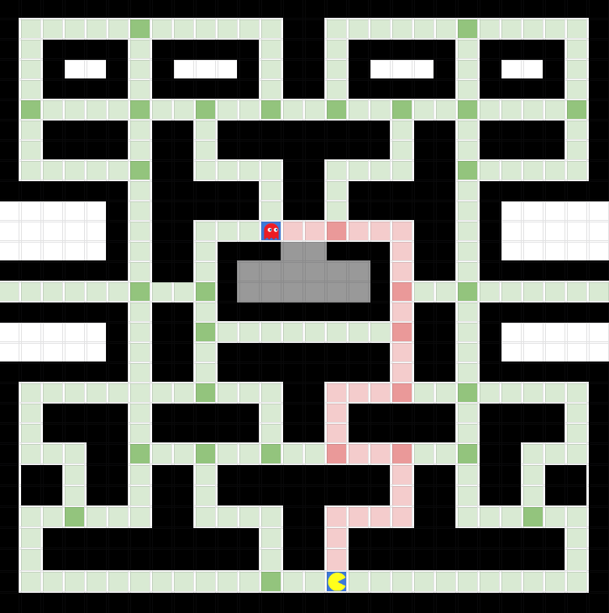

## Waypoint 25: Blinky Chase Strategy

In chase mode, Blinky hunts Pac-Man constantly. In our version of Pac-Man game, Blinky updates its chase strategy each time it arrives at a node (junction of corridors).

Blinky determines the next node of the maze where Pac-Man is at or moving towards. Blinky calculates the shortest path between his current node and this other node. Blinky starts following this path until it reaches an intermediate node where it updates its chase strategy:

|                                                        |                                                        |
| ------------------------------------------------------ | ------------------------------------------------------ |
| 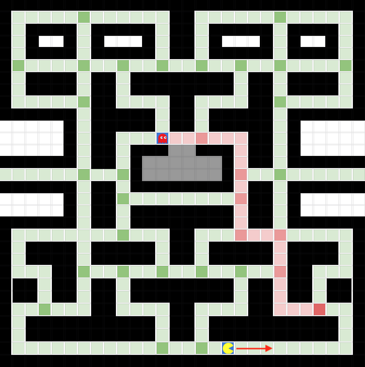 | 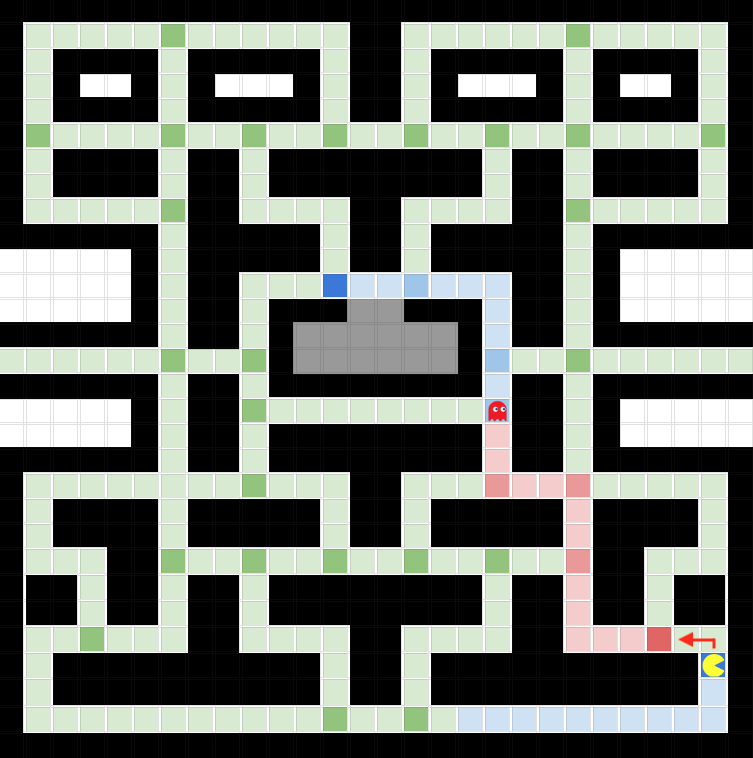 |

If Blinky arrives at the junction where Pac-Man is heading at, Blinky determines the neighbor node which path makes contact with Pac-Man. Blinky starts following this path:


