# Heritage at Risk


(Heritage at Risk Logo; [Evolve Design](http://www.evolvedesign.co.uk/portfolio/english-heritage-heritage-risk/); Jonathan Hawkes, Marianne Westergaard)

[Heritage at risk](https://en.wikipedia.org/wiki/Heritage_at_risk) is term for cultural heritage assets that are at risk as a result of neglect, decay or inappropriate development, or are vulnerable to becoming so.

Armed conflict and war, earthquakes and other natural disasters, pollution, poaching, uncontrolled urbanization and unchecked tourist development pose major problems to world heritage sites. Dangers can be **ascertained**, referring to specific and proven imminent threats, or **potential**, when a property is faced with threats which could have negative effects on its world heritage values.

Heritage at Risk is a mobile application that allows users to take photos of heritages in danger and to submit the report to the Heritage Observatory platform in order to inscribe these heritage in the list of the world heritages at risk. This list is designed to inform the international community of conditions which threaten a characteristics heritage, to inscribe this heritage on the world heritage list (if not already registered), and to encourage corrective action.

_Note: To complete this mission, you will need Intek Curriculum team to provide you two keys to integrate into your mobile application: a **Consumer Key** and a **Consumer Secret**. We will explain later in this mission how these two keys need to be used._

## Storyboard

The Heritage at Risk is a mobile application composed of 4 screens:

| Connection                               | Report List                               | Report Creation                               | Report Submission                             |
| ---------------------------------------- | ----------------------------------------- | --------------------------------------------- | --------------------------------------------- |
|  |  |  |  |

Intek Curriculum team has designed the interface of the Heritage at Risk mobile application mobile application using [Figma](https://www.figma.com/design/), a collaborative cloud-based [interface design and prototyping tool](https://www.youtube.com/watch?v=Cx2dkpBxst8). Please, take a look at our [Figma interface design](https://www.figma.com/file/KLL4LsMD40plD6bvJqcKuK/Heritage-at-Risk) to check out all the styles (e.g., fonts, colors, sizes, etc.) we have specified.

_Note: You may also be interested in [learning more about how to use Figma](https://www.youtube.com/watch?v=jk1T0CdLxwU). You will find several [online video tutorials](https://www.youtube.com/watch?v=3q3FV65ZrUs)._

The navigation between these screens is the following:

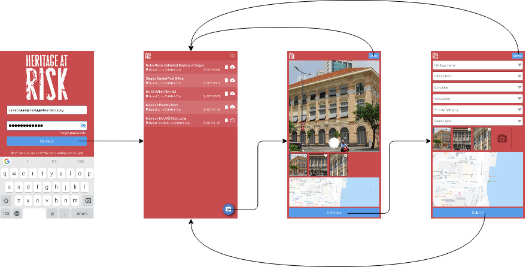

### User Connection

The screen `Connection` allows a user to sign-up (if he doesn't have an account yet) or to sign-in.

|                                         |                                         |                                         |
| --------------------------------------- | --------------------------------------- | --------------------------------------- |
| 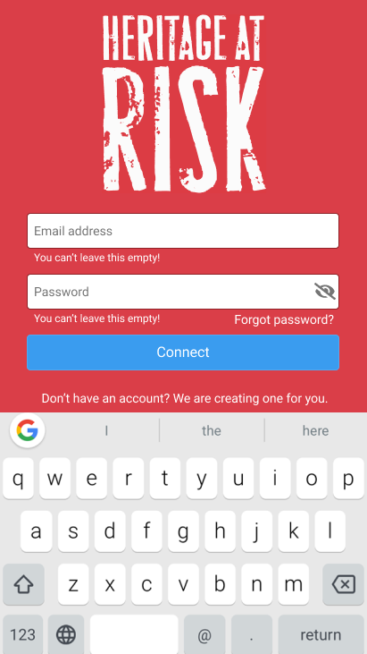 |  | 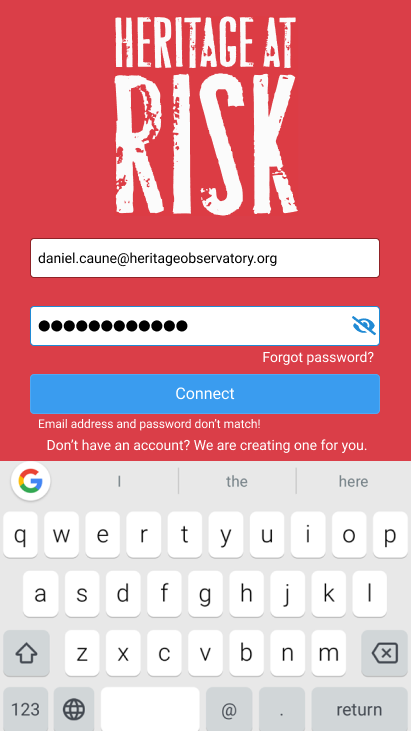 |

### List of Reports

The screen `Report List` displays the list of heritage at risk reports that the user has created.

|                                       |
| ------------------------------------- |
|  |

The screen `Report List` displays the list of heritage at risk reports in rows. Each row is composed of the following information:

- The name of the heritage.
- The formatted address of the heritage.
- The date when this report has been created.

A row provides a button `Delete` to remove the report. The report is soft-deleted from the online platform.

A row provides an indicator that informs whether the report has been successfully submitted to the online platform or whether the submission is still pending (more likely because of current limited network connectivity).

When the user clicks on the button `Camera`, the mobile application redirects the user to the screen `Report Submission` to create a new report of an heritage at risk.

### Settings

If the user clicks on the menu `Settings` located on the topmost rightmost position of the screen, the mobile application slides the menu fragment from the right to the left:

|                                 |                                 |
| ------------------------------- | ------------------------------- |
| 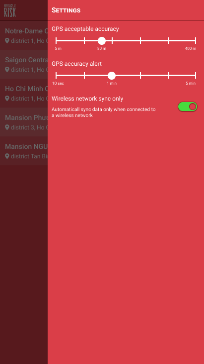 | 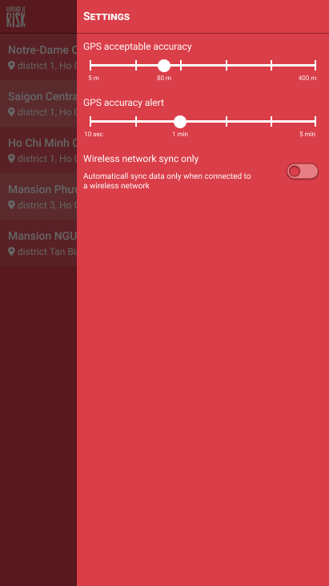 |

The menu fragment has 3 settings:

- **GPS acceptable accuracy**: Indicate the maximum number of meters for which a location is considered as acceptable. Any location updates with accuracy strictly above this number are ignored.
- **GPS accuracy alert**: Indicate the maximum duration of time during which the mobile application has not been able to get location update with an acceptable accuracy, after which the mobile application plays an alert sound.
- **Wireless network sync only**: Indicate whether the mobile application can only transfer data when the phone is connected to Internet through Wi-Fi. If this option is on, the mobile application does not transfer data when it is connected to cellular network (3G, 4G, etc.).

### Report Creation

The screen `Report Creation` allows a user to take one or more photos of an Heritage at Risk, to enter any additional information the user might be aware of.

|                                                      |                                                      |
| ---------------------------------------------------- | ---------------------------------------------------- |
| 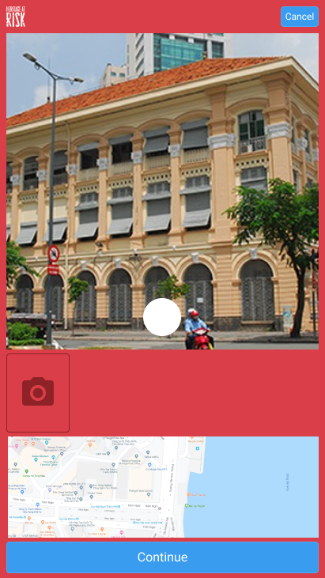 | 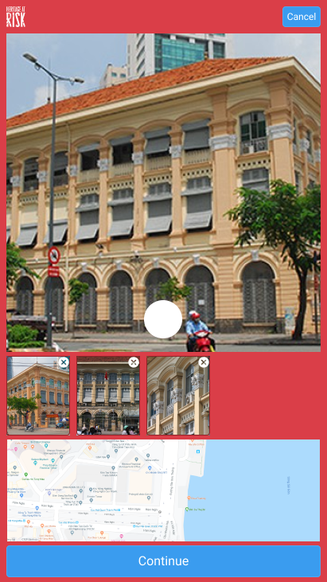 |

When the user accesses this screen, the mobile application continuously requests the mobile phone for GPS location updates. The mobile application centers the digital map to the current location of the user.

When the user takes a photo, the mobile application links the most recent and accurate GPS location to this photo. The mobile application adds a marker in the digital map corresponding to the location where the photo has been taken.

The mobile application allows the user to remove a photo by clicking on the deletion icon at the topmost rightmost position of each photo. The mobile application deletes the photo and removes the corresponding marker from the digital map.

When the user clicks on the button `Continue`, the mobile application redirects the user to the screen `Report Submission`.

If the user clicks on the button `Cancel`, the mobile application deletes all the photos that would have been taken, and redirects the user to the screen `Report List`.

### Report Submission

The screen `Report Submission` allows a user to complete the description of his report and to submit all the data to the server platform.

|                                                   |
| ------------------------------------------------- |
| 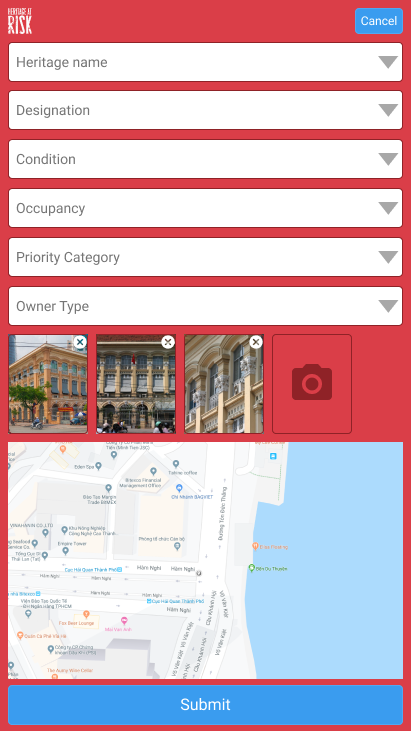 |

The mobile application displays a list of fields allowing the user to enter any information about the heritage at risk the user would be aware of.

The mobile application may be able to automatically determine the name of the heritage. The mobile application sends a request to the online platform providing the locations of the captured photos. The online platform returns a list of heritages that may correspond to these locations. The mobile application fills the corresponding dropdown component with the suggested list of heritages.

The dropdown components of the other input fields correspond to a static list of elements.

If the user taps on the camera mask, located on the rightmost position of the captured photos, the mobile application redirects the user to the initial fragment of the screen `Report Submission` to take additional photos.

When the user clicks on the button `Submit`, the mobile application eventually sends the photos, their respective location, and the description of the report to the online platform.

The mobile application adds this report to the list of the screen `Report List`. As long as the mobile application has limited connectivity, and thus the mobile application hasn't been able to send this report to the online platform, the mobile application displays the report entry with the icon `Cloud Pending` . As soon as the mobile application has network connectivity and it has been able to successfully send the report to the online platform, the mobile application displays the report entry with the icon `Cloud Done`.

If the user clicks on the button `Cancel`, the mobile application deletes all the photos that would have been taken, and redirects the user to the screen `Report List`.

# React Native: Mobile Application Framework

You will have to develop the Heritage at Risk mobile application using React Native.

[React Native](https://reactnative.dev/) is an open-source mobile application framework created by Facebook. It is used to develop cross-platform applications (Android, iOS, Windows).

There are [several other frameworks](https://www.youtube.com/watch?v=4m7msadL5iA) to develop mobile applications. We choose React Native for this mission as you already have learned a bit about HTML/CSS and [JavaScript](https://www.youtube.com/watch?v=W6NZfCO5SIk). And React Native is using these technologies.

However, before starting coding the Heritage at Risk mobile application, we encourage you to get familiarized with the basic principles of React Native by watching a [few tutorial video series](https://www.youtube.com/watch?v=ur6I5m2nTvk&list=PL4cUxeGkcC9ixPU-QkScoRBVxtPPzVjrQ).

You need first to [install React Native](https://www.youtube.com/watch?v=0DhQd_EK1Ng) on your computer.

# User Connection

## Waypoint 1: Implement the UI Layout

Complete the user interface layout of the connection screen as specified below.

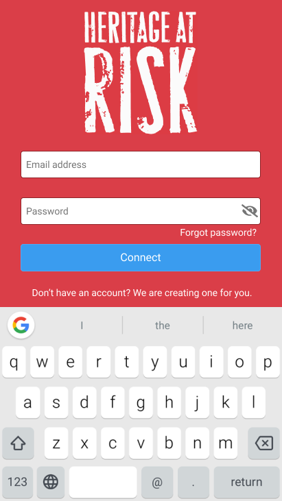

[`LOG-01`] The screen `Connection` is the first screen that is displayed to the user who runs the application.

[`LOG-02`] The user interface layout contains the following components:

- The [logo](https://reactnative.dev/docs/image) of the application (cf. file `logo_har.2.0.png`)
- A [text edit field](https://reactnative.dev/docs/textinput) `Email Address` to allow the user to enter his e-mail address
- A text edit field `Password` to allow the user to enter his password
- A clickable eye icon on the rightmost position of the password edit box
- A [label](https://reactnative.dev/docs/text) that corresponds to a clickable link to allow the user to recover his forgotten password
- A [button](https://reactnative.dev/docs/button) `Connect`
- A label informing the user that the mobile application will automatically create an account if the user is not already registered to the platform

[`LOG-03`] All the user interface components are horizontally centered, except the label `Forgot password?` that is aligned to the right.

[`LOG-04`] The font and border colors of the text edit fields `Email Address` and `Password` are initially `#757575` and `#8F2227`.

[`LOG-05`] When the user clicks on the text edit field `Email Address`, or `Password`, the mobile application changes the border color of the corresponding field to `#208AD4`.

[`LOG-06`] When the user enters text in the text edit field `Email Address`, or `Password`, the mobile application changes the font color of the corresponding field to `#00000`.

[`LOG-07`] If the user leaves the text edit field `Email Address`, or `Password`, by clicking on another component, the mobile application changes the border color of the corresponding field to `#8F2227`.

[`LOG-08`] If the user updates the text edit field `Email Address` and leaves this field, by clicking on another component, the mobile application removes any leading and trailing spaces characters from the text of this edit field.

[`LOG-09`] If the user updates the text edit field `Email Address`, or `Password`, and leaves this field, the mobile application checks whether the textual content of this field is empty or not. If this content is empty, the mobile application changes the font color to `#757575`.

[`LOG-10`] If text edit field `Email Address`, or `Password`, is empty, the mobile application displays its corresponding placeholder `Email Address`, respectively `Password`.

## Waypoint 2: Control User Input

[`LOG-11`] If the user updates the text edit field `Email Address`, and leaves this field by clicking on another component, the mobile application checks whether the textual content of this edit field is empty or not. If this content is not empty, the mobile application checks whether this content complies with the format of an email address (cf. [RFC 2822](http://tools.ietf.org/html/rfc2822#section-3.4.1)). If not, the mobile application displays a label below the text edit field `Email Address` to inform the user that the email address entered is invalid.

[`LOG-12`] If the user clicks on the button `Connect` while the text edit field `Email Address` is empty, the mobile application displays a label under this text edit field to inform the user that he cannot leave this field empty.

[`LOG-13`] If the user clicks on the button `Connect` while the text edit field `Password` is empty, the mobile application displays a label under this text edit field to inform the user that he cannot leave this field empty.

| Invalid Value                    | Empty Value                      |
| -------------------------------- | -------------------------------- |
| 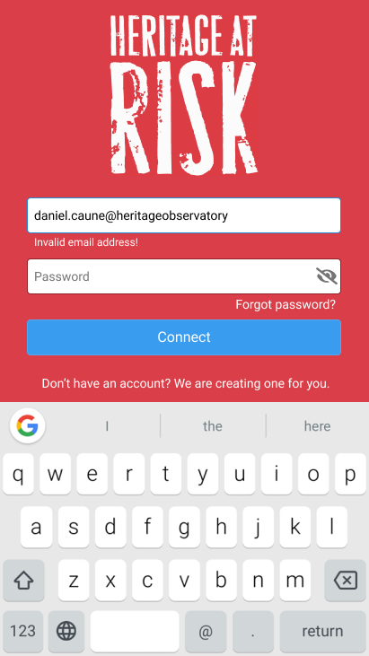 |  |

[`LOG-14`] The eye icon initially is the [`eye-slash`](https://fontawesome.com/icons/eye-slash?style=regular) icon: the password is hidden. The foreground color of this icon is `#757575`.

[`LOG-15`] When the user clicks on the eye icon, it toggles from [`eye-slash`](https://fontawesome.com/icons/eye-slash?style=regular) to [`eye`](https://fontawesome.com/icons/eye?style=regular) and back to [`eye-slash`](https://fontawesome.com/icons/eye-slash?style=regular), and the [password is respectively shown and hidden](https://medium.com/@Mdmoin07/react-native-hide-show-password-input-d4be4d0f70aa). The foreground color of this icon stays `#757575`.

| Hidden Password                  | Visible Password                 |
| -------------------------------- | -------------------------------- |
| 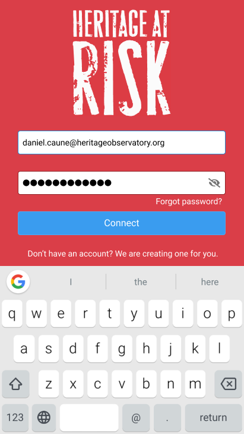 | 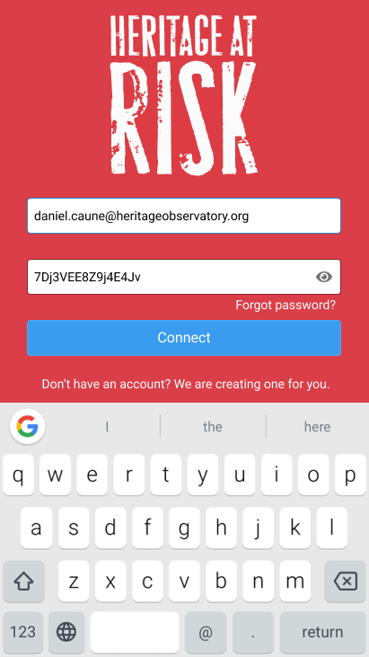 |

## Waypoint 3: Connect the User

### HTTP Request

[`LOG-16`] If the user clicks on the button `Connect` while both text edit fields `Email Address` and `Password` are not empty, the mobile application [sends an HTTP request](https://reactnative.dev/docs/network) to the RESTful API server to connect the user providing his email address and his password.

The [Uniform Resource Identifier (URI)](https://en.wikipedia.org/wiki/Uniform_Resource_Identifier) of the RESTful API server's endpoint to connect the user is defined with the following components:

- Scheme: `HTTPS`
- Hostname : `api.heobs.org`
- Path: `/account/session`

The [HTTP method](https://en.wikipedia.org/wiki/Hypertext_Transfer_Protocol#Request_methods) to perform on this endpoint is [`POST`](<https://en.wikipedia.org/wiki/POST_(HTTP)>).

The mobile application needs to [pass the email address and the password](https://codeburst.io/integrating-react-native-apps-with-back-end-code-using-fetch-api-8aeb83dfb428) entered by the user in a JSON expression to be passed in the body message of the HTTP request.

For example:

```json
{
  "email_address": "daniel.caune@heritageobservatory.org",
  "password": "7Dj3VEE8Z9j4E4Jv"
}
```

The mobile application needs to pass the HTTP header [`Content-Type`](https://developer.mozilla.org/en-US/docs/Web/HTTP/Headers/Content-Type) with the value `application/json` to designate the format of the [body of the request](https://en.wikipedia.org/wiki/HTTP_message_body) to be in JSON format.

```bash
$ curl -XPOST https://api.heobs.org/account/session \
     -H 'Content-Type: application/json' \
     -d '{"email_address": "daniel.caune@heritageobservatory.org", "password": "7Dj3VEE8Z9j4E4Jv"}'
```

### HTTP Request Signature

But, it's still not enough! You are missing a few other HTTP headers to pass along this HTTP request, otherwise the RESTful API server would refuse serving your request:

```json
{
  "error": "MissingHeaderException",
  "message": "Required HTTP header \"X-API-Key\" is not passed"
}
```

Hmmm... What does this `X-API-Key` HTTP header correspond to?

Intek Curriculum team has provided you two keys:

- **Consumer Key**: A unique string for your mobile application to identify itself to the RESTful API server (for example: `ac0842a888e611e58224c80aa9c8e9fb`).
- **Consumer Secret**: A secret used by your mobile application to establish ownership of the **Consumer Key** (for example: `NDk2MGFmMTNjZjYwNDVhODg0ZmZlNGFhYTMzNGJhOTM=`).

The value of the HTTP header `X-API-Key` is the **Consumer Key** that Intek Curriculum team has provided to you. Simple!

But, you also need to add the HTTP header `X-API-Sig` along your HTTP request. What is the value of this HTTP header the **Consumer Secret**? Almost... :)

The value of the HTTP header `X-API-Sig` has to be generated with the encryption of a few data using your **Consumer Secret**:

1. You concatenate the path of the HTTP request with the content of the body message:

```text
account/session{"email_address": "daniel.caune@heritageobservatory.org", "password": "7Dj3VEE8Z9j4E4Jv"}
```

2. You encrypt this message with the [cryptographic hash](https://en.wikipedia.org/wiki/SHA-1) function [`SHA1`](https://www.npmjs.com/package/react-native-sha1).

For example, in Python:

```python
import hmac
import hashlib

MY_CONSUMER_SECRET = 'NDk2MGFmMTNjZjYwNDVhODg0ZmZlNGFhYTMzNGJhOTM='

path = 'account/session'
body_message = '{"email_address": "daniel.caune@heritageobservatory.org", "password": "7Dj3VEE8Z9j4E4Jv"}'

message = path + body_message

encrypted_content = hmac.new(
    MY_CONSUMER_SECRET.encode(),
    msg=message.encode(),
    digestmod=hashlib.sha1)

http_api_sig = encrypted_content.hexdigest()
```

3. You pass the hexadecimal hash value in the HTTP header `X-API-Sig` (in this example, this would be `4f5898427a66a802cd052b4bebace407259d16be`)


Hard to guess, huh?! That's the idea! You need to get your **Consumer Private** secured, and no other client application would be able to generate the correct hash value and to pretend to be your mobile application.

The RESTful API server has your two keys stored in its secured storage. The RESTful API server identifies your mobile application with the **Consumer Key** passed in the HTTP header `X-API-Key`. The RESTful API server then retrieves your associated **Consumer Secret** from its secured storage. The RESTful API server performs the same encryption with the data of your HTTP request than your application did, and it compares the result with the hash value that your application passes in the HTTP header `X-API-Sig`. If the two values correspond, it means that the HTTP request has been sent on behalf of your application, otherwise the RESTful API server rejects the HTTP request.


### Error Handling

If your mobile application is missing information (e.g., wrong endpoint, incomplete JSON data, missing HTTP headers) or if the authentication of the user fails (e.g., email address and password don't match together), the RESTful API server returns a status code [`4xx` (client errors)](https://en.wikipedia.org/wiki/List_of_HTTP_status_codes#4xx_Client_errors) or [`5xx` (server errors)](https://en.wikipedia.org/wiki/List_of_HTTP_status_codes#5xx_Server_errors) with JSON data.

For example:

```json
{
  "error": "UndefinedObjectException",
  "message": "Undefined API consumer key"
}
```

or

```json
{
  "error": "AuthenticationFailureException",
  "message": "None"
}
```

### User Session Storage

If the authentication of the user passes successfully, the RESTful API server returns a status code `200` with the following JSON data:

```json
{
  "account_id": "b1f1211a-41f6-11e7-9da0-0007cb040bcc",
  "account_type": "standard",
  "app_id": "43886e4e-48b6-11ea-8e0d-0008a20c190f",
  "creation_time": "2017-05-26T11:35:46.112+02:00",
  "expiration_time": "2020-05-14T04:07:29.724+02:00",
  "fullname": "Daniel CAUNE",
  "is_primary": true,
  "is_verified": false,
  "locale": "fra",
  "picture_id": "59a3628e-58cb-11e7-9da0-0007cb040bcc",
  "picture_url": "https://cdn.heobs.org/avatar/59a3628e-58cb-11e7-9da0-0007cb040bcc",
  "object_status": "enabled",
  "session_id": "2b06a6f4-932c-11ea-8e0d-0008a20c190f",
  "update_time": "2017-06-24T13:08:55.135+02:00"
}
```

You will need to [store this information](https://pusher.com/tutorials/persisting-data-react-native) into your mobile application so that if the user closes the application and reruns it, the mobile application doesn't require the user to login again.

# List of Reports


The screen `Reports List` is the main screen of the mobile application. It lists all the reports that the user has created and submitted to the server platform.

## Waypoint 4: Implement the UI Layout

[`LST-01`] The screen `Reports List` has a header composed of the logo of the mobile application displayed on the leftmost position of the header, and an [icon](https://fontawesome.com/icons/bars), on the rightmost position of the header, to open the settings menu of the application.

[`LST-02`] The body of the screen `Reports List` is composed of rows, one row per Heritage at Risk report that the user has created and submitted. The body is initially empty. The body can vertically scroll if there are more rows than the body's height.

[`LST-03`] A row associated to a Heritage at Risk report is composed of:

- The name of the heritage.
- The formatted address of the heritage.
- The date when this report has been created.
- A button `Delete` to remove this report.
- An icon that indicates whether the report has been successfully submitted to the online platform or whether the submission is still pending (more likely because of current limited network connectivity):
  - [`Queued`](https://fontawesome.com/icons/cloud?style=regular): The report has been submitted for transmission to the RESTful API server, but not yet fully transferred
  - [`Stored`](https://fontawesome.com/icons/cloud-upload-alt?style=solid): The report has been successfully transferred to the RESTful API server

[`LST-04`] The body has a floating button located on the rightmost bottommost position of the body. The icon displayed in the floating button represents a [camera](https://fontawesome.com/icons/camera). This floating button allows the user to create a new report. When the user clicks on this button, the mobile application opens the screen `Report Creation`.

## Waypoint 5: Fetch the List of Reports

[`LST-05`] When the mobile application opens the screen `Reports List`, it sends an HTTP request to the RESTful API server to fetch the list of reports submitted by the user.

- HTTP method: `GET`
- Scheme: `HTTPS`
- Hostname : `api.heobs.org`
- Path: `/har/report`

The mobile application needs to add the HTTP header `X-Authentication` with the login session identification of the user. This information allows the RESTful API server to identify the user whose reports need to be returned to the mobile application.

The RESTful API server returns JSON data corresponding to a list of reports of this user:

```json
[
  {
    "condition": string,
    "creation_time": timestamp,
    "designation": string,
    "formatted_address": string,
    "grade": string,
    "is_address_edited": boolean,
    "is_anonymous": boolean,
    "is_location_edited": boolean,
    "location": {
      "accuracy": decimal,
      "altitude": decimal,
      "latitude": decimal,
      "longitude": decimal
    },
    "name": string,
    "occupancy": string,
    "owner_type": string,
    "photos": [
      _photo_info_,
      ...
    ],
    "place_id": string,
    "priority_category": string,
    "report_id": string,
    "update_time": timestamp
  },
  ...
]
```

Among all this information, your mobile application only needs to [save in its local storage](https://pusher.com/tutorials/persisting-data-react-native) the following attributes:

- `report_id` (required): Identification of this report.
- `name` (optional): Name given to the Heritage at Risk.
- `formatted_address` (optional): Postal address of the heritage.
- `creation_time` (required): Date and time when this report has been created.

This HTTP request will initially return an empty array. How to test your layout without data?! One solution is to use some fake made-up data. This approach is commonly referred to as testing with mock data or simply "**mocking**". Mock data is fake data which is artificially inserted into a piece of software. There are a few online services that help you in [generating mock data](https://www.mockaroo.com/).

## Waypoint 6: Delete a Report

[`LST-06`] When the user clicks on the button `Delete` of a row, the mobile application sends an HTTP request to the RESTful API server to delete the corresponding Heritage at Risk report:

- HTTP method: `DELETE`
- Scheme: `HTTPS`
- Hostname : `api.heobs.org`
- Path: `/har/report/(report_id)`

Where `(report_id)` is replaced with the identification of the report to delete.

The mobile application needs to add the HTTP header `X-Authentication` with the login session identification of the user. This information allows the RESTful API server to check the user on behalf whom the report is requested to be deleted. If the user is not the owner of the report (i.e., the user who created and submitted this report), the RESTful API server will deny the deletion of this report.

For example:

```bash
$ curl -XDELETE https://api.heobs.org/har/report/5215f46e4e1911ea8e0d0008a20c190f \
     -H 'Content-Type: application/json' \
     -H 'X-API-Key: ac0842a888e611e58224c80aa9c8e9fb' \
     -H 'X-API-Sig: 4f5898427a66a802cd052b4bebace407259d16be' \
     -H 'X-Authentication: 2b06a6f4932c11ea8e0d0008a20c190f'
```

[`LST-07`] If the report is not yet fully transmitted to the RESTful API server, the application doesn't need to call the RESTful API server.

[`LST-08`] If the RESTful API server returns a status code different than `200`, the mobile application displays an [alert dialog](https://reactnative.dev/docs/alert) to inform the user that the deletion of the report has failed. The alert dialog is composed of:

- a title "Report Deletion Failure"
- a message "Our servers cannot process your request at this time. Please try again later."
- a button "OK"

[`LST-09`] If the RESTful API server returns a status code `200`, the mobile application deletes the report from its local storage, and it removes the row from the list.

# Report Creation

When the user clicks on the button `Camera`, the mobile application redirects the user to the screen `Report Creation` to edit a new report of an heritage at risk.

## Waypoint 7: Implement the UI Layout

[`CRE-01`] The screen `Report Creation` has a header composed of the logo of the mobile application displayed on the leftmost position of the header, and a button `Cancel`, on the rightmost position of the header, that cancels the current report and redirects the user to the screen `Reports List`.

[`CRE-02`] The body of the screen `Report Creation` is composed of several areas from top to bottom:


- The [live preview](https://react-native-community.github.io/react-native-camera/docs/installation.html) of the camera of the mobile device, with a button to take picture centered on the bottommost position of this preview
- A row where all the photos taken are displayed horizontally (initially empty)
- An [electronic map](https://github.com/react-native-community/react-native-maps)
- A button `Continue`

_Note: You will need to [install React Native Maps](https://www.youtube.com/watch?v=WGtW14z4KDQ), and request Intek Curriculum Team to provide you a Google Maps API key._

## Waypoint 8: Geolocation of the User

[`CRE-03`] The mobile application determines the [current location](https://github.com/react-native-community/react-native-geolocation) of the user, and it keeps [updating this location](https://www.youtube.com/watch?v=bV7cLu7WL78) as long as the user stays on this screen.

[`CRE-04`] When the current location of the user changes, the mobile application [centers the map to this location](https://www.youtube.com/watch?v=AzjWv1X-uyg).

## Waypoint 9: Photo Capture

[`CRE-05`] When the user presses on the capture button of the camera's preview, the mobile application [takes a picture](https://www.youtube.com/watch?v=Ikgfr9Yot1M), stores the picture file to its local storage, and reminds the current location of the mobile device when this picture has been taken.

[`CRE-06`] The camera's preview always stays active, ready to take new pictures.

[`CRE-07`] Once the mobile application took a picture, it adds this picture at the end on the rightmost position of the list of pictures already taken.


[`CRE-08`] The mobile application displays a circle button with an [icon `X`](https://fontawesome.com/icons/times-circle?style=solid), on the topmost rightmost position of the picture, to allow the user to delete this photo.

[`CRE-09`] If the user clicks on the button to delete a picture, the mobile application removes this picture from the visual component, and it deletes the picture file from the local storage.

[`CRE-10`] If the width of the pictures list component is not large enough to show all the pictures that the user has taken so far, the user can horizontally scroll the content of this component.

[`CRE-11`] The mobile applications allows the user to take no more than 20 pictures for the creation of a heritage at risk report.

# Report Submission

When the user clicks on the button `Continue` of the screen `Report Creation`, the mobile application redirects the user to the screen `Report Submission` to complete the description of the Heritage at Risk and to submit this report to the RESTful API server.

## Waypoint 10: Implement the UI Layout

[`SUB-01`] The screen `Report Submission` has the same header than the previous screen `Report Creation`.

[`SUB-02`] The body of the screen `Report Submission` is composed of several [dropdown lists](https://github.com/alinz/react-native-dropdown) vertically arranged that allows the user to provide information.


- **Heritage Name**: For your mission, this field is actually a text edit field that the user can use to enter the name of the heritage at risk.

- **Designation**: Indicates the principal designation of the heritage. The associated dropdown list contains the following items:

  - `LB`
  - `LPW`
  - `SM`
  - `RGP`
  - `RB`
  - `PWS`
  - `CA`

- **Condition**: Indicates the actual condition of the heritage at risk, The associated dropdown list contains the following items:

  - `bad`
  - `poor`
  - `fair`
  - `good`

- **Occupancy**: Indicates the occupancy of the heritage at risk. The associated dropdown list contains the following items:

  - `vacant`
  - `occupied`
  - `part_occupied`
  - `unknown`
  - `not_applicable`

- **Priority Category**: Indicates the required action to preserve the heritage at risk. The associated dropdown list contains the following items:

  - `A`
  - `B`
  - `C`
  - `D`
  - `E`
  - `F`

- **Owner Type**: Indicates who is the owner of this heritage at risk. The associated dropdown list contains the following items:

  - `local_authority`
  - `multiple_owners`
  - `religious_organization`
  - `private`

[`SUB-03`] The rest of the body of the screen `Report Submission` is composed of the row of pictures that the user has taken, and the button `Submit` to submit the report.

[`SUB-04`] The user can remove one or more photos from the list.

[`SUB-05`] If the user taps on the camera mask, located on the rightmost position of the captured photos, the mobile application redirects the user to the screen `Report Creation` to take additional photos.

## Waypoint 11: Submit Report

[`SUB-06`] If the user clicks on the button `Submit`, the mobile application [queues the submission of the report](https://github.com/billmalarky/react-native-queue) to the RESTful API server, and immediately redirects the user to the screen `Reports List` where it adds a row with the information of this report.

We need the mobile application to differ the submission of the report to the RESTful API server for a couple of reasons:

- The mobile device of the user might not be connected to the Internet.
- If the user has taken a lot of photos, it could take quite a long time to transfer all these photos to the server platform.

<<<<<<< HEAD
All these situations should not block the user in continuing using his mobile application to create a new report of an heritage at risk. The mobile applications needs to upload data to the server platform in a background process, and when the submission of a report has been completed, the mobile application updates the icon status of the report in the screen `Reports List` to inform that the report has been fully submitted to the server. As long as the mobile application has limited connectivity, and thus the mobile application hasn't been able to send this report to the online platform, the mobile application displays the report entry with the icon `Cloud Pending` . As soon as the mobile application has network connectivity and it has been able to successfully send the report to the online platform, the mobile application displays the report entry with the icon `Cloud Done`.

[`SUB-07`] The mobile application first sends an HTTP request to the RESTful API server to create the report providing the information that the user has inputted:

- HTTP method: `POST`
- Scheme: `HTTPS`
- Hostname : `api.heobs.org`
- Path: `/har/report`

The mobile application needs to pass a body message that contains the following JSON structure:

```json
{
  "condition": string,
  "designation": string,
  "grade": string,
  "occupancy": string,
  "owner_type": string,
  "place_name": string,
  "priority_category": string
}
```

For example:

```bash
$ curl -XDELETE https://api.heobs.org/har/report/5215f46e4e1911ea8e0d0008a20c190f \
     -H 'Content-Type: application/json' \
     -H 'X-API-Key: ac0842a888e611e58224c80aa9c8e9fb' \
     -H 'X-API-Sig: 4f5898427a66a802cd052b4bebace407259d16be' \
     -H 'X-Authentication: 2b06a6f4932c11ea8e0d0008a20c190f' \
     -d '{
      "condition": "poor",
      "designation": "LPW",
      "grade": "I",
      "occupancy": "not_applicable",
      "owner_type": "religious_organization",
      "place_name": "Nha Tho Duc Ba",
      "priority_category": "F"
    }'
```

The RESTful API server returns the following JSON data:

```json
{
  "report_id": string,
  "object_status": string,
  "creation_time": timestamp
}
```

where:

- `report_id` (required): Identification of the report.

- `object_status` (required): Current status of this report.

- `creation_time` (required): Time when this report has been registered to the server platform.

[`SUB-08`] The mobile application uploads every photo of this report to the RESTful API server:

- HTTP method: `POST`
- Scheme: `HTTPS`
- Hostname : `api.heobs.org`
- Path: `/har/report/(report_id)/photo`

where `(report_id)` is replaced with the identification of the report as the RESTful API server returned.

The content type of the HTTP request is not `application/json`, but `multipart/form-data`. The MIME multipart data stream MUST conform to `RFC 2388 <http://www.ietf.org/rfc/rfc2388.txt>`. Each photo file is uploaded as part of MIME data stream. The field name of the `Content-Disposition` header that qualifies the entry has no importance, nor does the original name of the file has.

For example:

```bash
$ curl -XPOST "http://api.heobs.org/har/report/f31aa1c2f1bd11e1abf1109adda98fe0/photo" \
     -F file=@"~/IMG1224.jpg" \
     -H 'X-API-Key: ac0842a888e611e58224c80aa9c8e9fb' \
     -H 'X-API-Sig: 3706c4d77fcd8e99b5f1e5d22d7d7623786ce419' \
     -H 'X-Authentication: 2b06a6f4932c11ea8e0d0008a20c190f'
```
=======
All these situations should not block the user in continuing using his mobile application to create a new report of an heritage at risk. The mobile applications needs to upload data to the server platform in a background process, and when the submission of a report has been completed, the mobile application updates the icon status of the report in the screen `Reports List` to inform that the report has been fully submitted to the server. As long as the mobile application has limited connectivity, and thus the mobile application hasn't been able to send this report to the online platform, the mobile application displays the report entry with the icon `Cloud Pending`. As soon as the mobile application has network connectivity and it has been able to successfully send the report to the online platform, the mobile application displays the report entry with the icon `Cloud Done`.
>>>>>>> a3b0316ce184891fe1c34ddbd0eb34b31335ed60
