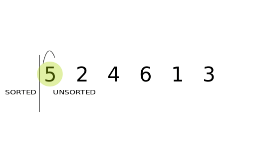

# Sorting Algorithms


A sorting algorithm is an [algorithm](https://en.wikipedia.org/wiki/Algorithm) that puts elements of a list in a certain order. The most frequently used orders are numerical order and [lexicographical order](https://en.wikipedia.org/wiki/Lexicographical_order).

The input data is often stored in an [**array**](https://en.wikipedia.org/wiki/Array_data_type), which allows [random access](https://en.wikipedia.org/wiki/Random_access), rather than a **list**, which only allows [sequential access](https://en.wikipedia.org/wiki/Sequential_access).

# Preamble

## Python Data Structure: List vs Array

Python data structure [`list`](https://docs.python.org/3/library/stdtypes.html#list) is a bit confusing, compared to some other programming languages, in the sense that Python [`list`](https://docs.python.org/3/tutorial/datastructures.htm) shares similarities with an array:

- It is used for storing data
- It is [**mutable**](https://docs.python.org/3/library/stdtypes.html#typesseq-mutable), i.e., which elements can be modified after the list is created
- It can be randomly indexed and iterated through
- It can be [sliced](https://docs.python.org/3/tutorial/introduction.html#lists), i.e., a [range of sequence's elements (defined with a _start_, a _stop_, and a _step_ parameters)](https://railsware.com/blog/python-for-machine-learning-indexing-and-slicing-for-lists-tuples-strings-and-other-sequential-types/) can be directly accessed, changed, or deleted

Even more confusing, while **`list`** is a Python standard data type, built into the interpreter, **`array`** is not:

```python
Python 3.7.3 (default, Mar 27 2019, 09:23:15)
[Clang 10.0.1 (clang-1001.0.46.3)] on darwin
Type "help", "copyright", "credits" or "license" for more information.
>>> list
<class 'list'>
>>> array
Traceback (most recent call last):
  File "<stdin>", line 1, in <module>
NameError: name 'array' is not defined
```

However, **`array`** data type is available in Python, for instance in the module [`array`](https://docs.python.org/3/library/array.html) of the Python Standard Library, or in 3rd party libraries, such as [`numpy`](https://numpy.org/) (he fundamental package for scientific computing with Python), that developers need to install to their computer. These modules need to be imported first in order to use the corresponding data type `array`:

```python
>>> from array import array
>>> array
<class 'array.array'>

>>> from numpy import array
>>> array
<built-in function array>
```

This is the reason **lists** are more often used than **arrays** in Python.

## Mission Requirements

[Your mission](./mission_impossible_theme.ogg), should you choose to accept it, is to write several sorting algorithms of increasing performance:

1. Bubble sort
1. Selection sort
1. Insertion sort
1. Merge sort
1. Quicksort

`[REQ-01]` You create a file `sort.py` where you will write all the sorting functions.

`[REQ-02]` Each sorting function takes an argument `l` (a list of elements) and returns a tuple `(comparisons, reads, writes)` of operations performed by your sort function, where:

- `comparisons`: Number of **comparison** operations
- `reads`: Number of **read access** operations (to the list of elements)
- `writes`: Number of **write access** operations (to the list of elements)

The performance of an in-place sorting algorithm mostly depends on the number of comparisons it does and the number of read and write accesses to the list it does to eventually order the elements of the input list. These operations have a direct impact on the [time complexity](https://en.wikipedia.org/wiki/Time_complexity) of an algorithm (cf. [Big-O complexity](https://www.bigocheatsheet.com/)). The less number of these operations, the fastest. This is the reason you **MUST** count every of these operations.

For instance, let's consider the following pseudocode:

<pre><code><strong>if</strong> A[i - 1] > A[i] <strong>then</strong>
    swap A[i - 1] with A[i]
<strong>end if</strong></code></pre>

where:

- `A` represents an array (i.e., the Python list that is passed to your sort function).
- `i` and `j` represent some indices to access elements of this array `A`.

The first line "`if A[i - 1] > A[i] then`" does 2 reads (`A[i -1]` and `A[i]`) and 1 comparison.

The second line "`swap A[i - 1] with A[i]`" needs to do 2 reads and 2 writes, decomposed as follows:

<pre><code>    <strong>let</strong> t ← A[i - 1]
    A[i - 1] ← A[i]
    A[i] ← t</code></pre>

Therefore this pseudocode does:

- **`1`** comparison
- **`4`** read accesses
- **`2`** write accesses

You can rewrite this pseudocode as follows to optimize the number of read accesses:

<pre><code><strong>let</strong> a ← A[i - 1]
<strong>let</strong> b ← A[i]
<strong>if</strong> a > b <strong>then</strong>
    A[i - 1] ← b
    A[i] ← a
<strong>end if</strong></code></pre>

This new pseudocode does:

- **`1`** comparison
- **`2`** read accesses
- **`2`** write accesses

`[REQ-03]` Each sorting function **MUST** sort the input list's elements by their ascending order.

`[REQ-04]` Each sorting function **MUST** sort the input list [**in-place**](https://en.wikipedia.org/wiki/In-place_algorithm). It is called a "destructive" operation in the sense that the input list is directly modified: the elements are reordered directly in the input list. The initial order of the list's elements is "lost":

```python
>>> l = [5, 4, 3, 2, 1]
>>> comparisons, reads, writes = bubble_sort(l)
>>> l
[1, 2, 3, 4, 5, 6]
```

`[REQ-05]` You **MUST NOT** [iterate](https://docs.python.org/3/reference/compound_stmts.html#the-for-statement) over the elements of the list. You **MUST** access only **one** element **at a time** by providing its index.

`[REQ-06]` You **MUST NOT** [slice](https://docs.python.org/3/reference/expressions.html#grammar-token-slicing) elements for both read and write access; the developer **MUST** access element **one by one** by providing its index.

`[REQ-07]` You **MUST NOT** [delete](https://docs.python.org/3/tutorial/datastructures.html#the-del-statement) element from the input list.

`[REQ-08]` You **MUST NOT** change the initial size of the input list (e.g., using [methods](https://docs.python.org/3/tutorial/datastructures.html#more-on-lists) such as `append`, `extend`, `insert`, etc.).

`[REQ-09]` Most of the sorting algorithms don't require temporary extra space, except the **merge sort**. You **MUST NOT** create temporary extra space in your code **other than** by cloning the input list `l` with the method `copy`:

```python
>>> l = [5, 4, 3, 2, 1]
>>> my_temporary_list = l.copy()
[5, 4, 3, 2, 1]
```

# Waypoint 1: Algorithm Performance Measurement

We will simulate the estimation of a sorting algorithm's execution cost (a fake simulation of [cycles per instruction](https://en.wikipedia.org/wiki/Cycles_per_instruction)), based on the number of comparisons and the number of read and write accesses to the elements of the list this algorithms has performed. We will consider that some operations have more costs than other, for example comparison take less time than read access from the list that takes less time that write access to the list.

Write a function `calculate_algorithm_cost` that takes two arguments `algorithm_stats` and `operation_costs` where:

- `algorithm_stats`: a tuple `(comparisons, reads, writes)` of operations performed by the sort function, where:
  - `comparisons`: Number of **comparison** operations
  - `reads`: Number of **read access** operations (to the list of elements)
  - `writes`: Number of **write access** operations (to the list of elements)
- `operation_costs`: a tuple `(comparison_cost, read_cost, write_cost)` where:
  - `comparison_cost`: an integer representing the cost of performing a comparison
  - `read_cost`: an integer representing the cost of performing a read access from the list
  - `write_cost`: an integer representing the cost of performing a write access to the list

The function `calculate_algorithm_cost` returns the total cost of the algorithm's execution based on the number comparison/read/write operations this algorithm has performed on the input list, and the costs of comparison/read/write operations:

```text
(comparisons * comparison_cost) + (reads * read_cost) + (writes * write_cost)
```

For example:

```python
# Let's say that a comparison requires 2 cycles, a read access
# requires 3 cycles, and a write access requires 5 cycles.
>>> OPERATION_COSTS = (2, 3, 5)

# Let's say a sorting algorithm has sorted a list with 15 comparisons,
# 30 read accesses, and 18 writes accesses.
>>> algorithm_stats = (15, 30, 18)

# Calculate the overall cost of the sort performed by this algorithm.
>>> calculate_algorithm_cost(algorithm_stats, OPERATION_COSTS)
210
```

# Waypoint 2: Bubble Sort


[**Bubble sort**](https://en.wikipedia.org/wiki/Bubble_sort) is a simple sorting algorithm.

It starts at the beginning of the list. It compares the first two elements, and if the first is greater than the second, it swaps them. It continues doing this for each pair of adjacent elements to the end of the list. It then starts again with the first two elements, repeating until no swaps have occurred on the last pass.

<pre><code><strong>procedure</strong> bubble_sort(A) <strong>is</strong>
    <strong>let</strong> n ← length(A)
    <strong>repeat</strong>
        <strong>let</strong> swapped ← false
        <strong>for</strong> i <strong>from</strong> 1 <strong>to</strong> n - 1 <strong>do</strong>
            <strong>if</strong> A[i - 1] > A[i] <strong>then</strong>
                swap A[i - 1] with A[i]
                swapped ← true
            <strong>end if</strong>
        <strong>end do</strong>
    <strong>until</strong> <strong>not</strong> swapped
<strong>end procedure</strong></code></pre>


Write a function `bubble_sort` that takes an argument `l` (a list of elements) and that returns the tuple of statistics `(comparisons, reads, writes)`.
For example:

```python
>>> l = [5, 2, 4, 6, 1, 3]
>>> stats = bubble_sort(l)
#0 [1] C:1 R:2 W:2 [2, 5, 4, 6, 1, 3]
#0 [2] C:2 R:4 W:4 [2, 4, 5, 6, 1, 3]
#0 [3] C:3 R:6 W:4 [2, 4, 5, 6, 1, 3]
#0 [4] C:4 R:8 W:6 [2, 4, 5, 1, 6, 3]
#0 [5] C:5 R:10 W:8 [2, 4, 5, 1, 3, 6]
#1 [1] C:6 R:12 W:8 [2, 4, 5, 1, 3, 6]
#1 [2] C:7 R:14 W:8 [2, 4, 5, 1, 3, 6]
#1 [3] C:8 R:16 W:10 [2, 4, 1, 5, 3, 6]
#1 [4] C:9 R:18 W:12 [2, 4, 1, 3, 5, 6]
#2 [1] C:10 R:20 W:12 [2, 4, 1, 3, 5, 6]
#2 [2] C:11 R:22 W:14 [2, 1, 4, 3, 5, 6]
#2 [3] C:12 R:24 W:16 [2, 1, 3, 4, 5, 6]
#3 [1] C:13 R:26 W:18 [1, 2, 3, 4, 5, 6]
#3 [2] C:14 R:28 W:18 [1, 2, 3, 4, 5, 6]
#4 [1] C:15 R:30 W:18 [1, 2, 3, 4, 5, 6]
>>> l
[1, 2, 3, 4, 5, 6]
>>> stats
(15, 30, 18)
>>> calculate_algorithm_cost(stats, OPERATION_COSTS)
210
```

<em>Note: our function `bubble_sort` prints some debugging information for each pass and each swap of the pair of adjacent elements that has been sorted, for example `#0 [0] C:1 R:2 W:2 [5, 6, 3, 1, 8, 7, 2, 4]` where:

- `#0`: pass number
- `[0]`: index of the first element each the pair of adjacent elements that the function has sorted
- `C:1`: number of comparison operations that the function has performed so far
- `R:2`: number of read access operations that the function has performed so far
- `W:2`: number of write access operations that the function has performed so far
- `[5, 6, 3, 1, 8, 7, 2, 4]`: list of the elements that the function has partially sorted so far

You **MUST NOT** print debugging information in the final release of your functions.</em>

Another example:

```python
>>> l = ['John', 'Mary', 'James', 'Oliver', 'Sofia', 'Jennie']
>>> stats = bubble_sort(l)
#0 [0] C:1 R:2 W:0 ['John', 'Mary', 'James', 'Oliver', 'Sofia', 'Jennie']
#0 [1] C:2 R:4 W:2 ['John', 'James', 'Mary', 'Oliver', 'Sofia', 'Jennie']
#0 [2] C:3 R:6 W:2 ['John', 'James', 'Mary', 'Oliver', 'Sofia', 'Jennie']
#0 [3] C:4 R:8 W:2 ['John', 'James', 'Mary', 'Oliver', 'Sofia', 'Jennie']
#0 [4] C:5 R:10 W:4 ['John', 'James', 'Mary', 'Oliver', 'Jennie', 'Sofia']
#1 [0] C:6 R:12 W:6 ['James', 'John', 'Mary', 'Oliver', 'Jennie', 'Sofia']
#1 [1] C:7 R:14 W:6 ['James', 'John', 'Mary', 'Oliver', 'Jennie', 'Sofia']
#1 [2] C:8 R:16 W:6 ['James', 'John', 'Mary', 'Oliver', 'Jennie', 'Sofia']
#1 [3] C:9 R:18 W:8 ['James', 'John', 'Mary', 'Jennie', 'Oliver', 'Sofia']
#2 [0] C:10 R:20 W:8 ['James', 'John', 'Mary', 'Jennie', 'Oliver', 'Sofia']
#2 [1] C:11 R:22 W:8 ['James', 'John', 'Mary', 'Jennie', 'Oliver', 'Sofia']
#2 [2] C:12 R:24 W:10 ['James', 'John', 'Jennie', 'Mary', 'Oliver', 'Sofia']
#3 [0] C:13 R:26 W:10 ['James', 'John', 'Jennie', 'Mary', 'Oliver', 'Sofia']
#3 [1] C:14 R:28 W:12 ['James', 'Jennie', 'John', 'Mary', 'Oliver', 'Sofia']
#4 [0] C:15 R:30 W:12 ['James', 'Jennie', 'John', 'Mary', 'Oliver', 'Sofia']
>>> l
['James', 'Jennie', 'John', 'Mary', 'Oliver', 'Sofia']
>>> stats
(15, 30, 12)
```

**Bubble sort** algorithm's average time and worst-case performance is **`O(n^2)`**, so it is rarely used to sort large, unordered list:

```python
>>> l = [6, 5, 4, 3, 2, 1]
>>> stats = bubble_sort(l)
#0 [1] C:1 R:2 W:2 [5, 6, 4, 3, 2, 1]
#0 [2] C:2 R:4 W:4 [5, 4, 6, 3, 2, 1]
#0 [3] C:3 R:6 W:6 [5, 4, 3, 6, 2, 1]
#0 [4] C:4 R:8 W:8 [5, 4, 3, 2, 6, 1]
#0 [5] C:5 R:10 W:10 [5, 4, 3, 2, 1, 6]
#1 [1] C:6 R:12 W:12 [4, 5, 3, 2, 1, 6]
#1 [2] C:7 R:14 W:14 [4, 3, 5, 2, 1, 6]
#1 [3] C:8 R:16 W:16 [4, 3, 2, 5, 1, 6]
#1 [4] C:9 R:18 W:18 [4, 3, 2, 1, 5, 6]
#2 [1] C:10 R:20 W:20 [3, 4, 2, 1, 5, 6]
#2 [2] C:11 R:22 W:22 [3, 2, 4, 1, 5, 6]
#2 [3] C:12 R:24 W:24 [3, 2, 1, 4, 5, 6]
#3 [1] C:13 R:26 W:26 [2, 3, 1, 4, 5, 6]
#3 [2] C:14 R:28 W:28 [2, 1, 3, 4, 5, 6]
#4 [1] C:15 R:30 W:30 [1, 2, 3, 4, 5, 6]
>>> stats
(15, 30, 30)
```

Bubble sort can be used to sort a small number of items (where its asymptotic inefficiency is not a high penalty). Bubble sort can be used efficiently on a list of any length that is nearly sorted (that is, the elements are not significantly out of place). For example, if any number of elements are out of place by only one position, bubble sort's exchange will get them in order on the first pass, the second pass will find all elements in order, so the sort will take only `O(n)` time:

```python
>>> l = [1, 2, 3, 5, 4, 6]
>>> stats = bubble_sort(l)
#0 [1] C:1 R:2 W:0 [1, 2, 3, 5, 4, 6]
#0 [2] C:2 R:4 W:0 [1, 2, 3, 5, 4, 6]
#0 [3] C:3 R:6 W:0 [1, 2, 3, 5, 4, 6]
#0 [4] C:4 R:8 W:2 [1, 2, 3, 4, 5, 6]
#0 [5] C:5 R:10 W:2 [1, 2, 3, 4, 5, 6]
#1 [1] C:6 R:12 W:2 [1, 2, 3, 4, 5, 6]
#1 [2] C:7 R:14 W:2 [1, 2, 3, 4, 5, 6]
#1 [3] C:8 R:16 W:2 [1, 2, 3, 4, 5, 6]
#1 [4] C:9 R:18 W:2 [1, 2, 3, 4, 5, 6]
>>> stats
(9, 18, 2)
```

_Note: **Bubble sort** is named for the way elements tend to move up into the correct order like bubbles rising to the surface._


# Waypoint 3: Selection Sort

[**Selection sort**](https://en.wikipedia.org/wiki/Selection_sort) is a sorting algorithm, specifically an in-place comparison sort.

It divides the list into two parts: the sub-list of elements already sorted and the sub-list of elements remaining to be sorted that make up the rest of the list. It first find the smallest element in the unsorted sub-list and place it at the end of the sorted sub-list. Thus, it is continuously grabbing the smallest unsorted element and placing it in sorted order in the sorted sub-list. This process continues iteratively until the list is fully sorted.

Selecting the smallest value requires scanning `n` elements (taking `n - 1` comparisons) and then swapping it into the first position. Finding the next lowest element requires scanning the remaining `n - 1` elements and so on. Therefore, the total number of comparisons is:


The selection sort has a complexity of `O(n^2)` in terms of number of comparisons.

<pre><code><strong>procedure</strong> selection_sort(A) <strong>is</strong>
    <strong>let</strong> n ← length(A)
    <strong>for</strong> i <strong>from</strong> 0 <strong>to</strong> n - 1 <strong>do</strong>
        <strong>let</strong> k ← i;
        <strong>for</strong> j <strong>from</strong> i + 1 <strong>to</strong> n - 1 <strong>do</strong>
            <strong>if</strong> A[j] < A[k] <strong>then</strong>
                k ← j
            <strong>end if</strong>
        <strong>end do</strong>
        <strong>if</strong> k != i <strong>then</strong>
            swap A[i] with A[k]
        <strong>end if</strong>
    <strong>end do</strong>
<strong>end procedure</strong></code></pre>


Write a function `selection_sort` that takes an argument `l` (a list of elements) and that returns the tuple of statistics `(comparisons, reads, writes)`.

For example:

```python
>>> l = [5, 2, 4, 6, 1, 3]
>>> stats = selection_sort(l)
#0 [1] C:1 R:2 W:0 [5, 2, 4, 6, 1, 3]
#0 [2] C:2 R:3 W:0 [5, 2, 4, 6, 1, 3]
#0 [3] C:3 R:4 W:0 [5, 2, 4, 6, 1, 3]
#0 [4] C:4 R:5 W:0 [5, 2, 4, 6, 1, 3]
#0 [5] C:5 R:6 W:0 [5, 2, 4, 6, 1, 3]
#5 C:5 R:6 W:2 [1, 2, 4, 6, 5, 3]
#1 [2] C:6 R:8 W:2 [1, 2, 4, 6, 5, 3]
#1 [3] C:7 R:9 W:2 [1, 2, 4, 6, 5, 3]
#1 [4] C:8 R:10 W:2 [1, 2, 4, 6, 5, 3]
#1 [5] C:9 R:11 W:2 [1, 2, 4, 6, 5, 3]
#5 C:9 R:11 W:4 [1, 2, 4, 6, 5, 3]
#2 [3] C:10 R:13 W:4 [1, 2, 4, 6, 5, 3]
#2 [4] C:11 R:14 W:4 [1, 2, 4, 6, 5, 3]
#2 [5] C:12 R:15 W:4 [1, 2, 4, 6, 5, 3]
#5 C:12 R:15 W:6 [1, 2, 3, 6, 5, 4]
#3 [4] C:13 R:17 W:6 [1, 2, 3, 6, 5, 4]
#3 [5] C:14 R:18 W:6 [1, 2, 3, 6, 5, 4]
#5 C:14 R:18 W:8 [1, 2, 3, 4, 5, 6]
#4 [5] C:15 R:20 W:8 [1, 2, 3, 4, 5, 6]
#5 C:15 R:20 W:10 [1, 2, 3, 4, 5, 6]
#5 C:15 R:21 W:12 [1, 2, 3, 4, 5, 6]
>>> l
[1, 2, 3, 4, 5, 6]
>>> stats
(15, 21, 12)
>>> calculate_algorithm_cost(stats, OPERATION_COSTS)
153
```

# Waypoint 4: Insertion Sort

[**Insertion sort**](https://en.wikipedia.org/wiki/Insertion_sort) is a sorting algorithm that builds the final sorted list one element at a time. It is both faster and more simplistic than both **bubble sort** and **selection sort**.

On each loop iteration, **insertion sort** removes one element from the list. It then finds the location where that element belongs within another sorted array and inserts it there. It repeats this process until no input elements remain.

<pre><code><strong>procedure</strong> insertion_sort(A) <strong>is</strong>
    <strong>let</strong> i ← 1
    <strong>while</strong> i < length(A) <strong>do</strong>
        <strong>let</strong> j ← i
        <strong>while</strong> j > 0 <strong>and</strong> A[j - 1] > A[j] <strong>do</strong>
            swap A[j] with A[j - 1]
            j ← j - 1
        <strong>end do</strong>
        i ← i + 1
    <strong>end do</strong>
<strong>end procedure</strong></code></pre>



Write a function `insertion_sort` that takes an argument `l` (a list of elements) and that returns the tuple of statistics `(comparisons, reads, writes)`.

For example:

```python
>>> l = [5, 2, 4, 6, 1, 3]
>>> stats = insertion_sort(l)
#1 [0] C:2 R:2 W:1 [5, 5, 4, 6, 1, 3]
#1 C:2 R:2 W:2 [2, 5, 4, 6, 1, 3]
#2 [1] C:4 R:4 W:3 [2, 5, 5, 6, 1, 3]
#2 C:5 R:5 W:4 [2, 4, 5, 6, 1, 3]
#3 C:7 R:7 W:5 [2, 4, 5, 6, 1, 3]
#4 [3] C:9 R:9 W:6 [2, 4, 5, 6, 6, 3]
#4 [2] C:10 R:10 W:7 [2, 4, 5, 5, 6, 3]
#4 [1] C:11 R:11 W:8 [2, 4, 4, 5, 6, 3]
#4 [0] C:12 R:12 W:9 [2, 2, 4, 5, 6, 3]
#4 C:12 R:12 W:10 [1, 2, 4, 5, 6, 3]
#5 [4] C:14 R:14 W:11 [1, 2, 4, 5, 6, 6]
#5 [3] C:15 R:15 W:12 [1, 2, 4, 5, 5, 6]
#5 [2] C:16 R:16 W:13 [1, 2, 4, 4, 5, 6]
#5 C:17 R:17 W:14 [1, 2, 3, 4, 5, 6]
>>> l
[1, 2, 3, 4, 5, 6]
>>> stats
(17, 17, 14)
>>> calculate_algorithm_cost(stats, OPERATION_COSTS)
155
```

# Waypoint 5: Merge Sort

[**Merge sort**](https://en.wikipedia.org/wiki/Merge_sort) is an efficient sorting algorithm. Merge sort is a [divide and conquer algorithm](https://en.wikipedia.org/wiki/Divide-and-conquer_algorithm) that was invented by [John von Neumann](https://en.wikipedia.org/wiki/John_von_Neumann) in 1945.

**Merge sort** uses the 2 main steps:

1. Continuously divide the unsorted list until you have N sub-lists, where each sub-list has 1 element that is unsorted and `n` is the number of elements in the original list.

1. Repeatedly merge, i.e conquer, the sub-lists together 2 at a time to produce new sorted sub-lists until all elements have been fully merged into a single sorted list.

<pre><code><strong>procedure</strong> merge_sort(A)
    merge_sort_aux(l, 0, length(l) - 1)
<strong>end procedure</strong>

<strong>procedure</strong> merge_sort_aux(A, i, j)
    <strong>if</strong> i < j <strong>then</strong>
        <strong>let</strong> k ← (i + j) / 2
        merge_sort_aux(A, i, k)
        merge_sort_aux(A, k + 1, j)
        merge(A, i, k, k + 1, j)
    <strong>end if</strong>
<strong>end procedure</strong>

<strong>procedure</strong> merge(A, i1, j1, i2, j2):
    <strong>let</strong> B ← <strong>array</strong>[length(A)]
    <strong>let</strong> i ← i1  // Beginning of the left list
    <strong>let</strong> j ← i2  // Beginning of the right list
    <strong>let</strong> k ← 0

    // While elements in both lists
    <strong>while</strong> i <= j1 <strong>and</strong> j <= j2 <strong>do</strong>
        <strong>if</strong> A[i] < A[j] <strong>then</strong>
            B[k] ← A[i]
            i ← i + 1
            k ← k + 1
        <strong>else</strong>
            B[k] ← A[j]
            j ← j + 1
            k ← k + 1
        <strong>end if</strong>
    <strong>end do</strong>

    // Copy remaining elements of the first list
    <strong>while</strong> i <= j1 <strong>do</strong>
        B[k] ← A[i]
        i ← i + 1
        k ← k + 1
    <strong>end do</strong>

    // Copy remaining elements of the second list
    <strong>while</strong> j <= j2 <strong>do</strong>
        B[k] ← A[j]
        j ← j + 1
        k ← k + 1
    <strong>end do</strong>

    i ← i1
    j ← 0
    <strong>while</strong> i <= j2 <strong>do</strong>
        A[i] ← B[j]
        i ← i + 1
        j ← j + 1
    <strong>end do</strong>
<strong>end procedure</strong></code></pre>


Write a function `merge_sort` that takes an argument `l` (a list of elements) and that returns the tuple of statistics `(comparisons, reads, writes)`.

For example:

```python
>>> l = [5, 2, 4, 6, 1, 3]
>>> stats = merge_sort(l)
Partitioned [0:0] C:4 R:0 W:0 [5, 2, 4, 6, 1, 3]
Partitioned [1:1] C:5 R:0 W:0 [5, 2, 4, 6, 1, 3]
Merged [0:0] - [1:1] C:15 R:5 W:4 [2, 5, 4, 6, 1, 3]
Partitioned [0:1] C:15 R:5 W:4 [2, 5, 4, 6, 1, 3]
Partitioned [2:2] C:16 R:5 W:4 [2, 5, 4, 6, 1, 3]
Merged [0:1] - [2:2] C:29 R:13 W:10 [2, 4, 5, 6, 1, 3]
Partitioned [0:2] C:29 R:13 W:10 [2, 4, 5, 6, 1, 3]
Partitioned [3:3] C:32 R:13 W:10 [2, 4, 5, 6, 1, 3]
Partitioned [4:4] C:33 R:13 W:10 [2, 4, 5, 6, 1, 3]
Merged [3:3] - [4:4] C:43 R:18 W:14 [2, 4, 5, 1, 6, 3]
Partitioned [3:4] C:43 R:18 W:14 [2, 4, 5, 1, 6, 3]
Partitioned [5:5] C:44 R:18 W:14 [2, 4, 5, 1, 6, 3]
Merged [3:4] - [5:5] C:57 R:26 W:20 [2, 4, 5, 1, 3, 6]
Partitioned [3:5] C:57 R:26 W:20 [2, 4, 5, 1, 3, 6]
Merged [0:2] - [3:5] C:79 R:43 W:32 [1, 2, 3, 4, 5, 6]
>>> l
[1, 2, 3, 4, 5, 6]
>>> stats
(79, 43, 32)
>>> calculate_algorithm_cost(stats, OPERATION_COSTS)
447
```

_Note: You may need to define inner functions where you will need to access to variables defined in the outer function. You may face some [scope](https://www.codesdope.com/blog/article/nested-function-scope-of-variable-closures-in-pyth/) issues. You should declare these variables as [`nonlocal`](https://docs.python.org/3/reference/simple_stmts.html#grammar-token-nonlocal-stmt) in the inner function._

# Waypoint 6: Quicksort (Lumo Partition Scheme)

[**Quicksort**]() is an efficient sorting algorithm, developed by British computer scientist [Tony Hoare](https://en.wikipedia.org/wiki/Tony_Hoare) in 1959.

**Quicksort** is a divide and conquer algorithm. **Quicksort** first divides a large list into two smaller sub-lists: the low elements and the high elements. **Quicksort** can then recursively sort the sub-lists. The steps are:

1. Pick an element, called a **pivot**, from the list.

1. Reorder the list so that all elements with values less than the pivot come before the pivot, while all elements with values greater than the pivot come after it (equal values can go either way). After this partitioning, the pivot is in its final position.

1. Recursively apply the above steps to the sub-list of elements with smaller values and separately to the sub-list of elements with greater values.

The base case of the recursion is lists of size zero or one, which are in order by definition, so they never need to be sorted.

The pivot selection and partitioning steps can be done in several different ways; the choice of specific implementation schemes greatly affects the algorithm's performance.

<pre><code><strong>procedure</strong> quicksort(A, lo, hi) <strong>is</strong>
    <strong>if</strong> lo < hi <strong>then</strong>
        p ← partition(A, lo, hi)
        quicksort(A, lo, p - 1)
        quicksort(A, p + 1, hi)
    <strong>end if</strong>
<strong>end procedure</strong>

<strong>procedure</strong> partition(A, lo, hi) is</strong>
    <strong>let</strong> pivot ← A[hi]
    <strong>let</strong> i ← lo
    <strong>for</strong> j <strong>from</strong> lo <strong>to</strong> hi <strong>do</strong>
        <strong>if</strong> A[j] < pivot <strong>then</strong>
            swap A[i] with A[j]
            i ← i + 1
        <strong>end if</strong>
    <strong>end do</strong>
    swap A[i] with A[hi]
    <strong>return</strong> i
<strong>end procedure</strong></code></pre>


Write a function `quicksort_lumo` that takes an argument `l` (a list of elements) and that returns the tuple of statistics `(comparisons, reads, writes)`.

For example:

```python
>>> l = [5, 2, 4, 6, 1, 3]
>>> stats = quicksort_lumo(l)
#0 C:2 R:2 W:0 pivot=3 [5, 2, 4, 6, 1, 3]
#1 C:4 R:4 W:2 pivot=3 [2, 5, 4, 6, 1, 3]
#2 C:5 R:5 W:2 pivot=3 [2, 5, 4, 6, 1, 3]
#3 C:6 R:6 W:2 pivot=3 [2, 5, 4, 6, 1, 3]
#4 C:8 R:8 W:4 pivot=3 [2, 1, 4, 6, 5, 3]
Partitioned [0:5] C:9 R:10 W:6 [2, 1, 3, 6, 5, 4]
#0 C:11 R:12 W:6 pivot=1 [2, 1, 3, 6, 5, 4]
Partitioned [0:1] C:12 R:14 W:8 [1, 2, 3, 6, 5, 4]
Merged [0:-1] C:13 R:14 W:8 [1, 2, 3, 6, 5, 4]
Merged [1:1] C:14 R:14 W:8 [1, 2, 3, 6, 5, 4]
Merged [0:1] C:14 R:14 W:8 [1, 2, 3, 6, 5, 4]
#3 C:16 R:16 W:8 pivot=4 [1, 2, 3, 6, 5, 4]
#4 C:17 R:17 W:8 pivot=4 [1, 2, 3, 6, 5, 4]
Partitioned [3:5] C:18 R:19 W:10 [1, 2, 3, 4, 5, 6]
Merged [3:2] C:19 R:19 W:10 [1, 2, 3, 4, 5, 6]
#4 C:22 R:21 W:10 pivot=6 [1, 2, 3, 4, 5, 6]
Partitioned [4:5] C:23 R:21 W:10 [1, 2, 3, 4, 5, 6]
Merged [4:4] C:24 R:21 W:10 [1, 2, 3, 4, 5, 6]
Merged [6:5] C:25 R:21 W:10 [1, 2, 3, 4, 5, 6]
Merged [4:5] C:25 R:21 W:10 [1, 2, 3, 4, 5, 6]
Merged [3:5] C:25 R:21 W:10 [1, 2, 3, 4, 5, 6]
>>> l
[1, 2, 3, 4, 5, 6]
>>> stats
(25, 21, 10)
>>> calculate_algorithm_cost(stats, OPERATION_COSTS)
163
```

**Your function `quicksort_lumo` MUST use the [Lomuto partition scheme](https://en.wikipedia.org/wiki/Quicksort#Lomuto_partition_scheme).**

# Waypoint 7: Quicksort (Hoare Partition Scheme)

[**Quicksort**]() can be implemented with another scheme called [Hoare partition scheme](https://en.wikipedia.org/wiki/Quicksort#Hoare_partition_scheme):

<pre><code><strong>procedure</strong> quicksort_aux(A, lo, hi) <strong>is</strong>
    <strong>if</strong> lo < hi <strong>then</strong>
        <strong>let</strong> p ← partition(A, lo, hi)
        quicksort(A, lo, p)
        quicksort(A, p + 1, hi)
    <strong>end if</strong>
<strong>end procedure</strong>

<strong>procedure</strong> partition(A, lo, hi) <strong>is</strong>
    <strong>let</strong> p ← A[lo + (hi - lo) / 2]
    <strong>let</strong> i ← lo - 1
    <strong>let</strong> j ← hi + 1
    <strong>loop forever do</strong>
        <strong>repeat</strong>>
            i ← i + 1
        <strong>while</strong> A[i] < p
        <strong>repeat</strong>
            j ← j - 1
        <strong>while</strong> A[j] > p
        <strong>if</strong> i >= j <strong>then</strong>
            <strong>return</strong> j
        <strong>end if</strong>
        swap A[i] with A[j]
    <strong>end do</strong>
<strong>end procedure</strong>

<strong>procedure</strong> quicksort(A) <strong>is</strong>
    return quicksort(A, 0, length(A) - 1)
<strong>end procedure</strong></code></pre>

Hoare's scheme is more efficient than Lomuto's partition scheme because it does three times fewer swaps on average, and it creates efficient partitions even when all values are equal.

Write a function `quicksort_hoare` that takes an argument `l` (a list of elements) and that returns the tuple of statistics `(comparisons, reads, writes)`.

For example:

```python
>>> l = [5, 2, 4, 6, 1, 3]
>>> stats = quicksort_hoare(l)
[0:5] C:4 R:5 W:2 pivot=4 [3, 2, 4, 6, 1, 5]
[2:4] C:7 R:9 W:4 pivot=4 [3, 2, 1, 6, 4, 5]
Partitioned [0:5] C:10 R:11 W:4 [3, 2, 1, 6, 4, 5]
[0:2] C:14 R:16 W:6 pivot=2 [1, 2, 3, 6, 4, 5]
Partitioned [0:2] C:17 R:18 W:6 [1, 2, 3, 6, 4, 5]
Partitioned [0:1] C:21 R:21 W:6 [1, 2, 3, 6, 4, 5]
Merged [0:0] C:22 R:21 W:6 [1, 2, 3, 6, 4, 5]
Merged [1:1] C:23 R:21 W:6 [1, 2, 3, 6, 4, 5]
Merged [0:1] C:23 R:21 W:6 [1, 2, 3, 6, 4, 5]
Merged [2:2] C:24 R:21 W:6 [1, 2, 3, 6, 4, 5]
Merged [0:2] C:24 R:21 W:6 [1, 2, 3, 6, 4, 5]
[3:4] C:28 R:26 W:8 pivot=4 [1, 2, 3, 4, 6, 5]
Partitioned [3:5] C:31 R:28 W:8 [1, 2, 3, 4, 6, 5]
Merged [3:3] C:32 R:28 W:8 [1, 2, 3, 4, 6, 5]
[4:5] C:36 R:33 W:10 pivot=6 [1, 2, 3, 4, 5, 6]
Partitioned [4:5] C:39 R:35 W:10 [1, 2, 3, 4, 5, 6]
Merged [4:4] C:40 R:35 W:10 [1, 2, 3, 4, 5, 6]
Merged [5:5] C:41 R:35 W:10 [1, 2, 3, 4, 5, 6]
Merged [4:5] C:41 R:35 W:10 [1, 2, 3, 4, 5, 6]
Merged [3:5] C:41 R:35 W:10 [1, 2, 3, 4, 5, 6]
>>> l
[1, 2, 3, 4, 5, 6]
>>> stats
(41, 35, 10)
>>> calculate_algorithm_cost(stats, OPERATION_COSTS)
237
```

**Your function `quicksort_hoare` MUST use the [Hoare partition scheme](https://en.wikipedia.org/wiki/Quicksort#Hoare_partition_scheme).**

# Epilogue

The unordered list `[1, 2, 3, 4, 5, 6]` that we have used to test each sorting algorithm is not representative to measure the performance of the sorting algorithms.

We write the following additional code to our Python file `sort.py` to measure the performance of each sorting algorithm.

```python
import functools
import random
import time


def timeit(func):
    @functools.wraps(func)
    def timed(*args, **kwargs):
        start_time = time.perf_counter()
        value = func(*args, **kwargs)
        end_time = time.perf_counter()
        run_time = end_time - start_time
        print(f'{func.__name__!r} finished in {run_time:.4f} secs')
        return value
    return timed


@timeit
def test_bubble_sort(l):
    return bubble_sort(l)


@timeit
def test_insertion_sort(l):
    return insertion_sort(l)


@timeit
def test_merge_sort(l):
    return merge_sort(l)


@timeit
def test_quicksort_hoare(l):
    return quicksort_hoare(l)


@timeit
def test_quicksort_lumo(l):
    return quicksort_lumo(l)


@timeit
def test_selection_sort(l):
    return selection_sort(l)


OPERATION_COSTS = (2, 3, 5)


SORTING_ALGORITHMS = [
    test_bubble_sort,
    test_selection_sort,
    test_insertion_sort,
    test_merge_sort,
    test_quicksort_lumo,
    test_quicksort_hoare
]


def test_sorting_algorithms(algorithms, n):
    unordered_list = [random.randint(0, n) for i in range(n)]
    for algorithm in algorithms:
        l = unordered_list.copy()
        stats = algorithm(l)
        algorithm_cost = calculate_algorithm_cost(stats, OPERATION_COSTS)
        print(f'Stats={stats}, Cost={algorithm_cost}\n')
```

_Note: The function `timeit` is a Python [**decorator**](https://realpython.com/primer-on-python-decorators/), i.e., a function that takes another function and extends the behavior of the latter function without explicitly modifying it. No worry, you don't need to understand this concept at the moment. We will teach you decorators in a next mission. You just need to understand that the decorator `timeit` is going to measure the execution of each sorting algorithm._

We run our test with a random list of 20,000 integers. Check out the relative performance of each sorting algorithm:

```python
>>> import sort
>>> sort.test_sorting_algorithms(sort.SORTING_ALGORITHMS, 20000)
'test_bubble_sort' finished in 75.8823 secs
Stats=(199975294, 399950588, 201091574), Cost=2605260222

'test_selection_sort' finished in 40.3209 secs
Stats=(199990000, 200010000, 40000), Cost=1000210000

'test_insertion_sort' finished in 39.4322 secs
Stats=(100585772, 100585772, 100565786), Cost=1005757790

'test_merge_sort' finished in 4.3289 secs
Stats=(975418, 835424, 574464), Cost=7329428

'test_quicksort_lumo' finished in 0.6580 secs
Stats=(511313, 491666, 289330), Cost=3944274

'test_quicksort_hoare' finished in 0.2378 secs
Stats=(309657, 339545, 139774), Cost=2336819
```
