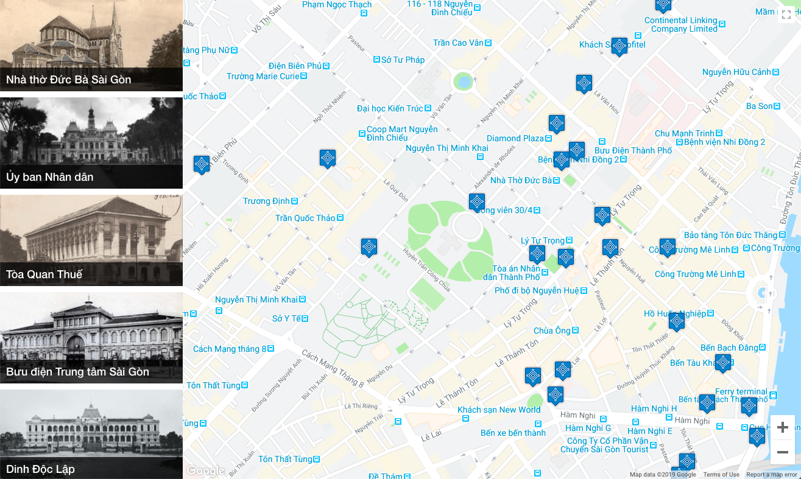

# Unix Shell: Intermediate

The year 2018 marked the 45th anniversary of diplomatic relations between Vietnam and France. The Vietnam National Archives II (Trung tâm Lưu trữ Quốc gia II), the French Consulate, and the Ho Chi Minh City People's Committee (Ủy ban Nhân dân thành phố Hồ Chí Minh), collaborated together to exhibit, along the Nguyen Hue pedestrian mall in District 1, some 300 photos and documents on the construction and design of French-style buildings in Ho Chi Minh City. It was a highlight in cultural and historical activities for local people as well as international tourists.

The association [Heritage Observatory](https://www.heobs.org/), that develops a crowdsourcing & open data heritage mapping platform, prepared a Web application that gives information to tourists about the most famous French-style buildings in Ho Chi Minh City and to display their location on a electronic map:



You will find the data of this Web application in the directory `./data` of the Git repository you have cloned.

## Heritage Data

The data of this Web application have been stored in a folder `./data` that contains two sub-folders:

```text
./data
├── img
└── json
```

The folder `img` contains image files of old photographs of heritages. The folder `json` contains [JSON](https://en.wikipedia.org/wiki/JSON) files that describes each of these heritage.

### JSON Files

A heritage's JSON file contains the following attributes:

- **`place_id`** (required): The unique identification of the heritage as registered on the Web application;
- **`address`** (optional): a list of addresses of the heritage written in different languages:
  - **`locale`** (required): The [ISO 639-3](https://en.wikipedia.org/wiki/ISO_639-3) [code](https://iso639-3.sil.org/code_tables/download_tables#Complete%20Code%20Tables) of the [language](https://docs.google.com/spreadsheets/d/1BnrNVSsFbgSuP_ERyAPEZ-LFpvKYfGlREsInTjJVvr4/edit?usp=sharing) in which the address is written;
  - **`recipient_name`** (required): The name of the heritage written in the corresponding language;
  - **`house_number`** (optional): Unique number of the place in the street or area, which eases to locate this particular place. House numbering schemes vary by place, and in many cases even within cities;
  - **`street_name`** (optional): Street name or odonym, i.e., an identifying name, given to the street where the place is located in;
  - **`ward`** (optional): Rural commune, commune-level town, urban ward;
  - **`district`** (optional): District in rural areas and precincts in urban areas;
  - **`city`** (required)
  - **`country`** (required)
- **`location`** (required): Geographical location of the heritage:
  - **`latitude`** (required): Latitude-angular distance, expressed in decimal degrees (WGS84 datum), measured from the center of the Earth, of a point north or south of the Equator of the center of the place;
  - **`longitude`** (required): Longitude-angular distance, expressed in decimal degrees (WGS84 datum), measured from the center of the Earth, of the location east or west of the Prime Meridian of the center of the place.
- **`cover`** (required): Information about the image that illustrates this heritage:
  - **`picture_id`** (required): Identification of the image of the heritage's old photograph;
  - **`picture_url`** (required): Uniform Resource Location (URL) of the image of this old photograph as hosted on the Web site (relative path only).

For example:

```json
{
  "place_id": "1cc97c5a-8d15-11e5-96c2-5b13a03c6ca8",
  "address": [
    {
      "locale": "fra",
      "recipient_name": "Cathédrale Notre Dame de Saïgon",
      "house_number": "1",
      "street_name": "place de la commune de Paris",
      "ward": "quartier Bên Nghe",
      "district": "1er arrondissement",
      "city": "Hô Chi Minh Ville",
      "country": "Viêt-nam"
    },
    {
      "locale": "vie",
      "recipient_name": "Nhà thờ Đức Bà Sài Gòn",
      "house_number": "1",
      "street_name": "công xã Paris",
      "ward": "phường Bến Nghé",
      "district": "quận 1",
      "city": "thành phố Hồ Chí Minh",
      "country": "Việt Nam"
    },
    {
      "locale": "eng",
      "recipient_name": "Notre-Dame Cathedral Basilica of Saigon",
      "house_number": "1",
      "street_name": "Paris square",
      "ward": "ward Ben Nghe",
      "district": "district 1",
      "city": "Ho Chi Minh City",
      "country": "Vietnam"
    },
    {
      "locale": "kor",
      "recipient_name": "사이공 노트르담 성당"
    },
    {
      "locale": "spa",
      "recipient_name": "Basílica de Notre-Dame de Saigón"
    },
    {
      "locale": "jap",
      "recipient_name": "サイゴン大教会"
    },
    {
      "locale": "zho-hant",
      "recipient_name": "西貢聖母聖殿主教座堂"
    }
  ],
  "location": {
    "latitude": 10.7795,
    "longitude": 106.69933
  },
  "cover": {
    "picture_url": "/static/_cover/bd00373a-f812-11e7-9de2-0007cb040bcc_cover.jpg",
    "picture_id": "bd00373a-f812-11e7-9de2-0007cb040bcc"
  }
}
```

### Image Files

The image files of each heritage's old photograph are located in a tree of 4-folder depth. The name of the consecutive 4 sub-folders corresponds to the first 4-hexadecimal characters of the identification of the heritage's cover picture.

For example, the identification of the picture representing the heritage **Notre-Dame Cathedral Basilica of Saigon** is **`bd00373a-f812-11e7-9de2-0007cb040bcc`**. The image file of this heritage's cover picture is located under **`./data/img/b/d/0/0/`**.

The image file corresponding to an heritage's cover picture is named after the identification of this picture. For example, the name of image file of the heritage **Notre-Dame Cathedral Basilica of Saigon** is **`bd00373a-f812-11e7-9de2-0007cb040bcc.jpg`**:

```text
./data
└── img
    └── b
        └── d
            └── 0
                └── 0
                    └── bd00373a-f812-11e7-9de2-0007cb040bcc.jpg
```


# Waypoint 1: Return the Size of a File (1)

Write a Unix Bash file **`file_size.sh`** that takes one argument (the path and name of a file) and that returns the size of this file in bytes.

You will use the command **`stat`** to get the size of file in bytes and to return this value.

For example:

```bash
$ ./file_size.sh ./data/img/0/e/7/0/0e7012b4-16c4-11e8-9dee-0007cb040bcc.jpg
307604
```

At the beginning of your file, you **MUST** include a directive (also known as [**shebang**](https://linuxize.com/post/bash-shebang/)) to indicate which interpreter **MUST** be used to execute your script file.

You **MUST** make your file `file_size.sh` executable, using the command `chmod`, so that we can run your script without specifying the interpreter from the command line, otherwise you will face the following issue:

```bash
# Check the permissions of the script file (no execute permission set):
$ ls -la file_size.sh
-rw-r--r--  1 lythanhphu  student  1059 Sep 11 10:21 file_size.sh
# Executing the script requires to specify the interpreter to execute
# it:
$ sh ./file_size.sh ./data/img/0/e/7/0/0e7012b4-16c4-11e8-9dee-0007cb040bcc.jpg
307604
# Executing the script without specifying the interpreter to execute
# it will raise an error:
$ ./file_size.sh ./data/img/0/e/7/0/0e7012b4-16c4-11e8-9dee-0007cb040bcc.jpg
-bash: ./file_size.sh: Permission denied
```

_Note: You need to [understand how the arguments are passed](https://www.youtube.com/watch?v=vsRBWCfMf9A) from the command-line to a script._

<!--  -->

# Waypoint 2: Compare the Size of a File

Write a Unix Bash file **`cmp_file_size.sh`** that takes two arguments (`$1`) the path and name of a file and (`$2`) an integer, and that returns:

- `0` if the size in bytes of the file equals the integer passed to the script;

- `1` if the size in bytes of the file is greater than the integer passed to the script;

- `-1` if the size in bytes of the file is less than the integer passed to the script.

For example:

```bash
$ ./cmp_file_size.sh ./data/img/0/e/7/0/0e7012b4-16c4-11e8-9dee-0007cb040bcc.jpg 100000
1
$ ./cmp_file_size.sh ./data/img/0/e/7/0/0e7012b4-16c4-11e8-9dee-0007cb040bcc.jpg 307604
0
$ ./cmp_file_size.sh ./data/img/0/e/7/0/0e7012b4-16c4-11e8-9dee-0007cb040bcc.jpg 400000
-1
```

Your script [stores the output of the script](<(https://linuxhint.com/bash_command_output_variable/)>) `file_size.sh` in a [variable](https://thoughtbot.com/blog/the-unix-shells-humble-if) (also known as [command substitution](https://en.wikipedia.org/wiki/Command_substitution)) using [backtick/backquote (**\`**)](https://www.youtube.com/watch?v=VOOeXV4HYSA) or [the enclosing nested form **`$()`**](https://www.youtube.com/watch?v=b8U_fz0pc-g).

A [variable](https://www.shellscript.sh/variables1.html) corresponds to a value that you reference by a name.

To create a [variable](https://www.youtube.com/watch?v=WhqfbwQbWVE) and to assign a value to this variable, you use the assignment operator (`=`):

```bash
# Declare and set a string variable (the value doesn't need to be quoted)
$ MY_USERNAME=lythanhphu
# Declare and set a string variable (the value MUST be quoted)
$ MY_NAME="LÝ Thanh Phú"
# Declare and set a numeric variable
$ MY_AGE=24
```

When you refer to the value stored by a variable, you put a dollar symbol (`$`) in front of the name of the variable:

```bash
$ echo $MY_NAME
LÝ Thanh Phú
$ echo $MY_AGE
24
```

Your script uses a [**`if-then-elif-else`** statement](https://www.thegeekstuff.com/2010/06/bash-if-statement-examples/) with the [comparison operators](http://tldp.org/LDP/abs/html/comparison-ops.html).

You will follow the [Google Shell Style Guide](https://google.github.io/styleguide/shell.xml#Indentation)

_Note: The semicolon character (**`;`**) is a [command separator](http://tldp.org/LDP/abs/html/abs-guide.html#SEMICOLONREF) that permits putting two or more commands on the same line. It is needed before `then` if the `if-then` statement is written in one physical line, meaning that `then` is not written on a separate line (after a carriage-return/[newline](https://en.wikipedia.org/wiki/Newline)):_

```bash
if [ $a == $b ]; then
  echo "a == b"
fi
```

or

```bash
if [ $a == $b ]
then
  echo "a == b"
fi
```

# Waypoint 3: Return the Size of a File (2)

The command utilities on Mac OS X come from [FreeBSD](https://www.freebsd.org/). They're not always the same than those from [Linux distribution's tools](http://man7.org/linux/man-pages/man1/stat.1.html). The [command **`stat`** on Mac OS X](https://www.freebsd.org/cgi/man.cgi?query=stat) slightly differs from the [command **`stat`** on Linux](http://man7.org/linux/man-pages/man1/stat.1.html).

You need to modify your script file **`file_size.sh`** to support both Mac OS X and Linux.

You script MUST detect the operating system on which it is executed. Your script uses the command **`uname`** to retrieve the operating system name (`Linux`, `Darwin`, etc.).

Then your script executes the command **`stat`** with the specific arguments depending on the operating system. Your script uses a [**`case`** statement](https://www.thegeekstuff.com/2010/07/bash-case-statement/) which is more readable, in this case, than a **`if-then-elif-else`** statement.

Then your script returns the value, and [exits with the status](https://www.cyberciti.biz/faq/linux-bash-exit-status-set-exit-statusin-bash/) `0` to indicate that it has been executed successfully.

```bash
# Check the operating system (Mac OS X)
$ uname -a
Darwin hephaestus 18.7.0 Darwin Kernel Version 18.7.0: Tue Aug 20 16:57:14 PDT 2019; root:xnu-4903.271.2~2/RELEASE_X86_64 x86_64
# Get the size of the file
$ ./file_size.sh ./data/img/0/e/7/0/0e7012b4-16c4-11e8-9dee-0007cb040bcc.jpg
307604
# Display the exit status of the last command executed (our script)
$ echo $?
0
```

If the operating system, which your script is executed on, is not `Darwin`, nor `Linux`, you script **MUST** **`echo`** the message "Unsupported operating system" [on the **standard error**](https://www.youtube.com/watch?v=icuV2CR3Ghg), and **`exit`** with the status `1`. For example:

```bash
# Check the operating system (Cygwin on Windows 10)
$ uname -a
CYGWIN_NT-10.0 DESKTOP-GHEEA9U 3.0.7(0.338/5/3) 2019-04-30 18:08 x86_64 Cygwin
# Get the size of the file
$ ./file_size.sh ./data/img/0/e/7/0/0e7012b4-16c4-11e8-9dee-0007cb040bcc.jpg
Unsupported operating system
# Display the exit status of the last command executed (our script)
$ echo $?
1

# Verify that the script writes the error message to the standard
# error: redirect stderr to /dev/null; the error message MUST NOT be
# displayed on the terminal.
$ ./file_size.sh ./data/img/0/e/7/0/0e7012b4-16c4-11e8-9dee-0007cb040bcc.jpg 2> /dev/null
```

_Note: [**`/dev/null`**](https://medium.com/@codenameyau/step-by-step-breakdown-of-dev-null-a0f516f53158) is a special file called the **null device** in Unix systems._

<em>Note: Each executed command gets associated with 3 [standard streams](https://en.wikipedia.org/wiki/Standard_streams) and returns a [result code](https://en.wikipedia.org/wiki/Exit_status) (also known as exit code) once the command terminates:


- Standard input (**stdin**): Stream data (often text) going into a program, which is the keyboard by default. The [file descriptor](https://en.wikipedia.org/wiki/File_descriptor) for standard input is `0`.

- Standard output (**stdout**): Stream where a program writes its output data, which is the console by default. The file descriptor for standard input is `1`.

- Standard error (**stderr**): Stream where a program writes error messages or diagnostics, which is also the console by default. The file descriptor for standard input is 2.</em>

For example:

```bash
$ echo foo
foo
```

The `echo` command takes the input from the argument `foo` on the command line (NOT from `stdin`), and then dumps the output to `stdout`:


# Waypoint 4: Find JPEG Files

Write a Unix Bash file **`find_jpeg_files.sh`** that returns the list of heritage JPEG files located under the current working directory.

For example:

```bash
$ ./find_jpeg_files.sh
./data/img/9/7/1/f/971facb6-d253-11e6-b775-73bb4ce1dc2c.jpg
./data/img/0/0/7/7/0077c364-16c4-11e8-9dee-0007cb040bcc.jpg
./data/img/0/6/5/4/06545ecc-46d6-11e8-9df4-0007cb040bcc.jpg
./data/img/0/e/7/0/0e7012b4-16c4-11e8-9dee-0007cb040bcc.jpg
./data/img/6/7/d/e/67de076a-4843-11e8-9df4-0007cb040bcc.jpg
./data/img/6/b/8/8/6b885e58-d254-11e6-a7e9-dfe9e42d8360.jpg
./data/img/1/f/d/6/1fd6cbe6-4537-11e8-9df4-0007cb040bcc.jpg
./data/img/8/0/4/f/804fefa2-4df2-11e8-9df5-0007cb040bcc.jpg
./data/img/8/6/8/4/868441c4-4dd5-11e8-9df5-0007cb040bcc.jpg
./data/img/8/1/a/4/81a4d494-4e74-11e8-9df5-0007cb040bcc.jpg
./data/img/8/f/b/0/8fb06b7a-4e7e-11e8-9df5-0007cb040bcc.jpg
./data/img/a/f/5/6/af5635d0-4e7a-11e8-9df5-0007cb040bcc.jpg
./data/img/a/4/d/d/a4dd1d54-4c67-11e8-9df4-0007cb040bcc.jpg
./data/img/a/3/1/e/a31ec77c-d7b2-11e6-98da-e32631de8957.jpg
./data/img/f/0/7/a/f07abe9e-46c0-11e8-9df4-0007cb040bcc.jpg
./data/img/f/0/2/c/f02ce3e2-4da3-11e8-9df4-0007cb040bcc.jpg
./data/img/f/1/9/0/f190a0a2-4623-11e8-9df4-0007cb040bcc.jpg
./data/img/c/7/c/3/c7c3e86e-d253-11e6-b324-abc660d70999.jpg
./data/img/c/4/d/c/c4dc1c18-4ea6-11e8-9df5-0007cb040bcc.jpg
./data/img/4/7/7/0/47700f76-492b-11e8-9df4-0007cb040bcc.jpg
./data/img/3/6/b/9/36b9d904-4643-11e8-9df4-0007cb040bcc.jpg
./data/img/e/6/c/7/e6c716e2-6203-11e7-9da2-0007cb040bcc.jpg
./data/img/e/1/b/7/e1b72b48-453c-11e8-b6f1-0008a20c190f.jpg
./data/img/e/c/4/0/ec400d98-16c3-11e8-9dee-0007cb040bcc.jpg
./data/img/e/2/5/0/e25040da-4ce4-11e8-9df4-0007cb040bcc.jpg
./data/img/b/d/0/0/bd00373a-f812-11e7-9de2-0007cb040bcc.jpg
./data/img/b/2/0/4/b204d05c-4dbc-11e8-9df4-0007cb040bcc.jpg
./data/img/2/9/9/0/2990196c-453c-11e8-b6f1-0008a20c190f.jpg
./data/img/2/9/c/8/29c8cb32-16c4-11e8-9dee-0007cb040bcc.jpg
./data/img/2/0/e/f/20ef369e-476c-11e8-9df4-0007cb040bcc.jpg
./data/img/5/a/0/0/5a004bbe-476f-11e8-9df4-0007cb040bcc.jpg
./data/img/5/2/6/7/5267695c-46dc-11e8-9df4-0007cb040bcc.jpg
```

Your script uses the [command **`find`**](https://www.youtube.com/watch?v=KCVaNb_zOuw) with the argument **`-name`** to recursively find JPEG files, descending from the current working directory.

# Waypoint 5: Find Files with a Given Extension

Write a Unix Bash file **`find_files_with_extension.sh`** that takes one argument, a file extension without the initial dot character (**`.`**), and that returns the list of files having this extension, and that are located under the current working directory.

For example:

```bash
$ ./find_files_with_extension.sh json
./data/json/616ce60e-47a7-11e8-9df4-0007cb040bcc.json
./data/json/5bcaa116-9181-11e5-939d-ff8c5cb69867.json
./data/json/e982ef0e-4e76-11e8-9df5-0007cb040bcc.json
./data/json/b4d7ea2e-4c6a-11e8-9df4-0007cb040bcc.json
./data/json/00000000-0000-0000-0000-000000000000.json
./data/json/58515ca8-4e7d-11e8-9df5-0007cb040bcc.json
./data/json/54787976-4dd9-11e8-9df5-0007cb040bcc.json
./data/json/71e96ef0-4d27-11e8-9df4-0007cb040bcc.json
./data/json/02267f6a-46d6-11e8-9df4-0007cb040bcc.json
./data/json/292a1c02-479e-11e8-9df4-0007cb040bcc.json
./data/json/1fd6cbe6-4537-11e8-9df4-0007cb040bcc.json
./data/json/0e141c20-4e8c-11e8-9df5-0007cb040bcc.json
./data/json/8f6c7c88-4e76-11e8-9df5-0007cb040bcc.json
./data/json/af18ccfa-4843-11e8-9df4-0007cb040bcc.json
./data/json/4a2cafc2-4dd5-11e8-9df5-0007cb040bcc.json
./data/json/b8677798-4c67-11e8-9df4-0007cb040bcc.json
./data/json/983ed96a-9180-11e5-939c-0bc5d26b988c.json
./data/json/1cc97c5a-8d15-11e5-96c2-5b13a03c6ca8.json
./data/json/a2385db0-47d6-11e8-9df4-0007cb040bcc.json
./data/json/3d3c4026-4dd9-11e8-9df5-0007cb040bcc.json
./data/json/e1b72b48-453c-11e8-b6f1-0008a20c190f.json
./data/json/567dc584-4643-11e8-9df4-0007cb040bcc.json
./data/json/2ff3b500-492b-11e8-9df4-0007cb040bcc.json
./data/json/78aea68c-46d9-11e8-9df4-0007cb040bcc.json
./data/json/2990196c-453c-11e8-b6f1-0008a20c190f.json
./data/json/1305fd0e-8ea7-11e5-9bdf-5b7b1204a354.json
./data/json/0ddb56b8-4db2-11e8-9df4-0007cb040bcc.json
./data/json/8834993e-46c2-11e8-9df4-0007cb040bcc.json
./data/json/fb99b6f0-46ec-11e8-9df4-0007cb040bcc.json
./data/json/df026972-4626-11e8-9df4-0007cb040bcc.json
./data/json/7add77ea-4dbd-11e8-9df4-0007cb040bcc.json
./data/json/6610035e-4daf-11e8-9df4-0007cb040bcc.json
```

Your script **`find_files_with_extension.sh`** MUST check that one and only one argument has been passed. If zero or more than one argument are passed, your script writes its usage information to the standard output and exits with the status `1`.

For example:

```bash
$ ./find_files_with_extension.sh
NAME
    ./find_files_with_extension.sh -- find files of the specified extension

SYNOPSIS
    ./find_files_with_extension.sh extension

DESCRIPTION
    This utility recursively descends the directory tree for the current
    working directory and searches for files that have the given extension.

    The extension MUST be specified without the separator character (.).
$ echo $?
1
```

Your script **MUST** define a [function](https://www.gnu.org/software/bash/manual/html_node/Shell-Functions.html) **`display_usage`** that is responsible for writing the usage description of your script to the standard output. [Functions](https://www.shellscript.sh/functions.html) are named sections of a program that performs a specific task ([separation of concerns](https://en.wikipedia.org/wiki/Separation_of_concerns)).

Your script **MUST** use the redirection operator **`<<-`** (also known as the [**here-document**](https://www.gnu.org/savannah-checkouts/gnu/bash/manual/bash.html#Here-Documents)) to define the content of the usage to be displayed.

Your script **MUST NOT** explicitly use the name `find_files_with_extension.sh` but the special variable that refers to the name of the script itself that is executed. If we change the name of your script, your script MUST display this new name in the usage description, without any modifications of the code of your script.

# Waypoint 6: Count Files with a Given Extension


Write a Unix Bash file `count_files.sh` that takes one argument, a file extension without the initial dot character (**`.`**), and that returns the number of files having this extension, and that are located under the current working directory.

For example:

```bash
$ ./count_files.sh json
32
```

Your script MUST use your other script `find_files_with_extension.sh` _combined_ with the command [**`wc`**](https://shapeshed.com/unix-wc/). You will connect these two commands to form a pipeline.

A [**pipeline**](https://www.youtube.com/watch?v=bKzonnwoR2I) is a mechanism for inter-process communication using message passing. A [**pipeline**](<(https://ryanstutorials.net/linuxtutorial/piping.php)>) is a set of commands (processes) [chained together](https://www.youtube.com/watch?v=nCHjYP7kqYU) by their standard streams, so that the output text of each command (**`stdout`**) is passed directly as input (**`stdin`**) to the next one.

The standard shell syntax for anonymous pipes is to list multiple commands, separated by vertical bars (**pipes**):

```bash
$ command1 | command2 | command3
```

This direct connection between commands allows them to operate simultaneously and permits data to be transferred between them continuously rather than having to pass it through temporary text files or through the display screen.

Pipes are unidirectional, i.e data flows from left to right through the pipeline.

Unix piping is a great feature that allows to combine several modular commands together to accomplish complex tasks with ease.

<em>Note: On Mac OS X, the output of the command **`wc`**, with the appropriate argument to display the number of lines, is a bit different than on Linux:

```bash
$ ./count_files.sh json
      32
```

Your script MUST delete any useless whitespace characters by combining the command **`tr`**.</em>

# Waypoint 7: Check the Number of JSON and JPEG files

Write a Unix Bash file `check_heritage_files.sh` that checks whether there is the same number of JSON and JPEG files.

This script outputs `OK` and exits with the status `0` if there is the same number of JSON and JPEG files, otherwise it outputs `KO` and exits with the status `1`.

```bash
$ ./check_heritage_files.sh
OK
$ echo $?
0
$ touch foo.json
$ ./check_heritage_files.sh
KO
$ echo $?
1
$ rm foo.json
```

# Waypoint 8: List the First 5th JSON Files and the Last 5th JSON Files

Write a Unix Bash file `list_first_5th_and_5th_last_sorted_json_files.sh` that outputs the first 5th and the last 5th heritage JSON files taken from the list of heritage JSON files sorted by alphabetical order of their name.

For example:

```bash
$ ./list_first_5th_and_5th_last_sorted_json_files.sh
./data/json/02267f6a-46d6-11e8-9df4-0007cb040bcc.json
./data/json/0ddb56b8-4db2-11e8-9df4-0007cb040bcc.json
./data/json/0e141c20-4e8c-11e8-9df5-0007cb040bcc.json
./data/json/1305fd0e-8ea7-11e5-9bdf-5b7b1204a354.json
./data/json/1cc97c5a-8d15-11e5-96c2-5b13a03c6ca8.json
./data/json/b8677798-4c67-11e8-9df4-0007cb040bcc.json
./data/json/df026972-4626-11e8-9df4-0007cb040bcc.json
./data/json/e1b72b48-453c-11e8-b6f1-0008a20c190f.json
./data/json/e982ef0e-4e76-11e8-9df5-0007cb040bcc.json
./data/json/fb99b6f0-46ec-11e8-9df4-0007cb040bcc.json
```

You script uses the command **`sort`** to alphabetically order the list of heritage JSON files by their name.

_Hint: You can achieve this task with a combination of the commands **`echo`**, **`xargs`** (with the argument **`-n`**), and **`head`**, and a second combination replacing the command **`head`** with the command **`tail`**._

# Waypoint 9: Find JSON file with a Picture Identification

Write a Unix Bash file `find_json_file_with_picture_id.sh` that takes one argument (the identification of a cover picture) and that outputs the name of the JSON file that references this cover picture.

For example:

```bash
$ ./find_json_file_with_picture_id.sh 971facb6-d253-11e6-b775-73bb4ce1dc2c
./data/json/fb99b6f0-46ec-11e8-9df4-0007cb040bcc.json
```

Make sure that the search operation is not [case-sensitive](https://en.wikipedia.org/wiki/Case_sensitivity). The picture identification can be given with uppercase and/or lowercase letters.

For example:

```bash
$ ./find_json_file_with_picture_id.sh A31EC77C-D7B2-11E6-98DA-E32631DE8957
./data/json/616ce60e-47a7-11e8-9df4-0007cb040bcc.json
```

You script uses the command **`find`** with the arguments **`-exec`** to execute the [command **`grep`**](https://www.youtube.com/watch?v=VGgTmxXp7xQ) to search for the given picture identification, and the argument **`-print`** to display the JSON file that has been found.

_Note: For you personal culture, you might want to watch the [genesis of **`grep`**](https://www.youtube.com/watch?v=NTfOnGZUZDk)._

# Waypoint 10: List Heritage Picture Identifications

Write a Unix Bash file `list_heritage_picture_ids.sh` that outputs the list of heritage identifications, extracted from every JSON file, sorted by ascending alphabetical order.

For example:

```bash
$ ./list_heritage_picture_ids.sh
0077c364-16c4-11e8-9dee-0007cb040bcc
06545ecc-46d6-11e8-9df4-0007cb040bcc
0e7012b4-16c4-11e8-9dee-0007cb040bcc
20ef369e-476c-11e8-9df4-0007cb040bcc
2990196c-453c-11e8-b6f1-0008a20c190f
29c8cb32-16c4-11e8-9dee-0007cb040bcc
36b9d904-4643-11e8-9df4-0007cb040bcc
47700f76-492b-11e8-9df4-0007cb040bcc
5267695c-46dc-11e8-9df4-0007cb040bcc
5a004bbe-476f-11e8-9df4-0007cb040bcc
67de076a-4843-11e8-9df4-0007cb040bcc
6b885e58-d254-11e6-a7e9-dfe9e42d8360
804fefa2-4df2-11e8-9df5-0007cb040bcc
81a4d494-4e74-11e8-9df5-0007cb040bcc
868441c4-4dd5-11e8-9df5-0007cb040bcc
8fb06b7a-4e7e-11e8-9df5-0007cb040bcc
971facb6-d253-11e6-b775-73bb4ce1dc2c
a31ec77c-d7b2-11e6-98da-e32631de8957
a4dd1d54-4c67-11e8-9df4-0007cb040bcc
af5635d0-4e7a-11e8-9df5-0007cb040bcc
b204d05c-4dbc-11e8-9df4-0007cb040bcc
bd00373a-f812-11e7-9de2-0007cb040bcc
c4dc1c18-4ea6-11e8-9df5-0007cb040bcc
c7c3e86e-d253-11e6-b324-abc660d70999
e25040da-4ce4-11e8-9df4-0007cb040bcc
e6c716e2-6203-11e7-9da2-0007cb040bcc
ec400d98-16c3-11e8-9dee-0007cb040bcc
f02ce3e2-4da3-11e8-9df4-0007cb040bcc
f07abe9e-46c0-11e8-9df4-0007cb040bcc
f190a0a2-4623-11e8-9df4-0007cb040bcc
```

You script uses the [command **`cut`**](https://www.youtube.com/watch?v=_GxXbM0METw) in combination with other commands to achieve this task.

# Waypoint 11: List Supported Languages

The address information of an heritage, including the name of this heritage, can be written in various languages.

[Language localization (`l10n`)](https://en.wikipedia.org/wiki/Language_localisation) permits to publish content in the preferred language of a user. More generally speaking:

> <em>Localization refers to the adaptation of a product, application or document content to meet the language, cultural and other requirements of a specific target market (a [locale](<https://en.wikipedia.org/wiki/Locale_(computer*software)>)).</em>

For example, the information of the heritage **Notre-Dame Cathedral Basilica of Saigon** has been partially translated in 7 languages:

```json
{
  "place_id": "1cc97c5a-8d15-11e5-96c2-5b13a03c6ca8",
  "address": [
    {
      "locale": "fra",
      "recipient_name": "Cathédrale Notre Dame de Saïgon",
      "house_number": "1",
      "street_name": "place de la commune de Paris",
      "ward": "quartier Bên Nghe",
      "district": "1er arrondissement",
      "city": "Hô Chi Minh Ville",
      "country": "Viêt-nam"
    },
    {
      "locale": "vie",
      "recipient_name": "Nhà thờ Đức Bà Sài Gòn",
      "house_number": "1",
      "street_name": "công xã Paris",
      "ward": "phường Bến Nghé",
      "district": "quận 1",
      "city": "thành phố Hồ Chí Minh",
      "country": "Việt Nam"
    },
    {
      "locale": "eng",
      "recipient_name": "Notre-Dame Cathedral Basilica of Saigon",
      "house_number": "1",
      "street_name": "Paris square",
      "ward": "ward Ben Nghe",
      "district": "district 1",
      "city": "Ho Chi Minh City",
      "country": "Vietnam"
    },
    {
      "locale": "kor",
      "recipient_name": "사이공 노트르담 성당"
    },
    {
      "locale": "spa",
      "recipient_name": "Basílica de Notre-Dame de Saigón"
    },
    {
      "locale": "jap",
      "recipient_name": "サイゴン大教会"
    },
    {
      "locale": "zho-hant",
      "recipient_name": "西貢聖母聖殿主教座堂"
    }
  ],
  "location": {
    "latitude": 10.7795,
    "longitude": 106.69933
  },
  "cover": {
    "picture_url": "/static/_cover/bd00373a-f812-11e7-9de2-0007cb040bcc_cover.jpg",
    "picture_id": "bd00373a-f812-11e7-9de2-0007cb040bcc"
  }
}
```

Write a Unix Bash file `find_locales.sh` that outputs the list of distinct locales that are defined in one or more heritage JSON files. This list is sorted by ascending alphabetical order of the locales.

For example:

```bash
$ ./find_locales.sh
eng
fra
jap
kor
spa
vie
zho-hant
```

# Waypoint 11: Count Supported Language Occurrences

Write a Unix Bash file `find_and_count_locales.sh`, similar to the script `find_locales.sh`, except that it outputs this list with the number of times a locale has been defined (i.e., the number of heritages that include this locale).

The list **MUST** be returned in descending order of number of occurrences.

For example:

```bash
$ ./find_and_count_locales.sh
  32 vie
  32 fra
   7 eng
   1 zho-hant
   1 spa
   1 kor
   1 jap
```

Your script uses the [command **`uniq`**](https://www.youtube.com/watch?v=VRrd9ErU13w) in combination with some other commands to achieve this task.

# Waypoint 12: Search for an Heritage

Write a Unix Bash file `search_heritages.sh` that takes one argument, a keyword, and that outputs the content of the JSON file of the heritages which information matches, even partially, this keyword.

For example:

```bash
$ ./search_heritages.sh post
{
  "place_id": "2990196c-453c-11e8-b6f1-0008a20c190f",
  "address": [
    {
      "locale": "vie",
      "recipient_name": "Bưu điện Trung tâm Sài Gòn",
      "house_number": "2",
      "street_name": "công xã Paris",
      "ward": "phường Bến Nghé",
      "district": "quận 1",
      "city": "thành phố Hồ Chí Minh",
      "country": "Việt Nam"
    },
    {
      "locale": "fra",
      "recipient_name": "Hôtel des Postes et des Télégraphes",
      "house_number": "2",
      "street_name": "place de la Commune de Paris",
      "ward": "quartier Bên Nghe",
      "district": "1er arrondissement",
      "city": "Hô Chi Minh Ville",
      "country": "Viêt-nam"
    }
  ],
  "location": {
    "latitude": 10.77983,
    "longitude": 106.69986
  },
  "cover": {
    "picture_id": "2990196c-453c-11e8-b6f1-0008a20c190f",
    "picture_url": "/static/_cover/2990196c-453c-11e8-b6f1-0008a20c190f_cover.jpg"
  }
}
```

Other example:

```bash
$  ./search_heritages.sh 10.7764
{
  "place_id": "54787976-4dd9-11e8-9df5-0007cb040bcc",
  "address": [
    {
      "locale": "vie",
      "recipient_name": "Cung Văn Hóa Lao Động",
      "house_number": "55B",
      "street_name": "đường Nguyễn Thị Minh Khai",
      "ward": "phường Bến Thành",
      "district": "quận 1",
      "city": "thành phố Hồ Chí Minh",
      "country": "Việt Nam"
    },
    {
      "locale": "fra",
      "recipient_name": "Cercle Sportif Saïgonnais",
      "house_number": "55B",
      "street_name": "rue Nguyên Thi Minh Khai",
      "ward": "quartier Bên Thanh",
      "district": "1er arrondissement",
      "city": "Hô Chi Minh Ville",
      "country": "Viêt-nam"
    }
  ],
  "location": {
    "latitude": 10.77648,
    "longitude": 106.69255
  },
  "cover": {
    "picture_id": "804fefa2-4df2-11e8-9df5-0007cb040bcc",
    "picture_url": "/static/_cover/804fefa2-4df2-11e8-9df5-0007cb040bcc_cover.jpg"
  }
}
{
  "place_id": "983ed96a-9180-11e5-939c-0bc5d26b988c",
  "address": [
    {
      "locale": "fra",
      "recipient_name": "Théâtre Municipal",
      "house_number": "7",
      "street_name": "place Lam Son",
      "ward": "quartier Bên Nghe",
      "district": "1er arrondissement",
      "city": "Hô Chi Minh Ville",
      "country": "Viêt-nam"
    },
    {
      "locale": "vie",
      "recipient_name": "Nhà hát Thành phố Hồ Chí Minh",
      "house_number": "7",
      "street_name": "công trường Lam Sơn",
      "ward": "phường Bến Nghé",
      "district": "quận 1",
      "city": "thành phố Hồ Chí Minh",
      "country": "Việt Nam"
    }
  ],
  "location": {
    "latitude": 10.77649,
    "longitude": 106.70305
  },
  "cover": {
    "picture_id": "c7c3e86e-d253-11e6-b324-abc660d70999",
    "picture_url": "/static/_cover/c7c3e86e-d253-11e6-b324-abc660d70999_cover.jpg"
  }
}
{
  "place_id": "1305fd0e-8ea7-11e5-9bdf-5b7b1204a354",
  "address": [
    {
      "locale": "vie",
      "recipient_name": "Ủy ban Nhân dân Thành phố Hồ Chí Minh",
      "house_number": "86",
      "street_name": "đường Lê Thánh Tôn",
      "ward": "phường Bến Nghé",
      "district": "quận 1",
      "city": "thành phố Hồ Chí Minh",
      "country": "Việt Nam"
    },
    {
      "locale": "fra",
      "recipient_name": "Hôtel de Ville",
      "house_number": "86",
      "street_name": "rue Lê Thanh Tôn",
      "ward": "quartier Bên Nghe",
      "district": "1er arrondissement",
      "city": "Hô Chi Minh Ville",
      "country": "Viêt-nam"
    }
  ],
  "location": {
    "latitude": 10.77646,
    "longitude": 106.70104
  },
  "cover": {
    "picture_url": "/static/_cover/20ef369e-476c-11e8-9df4-0007cb040bcc_cover.jpg",
    "picture_id": "20ef369e-476c-11e8-9df4-0007cb040bcc"
  }
}
```

_Hint: You might want to use the option **`-q`** of the command **`grep`**._

# Waypoint 13: Display Pictures of Search Result

Write a Unix Bash file `search_and_display_heritage_pictures.sh` that takes one argument, a keyword, and that displays the picture of heritages which information matches, even partially, this keyword.

For example, the command:

```bash
$ search_and_display_heritage_pictures.sh "district 3"
```

displays the image:


_Note: There might possibly be duplicated heritage picture files but we suppose that they represent the same image. Your script **MUST** only display one of the duplicated images._

Your script **MUST** use the [command **locate**](https://www.geeksforgeeks.org/locate-command-in-linux-with-examples/) – even if the [command **`find`**](https://www.experts-exchange.com/videos/203/Linux-Unix-Bash-Shell-Finding-Files.html) would have been enough for this purpose.

Your script **MUST** use the command [**`display`**](https://imagemagick.org/script/display.php), a program of the ImageMagick suite of tools that has been installed on your computer.

If there are several heritages that match the specified keyword, your script **MUST** not display more than 2 pictures at the same time.

Also, if the user closes one of the pictures that have been displayed, your script **MUST** continue to load and display the remaining pictures (it **MUST NOT** stop).

At last, your script **MUST** not block the terminal. Your script **MUST** [run in the background](https://www.youtube.com/watch?v=93FljeF1He4), as a job.

For example:

```bash
$ search_and_display_heritage_pictures.sh "district 1"
```


_Hint: You might want to use the options **`-P`** and **`-I`** of the command **`xargs`**._

# Waypoint 14: Calculate the Total Size of Heritage Pictures (Using Loop Statement)

Write a script `calculate_heritage_pictures_size_with_loop.sh` that outputs the total size in bytes of pictures of all the heritages.

Your script **MUST** use the script **file_size.sh** you have already written (compatible with both Linux and Mac OS X).

You script **MUST** use the [loop](https://ryanstutorials.net/bash-scripting-tutorial/bash-loops.php) [statement](https://bash.cyberciti.biz/guide/For_loop) [**`for`**](https://linuxize.com/post/bash-for-loop/). Your loop body uses [arithmetic operations](https://bash.cyberciti.biz/guide/Perform_arithmetic_operations) to sum each picture file's size.

For example:

```bash
$ sh ./calculate_heritage_pictures_size_with_loop.sh
7591387
```

# Waypoint 15: Calculate the Total Size of Heritage Pictures (Using **`awk`**)

Write a script `calculate_heritage_pictures_size_with_awk.sh` that outputs the total size in bytes of pictures of all the heritages.

Your script **MUST** use the script **file_size.sh** you have already written (compatible with both Linux and Mac OS X).

This time, your script doesn't use any loop statements, but the [command **`awk`**](https://en.wikipedia.org/wiki/AWK), a powerful [text](https://www.whoishostingthis.com/resources/awk/) processing [tool](https://developer.ibm.com/tutorials/l-awk1/).

For example:

```bash
$ sh ./calculate_heritage_pictures_size_with_awk.sh
7591387
```

# Waypoint 16: Create an Archive of Heritages JSON and JPEG files

Write a script `create_heritage_files_archive.sh` that takes one argument, the name of the archive file to build, and that creates a [**`tar`** archive](https://www.cyberciti.biz/faq/linux-unix-find-tar-files-into-tarball-command/) of all the heritage JSON and JPEG files.

```bash
$ sh ./create_heritage_files_archive.sh heritage_data.tar
a ./data/img/9/7/1/f/971facb6-d253-11e6-b775-73bb4ce1dc2c.jpg
a ./data/img/0/0/7/7/0077c364-16c4-11e8-9dee-0007cb040bcc.jpg
a ./data/img/0/6/5/4/06545ecc-46d6-11e8-9df4-0007cb040bcc.jpg
a ./data/img/0/e/7/0/0e7012b4-16c4-11e8-9dee-0007cb040bcc.jpg
a ./data/img/6/7/d/e/67de076a-4843-11e8-9df4-0007cb040bcc.jpg
(...)
a ./data/json/616ce60e-47a7-11e8-9df4-0007cb040bcc.json
a ./data/json/5bcaa116-9181-11e5-939d-ff8c5cb69867.json
a ./data/json/e982ef0e-4e76-11e8-9df5-0007cb040bcc.json
a ./data/json/b4d7ea2e-4c6a-11e8-9df4-0007cb040bcc.json
a ./data/json/58515ca8-4e7d-11e8-9df5-0007cb040bcc.json
(...)
$ ls -lah heritage_data.tar
-rw-r--r--  1 lythanhphu  student   7.3M Sep 12 17:35 heritage_data.tar
```

# Cheat Sheets

We recommend you to download the following Linux command line cheat sheets:

- [Shell Scripting Cheat Sheet for Unix and Linux (Steve Parker)](https://steve-parker.org/sh/cheatsheet.pdf)

- [Linux Command Line Cheat Sheet (by Dave Child)](https://www.cheatography.com//davechild/cheat-sheets/linux-command-line/pdf/)
